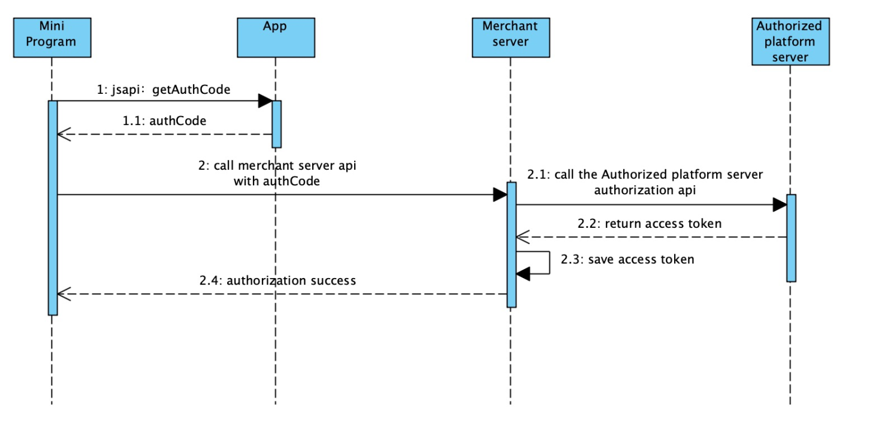

# Autorización de usuarios

La autorización del usuario describe el proceso de obtener el consentimiento de un usuario para acceder a la información del usuario.Se basa en el mecanismo de autorización estándar de la industria OAuth2.0.En la plataforma Mini Program, los desarrolladores deben obtener el permiso de los usuarios en el Mini programa antes de obtener y usar su información.

<table>
    <tr>
        <th>
            Nombre
        </th>    
        <th>
            Descripción
        </th>
    </tr>
    <tr>
        <td>Alcance de la autorización
    (alcance)</td>
        <td>Un alcance representa el alcance de los permisos que los desarrolladores necesitan para solicitar la autorización del usuario.Un alcance contiene al menos una interfaz API abierta o interfaz JSAPI.Una autorización puede combinar múltiples ámbitos para la autorización combinada.Para obtener más información, consulte la descripción del alcance en my.getAuthCode.</td>
    </tr>
    <tr>
        <td>Código de Autorización
    (código de autenticación)</td>
        <td>Credenciales de autorización de usuario temporal.Después de obtenerlo, intercambílo rápidamente para el token de acceso mencionado a continuación.</td>
    </tr>
    <tr>
        <td>Token de acceso o token de autorización
    (access_token o auth_token)</td>
        <td>Credenciales de autorización a largo plazo. Se utiliza para llamar a la puerta de enlace del sitio para llamar a la interfaz de autorización del lado del servidor. Preste atención al alcance y la validez del token de autorización.</td>
    </tr>
    <tr>
        <td>Actualización
    (refresh_token)</td>
        <td>Se utiliza para actualizar y obtener un nuevo token de acceso después de que expire el token de acceso.El token de actualización también tiene un período de validez.</td>
    </tr>
</table>

## Guias de acceso

### Flujo de acceso

Tomando la obtención de la información del usuario como ejemplo. El flujo de acceso general se ilustra a continuación:



1. El miniprogram hace el llamado al ```getAuthcode``` JSAPI para obtener el código de autorización (```AuthCode```) de la billetera [1.1].

2. El miniprogram hace el llamado a la API del servidor comercial con AuthCode [2].

3. El servidor comercial llama a Aplicando OpenApi y el servidor de plataforma autorizado devuelve el token de acceso [2.2].

4. El servidor comercial guarda el token de acceso y devuelve el resultado de la autorización al mini programa [2.4].

<b>Nota: </b>Para autorizar otra información, use un alcance diferente para el parámetro Scopes al llamar a ```GetAuthCode```.

## Obtener authcode

Puede obtener la autorización del usuario llamando al my.getAuthcode JSAPI y obtener el AuthCode en la devolución de llamada de éxito. Por ejemplo:

```js
my.getAuthCode({
  scopes: ['USER_ID'],
  success: (res) => {
    my.alert({
      content: res.authCode,
    });
  },
  failed: (res) => {
      console.log(res.authErrorScopes)
  },
});
```

##  Obtener accessToken

* Para comerciantes: antes de obtener un ```accesstoken```, necesita obtener un ```authcode``` de la billetera. Entonces puede llamar al ```applyToken``` Openapi a cambio de ```accessToken```.

* Para desarrolladores: los desarrolladores pueden intercambiar ```accessToken``` y ```userId``` con el ```authcode``` obtenido.

## Llamar al servidor Openapi

Después de obtener el ```AccessToken```, los desarrolladores pueden continuar utilizando el token de acceso para llamar a otras interfaces de autorización. Preste atención al alcance del permiso y el período de validez del token.

## Lista de la API

<table>
<tr>
    <td><b>JSAPI</b></td>
    <td><b>Descripción</b></td>
</tr>
<tr>
    <td>[my.getAuthCode](https://miniprogram.alipay.com/docs/miniprogram/mpdev/api_openapi_getauthcode)</td>
    <td>Obtiene el código de autorización del usuario.</td>
</tr>
<tr>
    <td><b>OpenAPI</b></td>
    <td><b>Descripción</b></td>
</tr>
<tr>
    <td>[v2/authorizations/applyToken](https://miniprogram.alipay.com/docs/miniprogram/mpdev/api_openapi_getauthcode)</td>
    <td>Obtenga el token de acceso.</td>
</tr>
</table>

## Preguntas frecuentes

1. <b>¿Por qué los desarrolladores deberían usar ```my.getAuthcode``` API?</b>

Toda la lectura y la redacción de información del usuario en la plataforma Mini Program solo se pueden usar después de obtener el consentimiento del usuario.La autorización del usuario se basa en el mecanismo de autorización estándar de la industria OAuth2.0. Con este mecanismo, los desarrolladores pueden obtener información del usuario en la plataforma Mini Program.

2. <b>¿Por qué la API de autorización del usuario no está permitida en la primera pantalla del mini programa?</b>

Para crear una mejor experiencia de usuario en el mini program, no se permite la orientación de autorización del usuario en la primera pantalla del mini program.La orientación para la autorización del usuario debe administrarse después de que el usuario comprende completamente el contenido comercial del mini programa. Le recomendamos que agregue la autorización de mini programa al proceso de negocio.

3. <b>¿Se puede obtener el ```userId``` a través de la API de autorización del usuario?</b>

No, el ```userId``` debe obtenerse llamando a la API relacionada en el lado del servidor.

## Más información

[Obtener información básica del usuario](https://miniprogram.alipay.com/docs/miniprogram/mpdev/api_openapi_obtainbasicmemberinformation)