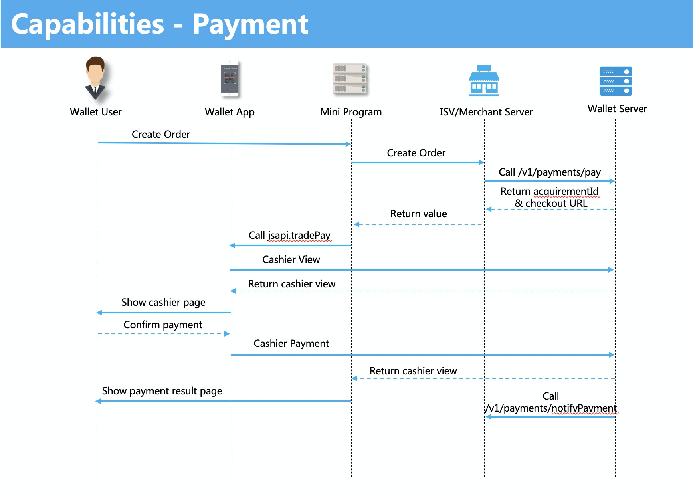

# Capacidad de pago

Los usuarios pueden activar la página de billetera en un mini programa.El proceso de pago y la experiencia del usuario en el programa MINI son similares a los de la aplicación nativa.

## Requisitos previos

Esta capacidad está abierta a un comerciante con una licencia comercial válida que es verificada por su billetera.El sitio web comercial debe ser accesible y proporcionar contenido comercial claro e información completa del producto.

## Experiencia de usuario

El proceso de pago general incluye los siguientes pasos:

1. Un usuario selecciona un producto en el mini programa y realiza un pedido.
2. El usuario confirma la compra y ingresa a la página de pago activada por el programa MINI.
3. El usuario confirma el beneficiario y el monto en la página de pago, luego confirma el pago.
4. Se muestra la página de éxito de pago.

## Procedimientos

Para desarrollar la capacidad de pago, siga los pasos a continuación:

1. Cree un mini programa

El comerciante/ISV comienza con el espacio de trabajo y publica un mini programa en la plataforma Mini Program.Para obtener más información, consulte la descripción general de la [Guía del producto](/) y la [Guía del desarrollador](/).

2. Agregar características (opcional)

Por defecto, la capacidad de pago está disponible. Para otras características, debe agregar una función y definir los detalles de acuerdo con los requisitos de su negocio.Para obtener más información, consulte las [características](/).

3. Llamar APIs



1. El usuario de la billetera crea una orden de pago en un mini programa.
2. El servidor Merchant o ISV crea el pedido llamando al ```/{versión}/Payments/Pay``` OpenApi desde el servidor de billetera.
3. El servidor de la billetera devuelve parámetros como el ```acquirementId``` la URL dek checkout y la del mini program.
4. El programa Mini llama al ```Tradepay``` JSAPI activando el proceso de pago de la billetera y otros parámetros de devolución y luego obtiene la respuesta.
5. El usuario confirma el pago.Luego, el servidor de billetera llama a ```/{versión}/pagos/notifypayment``` OpenApi y envía la notificación de estado del pedido al servidor de programa MIN.
6. El usuario se redirige a la página del resultado del pago en el programa MINI.
Nota:

* El ```version``` es la versión de Open API, por ejemplo, V1 o V2.
* El parámetro ```userId``` o ```uid``` se obtiene llamando a Aplicando OpenAPI. Para obtener más información, consulte [Capacidad de información del usuario](/).

## API list

<table>
    <tbody>
        <tr>
            <td>**JSAPI**</td>
            <td>**Descripción**</td>
        </tr>
        <tr>
            <td>[my.tradePay](/)</td>
            <td>Activar la página del cajero desde la billetera.</td>
        </tr>
        <tr>
            <td>OpenAPI</td>
            <td>Descripción</td>
        </tr>
        <tr>
            <td>
                / ```{version}/payments/{apiName}```
                The
                ```version``` es la versión de Open API, por ejemplo, v1 or v2.
            </td>
            <td>Para más detalles, consulte el capítulo Open API for Merchants.</td>
        </tr>
    </tbody>
</table>

## Mas información

[Capacidades](/)

[JSAPIs](/)

[Open APIs](/)

[Desarrollo de mini program](/)

[Uso de Mini Program Platform](/)

[Features](/)