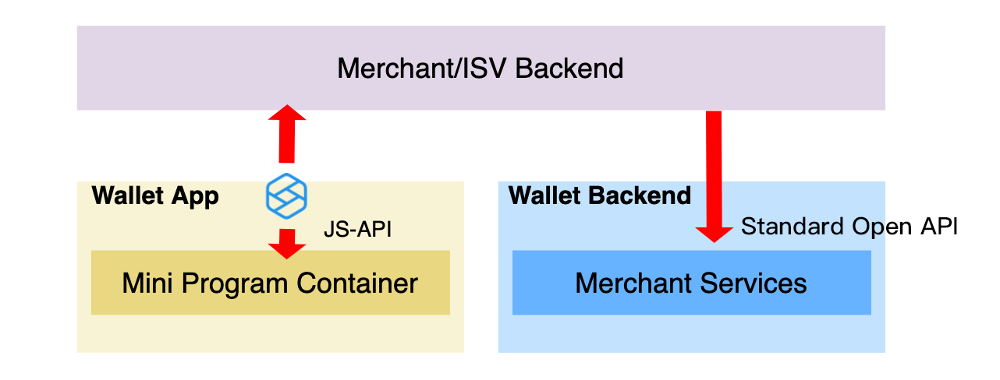

# Capacidades

Las capacidades son conjuntos de API de JavaScript (JSAPIS) y Openapis que pueden trabajar juntos para ayudar a los comerciantes e ISV a implementar funciones específicas. Por ejemplo, la capacidad de pago lo realiza ```my.tradePay``` JSAPI y OpenApis como ```/{version}/payments/pay``` y ```/{version}/payments/notifyPayment```, donde la version es ```V1``` o``` V2```.


## Descripción general de la arquitectura
El proceso de llamadas de JSAPIS y OpenApis se ilustra como se muestra a continuación:



## JSAPI

JSAPIS están disponibles de forma predeterminada en el contenedor del Mini Program. Puedes llamar a la JSAPi existente del Mini Programa para usar. Cuando realices el llamado a un JSAPI, interactuará entre la billetera y el comerciante o el servidor backend de ISV.

## OpenAPI

ACL (Lista de control de acceso) están disponibles los estándares de OpenAPI. También puede usar los estándares de OpenApis y definir el OpenApis. Cuando llame a un OpenAPI, interactuará entre la billetera y el comerciante o el servidor de backend de ISV.

Con una combinación de JSAPIS y OpenApis, se puede definir un conjunto de capacidades. Por ejemplo, puede ver las siguientes capacidades que están disponibles de forma predeterminada:

- [User information capability](https://miniprogram.alipay.com/docs/miniprogram/mpdev/capability-user-information)
- [Payment capability](https://miniprogram.alipay.com/docs/miniprogram/mpdev/capability-payment)
- [For all OpenAPIs that support various capabilities, see](https://miniprogram.alipay.com/docs/miniprogram/mpdev/openapi_overview)

Además, puede definir sus propias características que se administran centralmente en el espacio de trabajo de la plataforma Mini Program.Puede seleccionar los JSAPIS que están disponibles de forma predeterminada.Para obtener más información, consulte las [características](https://miniprogram.alipay.com/docs/miniprogram/platform/feature).

## Mas información

[JSAPIs](https://miniprogram.alipay.com/docs/miniprogram/mpdev/api_overview)

[Open APIs](https://miniprogram.alipay.com/docs/miniprogram/mpdev/openapi_overview)

[Usar la plataforma de Mini Programs](https://miniprogram.alipay.com/docs/miniprogram/mpdev/openapi_overview)

[Características](https://miniprogram.alipay.com/docs/miniprogram/platform/feature)