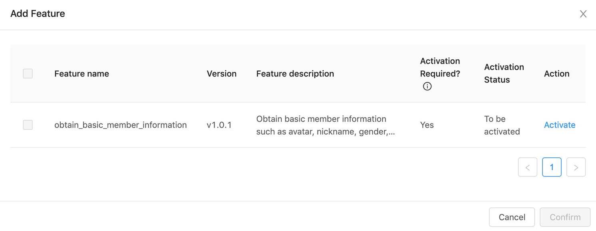

# Obtener información básica del usuario

El Mini programa puede obtener información básica de los usuarios billetera. Este es un servicio abierto que captura la información básica del usuario como Avatar, Apodo, Género y Región después de obtener la autorización del usuario.

## Requisitos

Cuando se obtenga información básica del usuario, los desarrolladores del mini program deben cumplir con los siguientes requisitos:

* No guíe a los usuarios a otorgar autorización al lanzamiento del Mini Programa.Los usuarios tienen derecho a comprender completamente el Mini Programa y sus operaciones antes de dar cualquier autorización.

* No obtenga la ID de usuario y el nombre real del usuario. La información para obtener solo puede incluir información básica del usuario, como avatar de usuarios, apodo, género y ubicación.

* Como la información básica del usuario y el número de teléfono móvil del usuario son obtenidos por dos JSAPIS, estos dos tipos de información no se pueden solicitar en el mismo modal.

* No obtenga información del usuario que no esté relacionada con el negocio. Si el usuario no otorga autorización a la primera solicitud, muestre el modal para permitir al usuario revertir la decisión cuando la empresa requiere la autorización nuevamente.

## Procedimientos

Para obtener la información básica del usuario en el mini program, los desarrolladores del mini program deben completar los siguientes pasos:

### Paso 1: Crear un mini program

Solicite una cuenta y cree un mini programa en la plataforma de Mini Program

### Paso 2: Agregar la caracteristica

Ingrese el mini programa que acaba de crear. Haga clic en la pestaña "**Features**", luego "**Add Feature**" para que aparezca la lista de funciones. Marque "Obtenga información básica para miembros" y haga clic en el botón "Confirmar" para activar la caracteristica.



### Paso 3: Llamar al jsapi

Llame al my.getOpenUserInfo JSAPI para obtener la información básica del usuario.

**Nota:**

Los desarrolladores deben considerar la posibilidad de que los usuarios rechazen autorizar el Mini Program para recopilar su información.En tales casos, los desarrolladores deben tener soluciones correspondientes, como guiar a los usuarios a completar o cargar manualmente su información.

#### Mostrar el modal de autorización

En el componente del botón, establezca el valor de Open-Type como GetAuthorize y establezca el valor del alcance como UserInfo.

**Código de muestra:**

```js
<!-- .axml -->
<button 
    open-type="getAuthorize" 
    onGetAuthorize="onGetAuthorize" 
    onError="onAuthError" 
    scope='userInfo'>
</button>
```

**Button properties**

<table>
    <tr>
        <th>Nombre</th>
        <th>Descripción</th>
    </tr>
    <tr>
        <td>open-type</td>
        <td>El valor es ```getAuthorize```.</td>
    </tr>
    <tr>
        <td>scope</td>
        <td>El valor es ```userInfo```.</td>
    </tr>
    <tr>
        <td>onGetAuthorize</td>
        <td>Autorización de devolución de llamada satifactoria. El mini program puede llamar ```my.getOpenUserInfo``` Para obtener información en esta devolución de llamada.</td>
    </tr>
    <tr>
        <td>onError</td>
        <td>Authorization failure callback, including user rejection and system errors.</td>
    </tr>
</table>

#### Llama al my.getOpenUserInfo JSAPI

Después de que el usuario otorga la autorización, el Mini Program puede llamar al my.getOpenuserInfo JSAPI para obtener información básica del usuario.

**Código de muestra:**

```js
// .js 
onGetAuthorize(res) {
    my.getOpenUserInfo({
        fail: (res) => {
        },
        success: (res) => {
            let userInfo = JSON.parse(res.response).response
        }
    });
}
```

**Muestra de un formato de mensaje devuelto correctamente:**

```js
{
    "response":{
        "response":{
            "code":"10000",
            "msg":"Success",
            "countryCode":"code",
            "gender":"f",
            "nickName":"XXX",
            "avatar":"https://image_domain/images/partner/XXXXXXXX",
            "city":"city",
            "province":"province"
        }
    }
}
```

## Lista de API

<table>
    <tr>
        <th>JSAPI</th>
        <th>Descripción</th>
    </tr>
    <tr>
        <td>my.getAuthCode</td>
        <td>Gets user's authorization code.</td>
    </tr>
    <tr>
        <td>my.getOpenUserInfo</td>
        <td>Gets basic user information.</td>
    </tr>
</table>

## Preguntas frecuentes

**1. ¿Se puede utilizar la función de obtener información básica del usuario para obtener el ID de usuario de la billetera?**

No. Si los mini programas deben obtener la ID de usuario, consulte la [autorización del usuario](/) para obtener detalles y llame a [My.getAuthCode](/) para obtener la ID de usuario.

**2. ¿Pueden los mini programas obtener el número de teléfono móvil del usuario, el avatar, el apodo y otra información pública al mismo tiempo?**

No. Los mini programs no pueden obtener el número de teléfono móvil del usuario, Avatar, apodo al mismo tiempo en el mismo modal.

La siguiente información pública del usuario se puede obtener con [my.getOpenUserInfo](/):

* Avatar
* Alias
* Género
* País

La siguiente información de usuario privado se puede obtener con [my.getAuthCode](/):

* User ID
* Phone number


**3. ¿Pueden los mini programas obtener ID de usuario, nombre real e información privada a través de la función de obtener información básica del usuario?**

No. A través de la función de obtener información básica del usuario, los mini programas solo pueden obtener avatar de usuario, apodo, género, ubicación y otra información pública.


 
