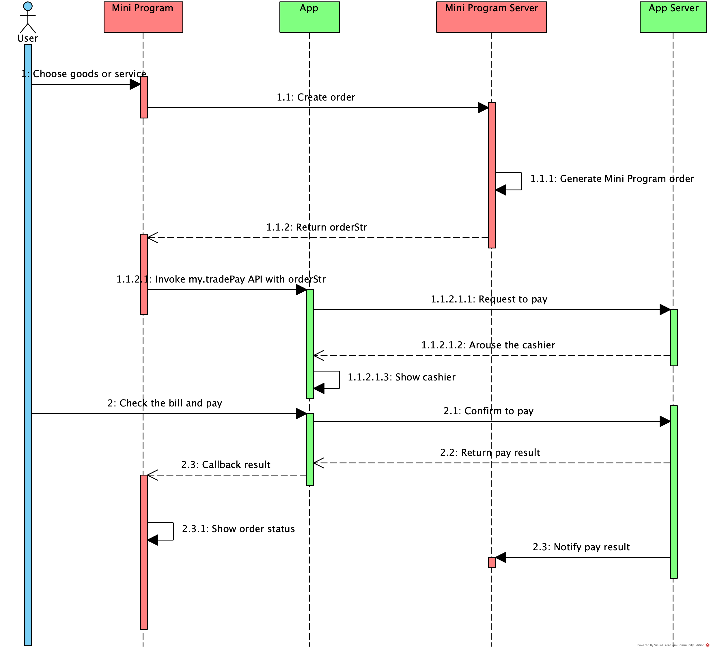
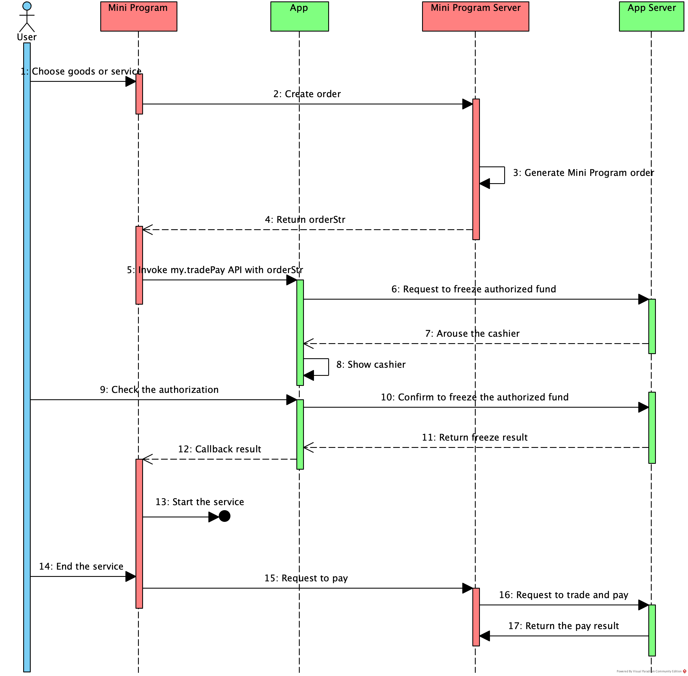

# Uso de OrderStr para pagos

Los usuarios pueden usar la aplicación de billetera para pagar el pedido realizado en el mini program si la aplicación de billetera proporciona el servicio de pago.Este documento presenta el pago llamando a la API My.Tradepay con OrderStr.Se admiten los siguientes dos tipos de pago:

* Pago general en línea

* Pago previo a la autorización

## Pago general en línea

Los usuarios pueden completar un pago general en línea en el mini programa.

## Experiencia de usuario

Para completar un pago en el mini program, los usuarios generalmente siguen los pasos a continuación:

1. El usuario elige bienes en el mini program y crea un pedido, luego presiona el botón de pago en el mini program.
2. El mini program redirige al usuario a la aplicación de billetera y la aplicación de billetera muestra la página de pago.
3. El usuario confirma la información del pedido, como el beneficiario y el monto, luego hace clic en el botón de pago para realizar el pago.
4. Después de confirmar el pago, la aplicación de billetera muestra el resultado del pago y redirige al usuario a la página del resultado del pago en el mini program.

## Procedimientos

Para usar la api ```My.Tradepay``` Para Iniciary Pago en El mini program, Los Desarrolladores de Mini del Programa Deben Agrupo los Sigenes Pasos:

1. Confirme que el servicio de pago proporcionado por la aplicación de billetera admite el pago por OrderStr y obtenga la guía de integración de la aplicación de billetera.
2. Integre el servicio de pago en el lado del servidor Mini del programa.
3. Cree un mini programa en el espacio de trabajo de la billetera en la plataforma Mini Program, o asegúrese de que el Mini programa pueda publicarse en la aplicación de billetera.
4. Proporcione bienes y servicios de pago en el mini program.
5. Publique el mini programa..

## Proceso de pago

La siguiente figura ilustra el proceso de pago:



El proceso de pago contiene los siguientes pasos:

1. El usuario realiza un pedido en el Mini Programa (Paso 1).
2. El Cliente de Mini del Programa envía una solicitud para crear el pedido al servidor MINI del programa llamando a la API [my.request](/) (paso 1.1).
3. El servidor MINI del programa crea el pedido y devuelve ```orderStr``` al cliente MINI del programa (paso 1.1.1 y 1.1.2).
4. El Cliente de Mini del Programa inicia la solicitud de pago llamando a la API my.Tradepay con OrderStr a la aplicación de billetera (paso 1.1.2.1).
5. La billetera procesa la solicitud de pago internamente y la aplicación de billetera representa la página del cajero (paso 1.1.2.1.1 - 1.1.2.1.3).
6. El usuario confirma el pago y la aplicación de billetera muestra el resultado del pago (Paso 2 - 2.2).
7. La aplicación de billetera devuelve el resultado de pago al cliente mini del programa.Al mismo tiempo, el servidor de billetera devuelve el resultado de pago al servidor MINI del programa (paso 2.3).
8. El cliente mini del programa muestra el resultado de pago (paso 2.3.1).

**Nota:**

El flujo de pago es para referencia y puede variar según la implementación de la API de la billetera.

## Pago previo a la autorización

El pago previo a la autorización es una práctica común en las industrias de alquiler y hoteles donde el usuario puede pre-autorizar un pago por adelantado.A diferencia de los bienes con precios confirmados, el precio de algunos servicios solo se puede determinar cuando el usuario ha terminado de usar el servicio.Como tal, los comerciantes de servicios pueden usar pagos de preautorización para garantizar que el pedido se pueda pagar antes de proporcionar el servicio. 

Los comerciantes pueden llamar a la API [my.tradePay](/) con ```orderStr``` para iniciar una solicitud de pago de preautorización a través del mini program. Después de que el usuario ha otorgado la preautorización, los fondos son capturados por el comerciante automáticamente después de que se resuelva el monto del servicio.

### Experiencia de usuario

Para completar un pago previo a la autorización, los usuarios generalmente siguen los pasos a continuación:

1. El usuario confirma usar el servicio proporcionado por el mini program.
2. El mini program redirige al usuario a la página previa a la autorización en la aplicación de billetera.
3. El usuario confirma la autorización, luego la aplicación de billetera redirige al usuario al mini program.El usuario comienza a usar el servicio.
4. Después de que el usuario haya terminado de usar el servicio y se confirma la tarifa de servicio, el comerciante deduce los fondos automáticamente y el usuario recibe una notificación en la aplicación de billetera.

### Procedimientos

Para usar la API ```my.tradePay``` para completar la preautorización en el mini program, los desarrolladores de mini del programa deben completar los siguientes pasos:

1. Confirme que la aplicación de billetera admite la capacidad de preautorización y obtenga la guía de integración de la billetera.
2. Integre el servicio de pago en el lado del servidor mini program.
3. Cree un mini programa en el espacio de trabajo de la billetera en la plataforma Mini Program, o asegúrese de que el Mini programa pueda publicarse en la aplicación de billetera.
4. Proporcione el servicio que requiere la autorización previa en el mini program.
5. Publique el mini program.

### Proceso de pago

La siguiente figura ilustra el proceso de pago previo a la autorización:



El proceso de pago contiene los siguientes pasos:

1. El usuario comienza a usar el servicio en el mini program (Paso 1).
2. El Cliente del mini program envía una solicitud para crear el pedido al servidor de Mini del Programa llamando a la API [my.request](/) (Paso 2).
3. El servidor mini program crea el pedido y devuelve ```orderStr``` al Mini Cliente del Programa (Paso 3 y 4).
4. El Mini Cliente del Programa inicia la solicitud de preautorización llamando a la API [my.tradePay](/) con ```orderStr``` a la aplicación de billetera (paso 1.1.2.1).
5. La billetera procesa la solicitud de preautorización internamente y la aplicación de billetera representa la página de preautorización (Paso 6-8).
6. El usuario completa la preautorización y la aplicación de billetera devuelve el resultado previo a la autorización al cliente mini del programa (paso 10-12).
7. El usuario comienza a utilizar el servicio proporcionado por el mini program.Cuando el usuario ha terminado de usar el servicio, el cliente Mini del programa envía la solicitud de pago al servidor de MINI del programa llamando a la API [my.request](/) (paso 13 - 15).
8. El servidor Mini del programa envía la solicitud de pago llamando a la API del servidor proporcionada por la billetera y el servidor de la billetera devuelve el resultado de pago (paso 16 y 17).

**Nota:**

El flujo de pago es para referencia y puede variar según la implementación de la API de la billetera.

## Código de muestra

El código de muestra para la llamada de la API de ```my.tradePay``` es el siguiente:

```js
my.tradePay({
    orderStr: 'app_id=2018112803019836&biz_content=%7B%22amount%22%3A%220.02%22%2C%22extra_param%22%3A%22%7B%5C%22category%5C%22%3A%5C%22CHARGE_PILE_CAR%5C%22%7D%22%2C%22order_title%22%3A%22%D6%A7%B8%B6%B1%A6%D4%A4%CA%DA%C8%A8%22%2C%22out_order_no%22%3A%22ZMOutOrderNoAppFreeze2018052915543415090975%22%2C%22out_request_no%22%3A%22ZMOutReqNoAppFreeze20180529155434581875858%22%2C%22pay_timeout%22%3A%222d%22%2C%22payee_user_id%22%3A%222088202224929664%22%2C%22product_code%22%3A%22PRE_AUTH_ONLINE%22%7D&charset=GBK&format=json&sign=L4wk%2FNKcbJOo3n6Q5qbPzn0jUsvZlK4jr7iXnghudR0zeWJMmeNC71qIBSQfIz45n%2B5iTd0NQ5IK581xI2xCShTCiKAywnQcDmA%2Bjf%2BrRdKCDQCMLfCz%2BZ37C%2B6zxAX3e81%2F8Hr29lw4VPFfHkp9FmMwKw%2FGkNfV5ZlWoh7UtN8%3D&sign_type=RSA&timestamp=2018-05-29+15%3A54%3A35&version=1.0',  
    success: function(res) {            
        my.alert({
            content: JSON.stringify(res),
        });
    },
    fail: function(res) {  
        my.alert({
            content: JSON.stringify(res),
        });
    },
});
```