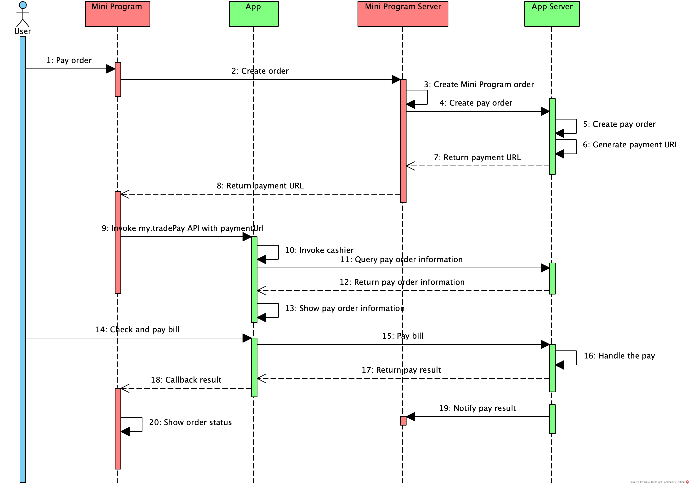

# Utilice PaymentUrl para pagar

Los usuarios pueden usar la aplicación de billetera para pagar el pedido realizado en el programa mini si la aplicación de billetera proporciona el servicio de pago.Este documento presenta el pago llamando a la API My.Tradepay con PaymentUrl.Tanto los procesos de integración para los desarrolladores de mini programas como la experiencia del usuario para los usuarios son similares a los del pago por Tradeno.

## Experiencia de usuario

Para completar un pago en el programa mini, Los usuarios generalme siguen los pasos una continua:

1. El usuario elige bienes en el programa mini y crea un pedido, luego presiona el botón de pago en el mini program.
2. El mini programa redirige al usuario a la aplicación de billetera y la aplicación de billetera muestra la página de pago.
3. El usuario confirma la información del pedido, como el beneficiario y el monto, luego hace clic en el botón de pago para realizar el pago.
5. Después de confirmar el pago, la aplicación de billetera muestra el resultado del pago y redirige al usuario a la página del resultado del pago en el mini programa.

## Procedimientos

Para usar la API ```my.tradePay``` para iniciar un pago en el Mini Programa, los desarrolladores de Mini del Programa deben completar los siguientes pasos:

1. Confirme que el servicio de pago proporcionado por la aplicación de billetera admite el pago por pago y obtenga la guía de integración de la aplicación de billetera.

2. Integre el servicio de pago en el lado del servidor Mini del programa.

3. Cree un mini programa en el espacio de trabajo de la billetera en la plataforma Mini Program, o asegúrese de que el Mini programa pueda publicarse en la aplicación de billetera.

4. Proporcionar bienes y servicios de pago en el Mini Programa.

5. Publique el mini programa.

## Proceso de pago

La siguiente figura ilustra el proceso de pago:



El proceso de pago contiene los siguientes pasos:

1. El usuario realiza un pedido en el Mini Programa (Paso 1).
2. El cliente mini del programa envía una solicitud para crear el pedido al servidor MINI del programa llamando a la API My.Request (Paso 2).
3. El servidor MINI del programa crea el pedido y envía la solicitud al servidor de billetera a través de la API del servidor proporcionada por la billetera (paso 3 y 4).
4. El servidor de la billetera crea el pedido y genera pagos, luego devuelve el pago de pagos al servidor Mini del programa (paso 5-7).
5. El servidor Mini del programa devuelve el pago al cliente mini del programa (paso 8).
6. El Cliente Mini del Programa inicia la solicitud de pago llamando a la API My.Tradepay con PaymentUrl a la aplicación de billetera (Paso 9).
7. La aplicación de billetera obtiene la información del pedido y hace que la página del cajero (paso 10-13).
8. El usuario confirma el pago y la billetera procesa la solicitud de pago (paso 14-17).
9. La aplicación de billetera devuelve el resultado de pago al cliente mini del programa.Al mismo tiempo, el servidor de billetera devuelve el resultado de pago al servidor MINI del programa (paso 18 y 19).
10. El cliente mini del programa muestra el resultado del pago (paso 20).

Nota:

El flujo de pago es para referencia y puede variar según la implementación de la API de la billetera.

Codigo de ejemplo:

Código de muestra para el my.tradepay API llamadas con PaymentUrl es el siguiente:

```js
my.tradePay({
    paymentUrl: 'payment url',  
    success: function(res) {            
        my.alert({
            content: JSON.stringify(res),
        });
    },
    fail: function(res) {  
        my.alert({
            content: JSON.stringify(res),
        });
    },
});
```