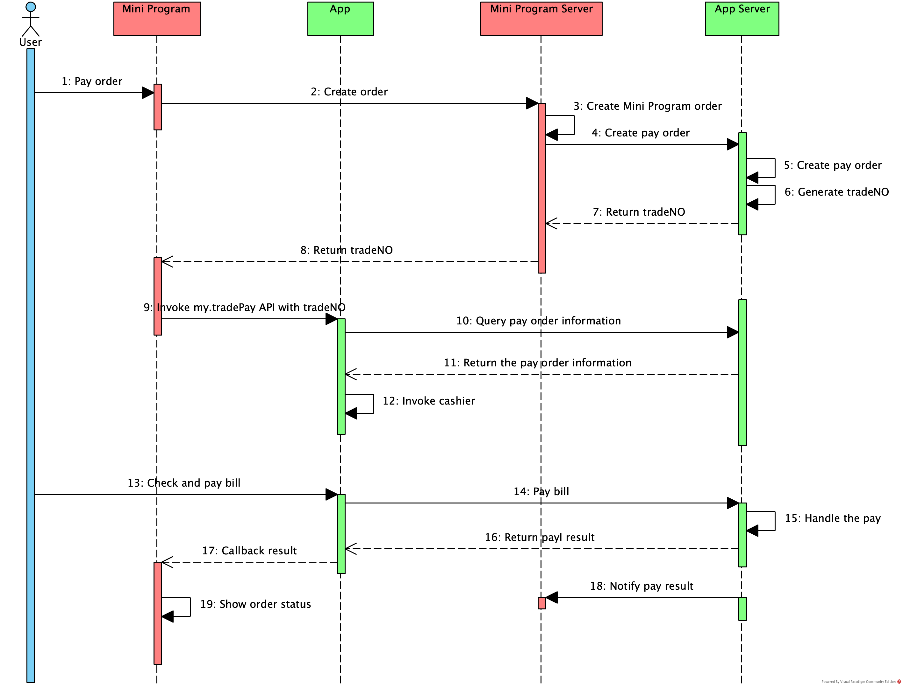

# Uso de TradeNO para pagos

Los usuarios pueden usar la aplicación de billetera para pagar el pedido realizado en el mini program si la aplicación de billetera proporciona el servicio de pago.Este documento presenta el pago llamando a la API [My.Tradepay](/) con ```tradeNo```.

## Experiencia de usuario

Para completar un pago en el mini program, los usuarios generalmente siguen los pasos a continuación:

1. El usuario elige bienes en el mini program y crea un pedido, luego presiona el botón de pago en el mini program.

2. El mini program redirige al usuario a la aplicación de billetera y la aplicación de billetera muestra la página de pago.

3. El usuario confirma la información del pedido, como el beneficiario y el monto, luego hace clic en el botón de pago para realizar el pago.

4. Después de confirmar el pago, la aplicación de billetera muestra el resultado del pago y redirige al usuario a la página del resultado del pago en el mini program.

## Procedimientos

Para usar la API my.tradePay para iniciar un pago en el Mini Programa, los desarrolladores de mini program deben completar los siguientes pasos:


1. Confirme que el servicio de pago proporcionado por la aplicación de billetera admite el pago por tradeNo y obtenga la guía de integración de la billetera.

2. Integre el servicio de pago en el lado del servidor mini program.

3. Cree un mini programa en el espacio de trabajo de la billetera en la plataforma Mini Program, o asegúrese de que el Mini programa pueda publicarse en la aplicación de billetera.

4. Proporcionar bienes y servicios de pago en el Mini Programa.

5. Publicar el mini program.

## Proceso de pago

La siguiente figura ilustra el proceso de pago:



El proceso de pago contiene los siguientes pasos:

1. El usuario realiza un pedido en el Mini Programa (Paso 1).
2. El cliente mini program envía una solicitud para crear el pedido al servidor mini program llamando a la API [my.request](/) (Paso 2).
3. El servidor mini program crea el pedido y envía la solicitud al servidor de billetera a través de la API del servidor proporcionada por la billetera (paso 3 y 4).
4. El servidor de la billetera crea el pedido y genera ```TradeNo```, luego devuelve ```TradeNo``` al servidor mini program (paso 5-7).
5. El servidor mini program devuelve ```TradeNo``` al Mini Cliente del Programa (Paso 8).
6. El cliente mini program inicia la solicitud de pago llamando a la API [my.tradePay](/) con ```TradeNo``` a la aplicación de billetera (Paso 9).
7. La aplicación de billetera obtiene la información del pedido y hace que la página del cajero (paso 10-12).
8. El usuario confirma el pago y la billetera procesa la solicitud de pago (paso 13-16).
9. La aplicación de billetera devuelve el resultado de pago al cliente mini program.Al mismo tiempo, el servidor de billetera devuelve el resultado de pago al servidor mini program (paso 17 y 18).
10. El cliente mini program muestra el resultado del pago (paso 19).

**Nota:**

El flujo de pago es para referencia y puede variar según la implementación de la API de la billetera.

## Código de muestra

El código de muestra para el ```my.tradepay``` la llamada a la API es la siguiente:

```js
my.tradePay({
    tradeNO: '201711152100110410533667792',  
    success: function(res) {            
        my.alert({
            content: JSON.stringify(res),
        });
    },
    fail: function(res) {  
        my.alert({
            content: JSON.stringify(res),
        });
    },
});
```