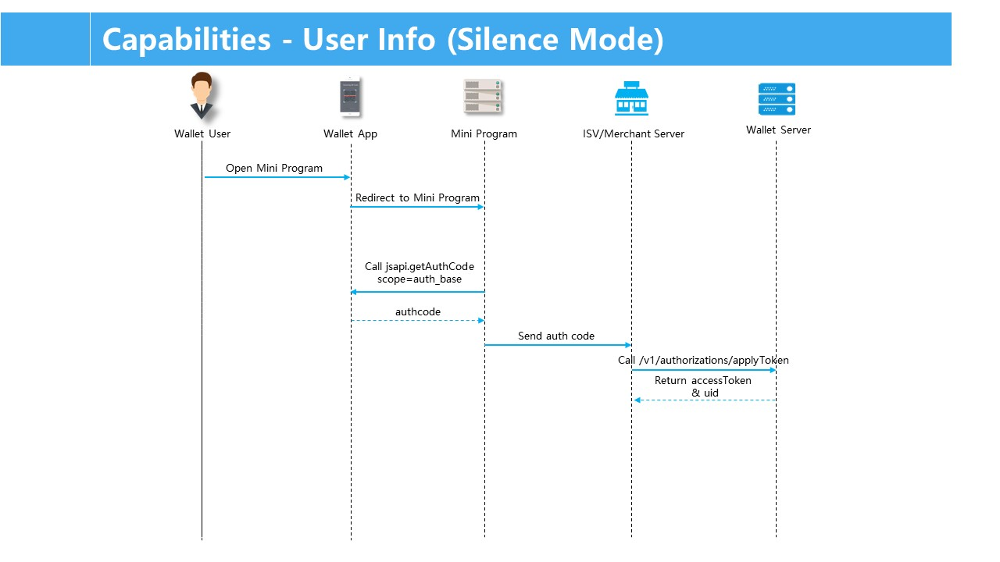
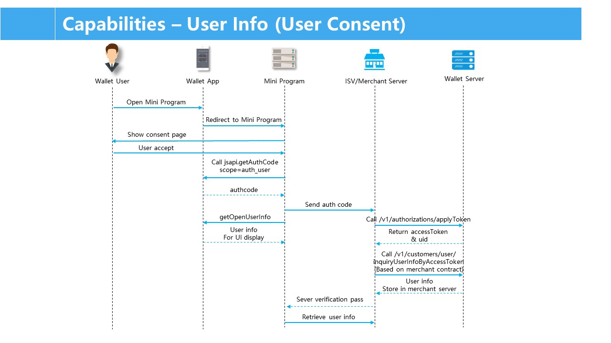

# Capacidad de la información del usuario

Toda la información del usuario en la plataforma de los mini program requiere la autorización del usuario.Según el mecanismo de autorización estándar de la industria OAuth2.0, los desarrolladores de mini programas pueden obtener la autorización del usuario para obtener información del usuario.

**Nota**: Los desarrolladores deben respetar completamente la privacidad de los usuarios y usar correctamente la autorización del usuario.Si se encuentra que la información se utiliza más allá del alcance acordado o el uso razonable, la plataforma tiene el derecho de retirar permanentemente la autoridad de interfaz del Mini Programa.

## Requisitos previos 

Esta capacidad está abierta a comerciantes que se han convertido en socios comerciales de la billetera.s de la billetera.
Asegúrese de que la integración y la configuración se hayan completado y se haya lanzado el mini programa.

## Proceso de interacción

### Modo silencioso

El modo silencioso requiere que el consentimiento del usuario en una aplicación nativa recopile la información requerida.El flujo de interacción del modo de silencio se ilustra como se muestra a continuación:



1. El usuario abre la aplicación de billetera y se redirige al Mini Programa Mercant.
2. El Mini programa Merchant llama al GetAuthcode JSAPI para solicitar AuthCode de la aplicación de billetera.
3. La aplicación de billetera devuelve AuthCode al programa Merchant Mini, que envía AuthCode al servidor ISV o Merchant.
4. Con el Código ```authCode``` obtenido en el Paso 3, el servidor ISV o comerciante llama a ```/{versión}/oauths/applyToke``` OpenApi para solicitar AccessToken y UID desde el servidor de billetera.

Nota: La ```version``` es la versión de Open APIs, por ejemplo, V1 o V2.

5. El servidor de billetera devuelve AccessToken y UID al ISV o Merchant Server.

**Notas:**

- AuthCode se utiliza para intercambiar por AccessToken.Cada vez que se completa la autorización del usuario, AuthCode en la respuesta JSAPI es diferente.Authcode solo se puede usar una vez y expirará automáticamente en un día.

- Después de que el ISV o el comerciante obtengan AccessToken y UID:
    - El ISV o el comerciante pueden usar AccessToken para llamar a otros OpenApis.Por ejemplo, llame a la investigación de consultyUserInfobyAccessToken OpenAPI para consultar la información del usuario.
    - El ISV o el comerciante pueden generar una sesión que se asigna a AccessToken y UID, luego establecer el tiempo de vencimiento de la sesión y almacenar el mapeo.La sesión se almacenará en el marco de mini del programa.

## Modo de consentimiento de usuario

El modo de consentimiento del usuario se utiliza para obtener información pública del usuario sin un permiso adicional de las billeteras.El flujo de interacción del modo de consentimiento del usuario se ilustra como se muestra a continuación:



#### Obtenga información de apertura del usuario

Cuando el Merchant Mini programa tiene la intención de obtener información pública de usuarios, como Name and Avatar, use el modo de consentimiento del usuario con GetOpenuserInfo JSAPI.El usuario debe firmar el acuerdo y hacer clic en el botón Aceptar.Esta función se utiliza para mostrar algunos datos personales del usuario en el mini programa.

#### Obtener código de autores

Cuando el programa Merchant Mini tiene la intención de obtener AuthCode para un uso adicional, llame al ```getAuthCode``` JSAPI especificando el campo de ```scope```.

## Lista de la API

<table>
    <tbody>
        <tr>
            <th>
                JSAPI
            </th>
            <th>
                Descripción
            </th>
        </tr>
        <tr>
            <td>
                my.getOpenUserInfo
            </td>
            <td>
                Obtiene información básica del usuario, como avatar, nombre de usuario, etc.
            </td>
        </tr>
        <tr>
            <td>```my.getAuthCode```</td>
            <td>Obtiene el código de autenticación del usuario.</td>
        </tr>
        <tr>
            <th>
                OpenAPI
            </th>
            <th>
                Descripción
            </th>
        </tr>
        <tr>
            <td>
                ``` /{versión}/autorizaciones/{apiname} ```
                Nota: La versión de api abierta, por eJemplo, v1 o v2
            </td>
            <td>
                Para más detalles, consulte las API abiertas para los comerciantes un capítulo.
            </td>
        </tr>
        <tr>
            <td>
                 ```/{version}/users/inquiryUserInfo```
            </td>
        </tr>
    </tbody>
</table>

## Mas información

[Capacidades](/)

[JSAPIs](/)

[Open APIs](/)

[Desarrollo de mini program](/)

[Uso de Mini Program Platform](/)

[Características](/)
