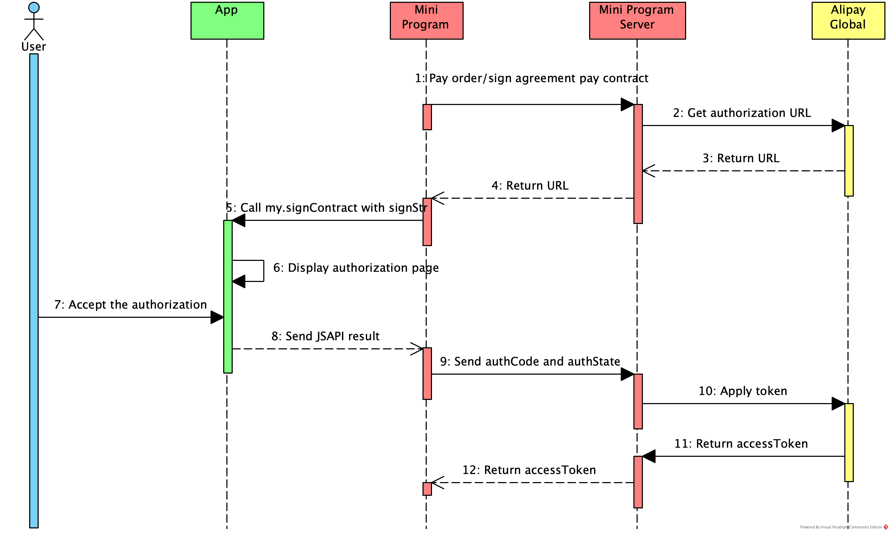

# my.signContract

Utilice esta API para redirigir al usuario a la página de autorización. Después de que el usuario complete la autorización, la aplicación devolverá el código de autorización que se puede usar para obtener el token de acceso para el pago del acuerdo.

**Nota:**

Asegúrese de usar Appx con la versión 1.24.6 o superior para utilizar esta API.

A continuación se muestra un diagrama que ilustra cómo funciona la interacción:



El servidor del Mini Program del merchant puede llamar a [la API de consulta de autorización](/) en el paso 2 para obtener el contenido de la firma con una URL de autorización. Luego, el Mini Program llamará al JSAPI `my.signContract` para invocar el proceso de autorización. Después de que el usuario complete la autorización, el Mini Programa envía el resultado de JSAPI a su servidor para que el servidor pueda llamar a la [API de aplicación de token](/) para obtener el accessToken.

## Ejemplo del código

```javascript
my.signContract({
  signStr: 'https://openauth.xxx.com/authentication.htm?authId=FBF16F91-28FB-47EC-B9BE-27B285C23CD3',
  success: (res) => {
    my.alert({
    content: JSON.stringify(res),
  });
  },
  fail: (res) => {
    my.alert({
    content: JSON.stringify(res),
  });
  }
});
```

## Parámetros

| Propiedad | Tipo     | Requerido | Descripción                                      |
| --------- | -------- | --------- | ------------------------------------------------ |
| signStr   | String   | Sí        | Esta es la cadena de autorización devuelta por la aplicación para continuar con el proceso de autorización. |
| success   | Function | No        | Función de devolución de llamada al tener éxito en la llamada. |
| fail      | Function | No        | Función de devolución de llamada al fallar la llamada. |
| complete  | Function | No        | Función de devolución de llamada al completarse la llamada (para ejecutarse tanto en caso de éxito como de fallo). |

### Función de devolución de llamada al tener éxito

| Propiedad  | Tipo    | Descripción                                      |
| ----------| --------| ------------------------------------------------ |
| authState | String  | El estado de autorización. Se genera en el servidor del Mini Programa y se envía al servidor de la aplicación. La longitud máxima es 256. Consulte [aquí](/) para más detalles. |
| authCode  | String  | El código de autorización asignado por la aplicación que se puede usar para obtener el token de acceso para el pago del acuerdo. La longitud máxima es 32. |

Un ejemplo de un mensaje devuelto exitosamente es el siguiente:

```js
{
	"authState":"663A8FA9-D836-48EE-8AA1-1FF682989DC7",
	"authCode":"663A8FA9D83648EE8AA11FF682989DC7"
}
```

### Función de devolución de llamada al fallar

| Propiedad  | Tipo    | Descripción                                      |
| ----------| --------| ------------------------------------------------ |
| error      | String  | El código de error para el fallo. |
| errMessage | String  | El mensaje de error. |

### Códigos de error

Cuando ocurre un error, se ejecutará la función de devolución de llamada de fallo. El código de error puede hacer referencia a la siguiente tabla.

| Código de error | Descripción                                      |
| ----------------| ------------------------------------------------ |
| 6001            | El usuario cancela el proceso de firma. |
| 6002            | La firma falla debido a un error de red. |
| 7001            | El resultado de la firma es desconocido, puede ser exitoso. |
| 7002            | La firma falla. |
