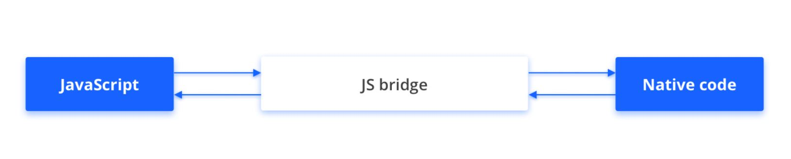

# Guía de puentes JS para el lanzamiento de aplicaciones cruzadas

Este documento lo guía a través de los pasos para usar el puente JavaScript (JS) al llamar a JSAPIS para mini programas en el escenario de lanzamiento de la aplicación cruzada.

## Descripción general

Para los mini programas que se lanzan a diferentes aplicaciones nativas, se ejecutan en diferentes contenedores.Los JSAPIS que pueden llamar estos mini programas pueden variar.Para resolver este problema, recomendamos que los desarrolladores de mini programas usen el puente JavaScript (JS) para que los mini programas llamen a los JSAPI estándar proporcionados por Mini Program Platform.

JS Bridge funciona como un puente que construye un canal de dos vías para la comunicación entre JavaScript y el código nativo.Al usar JS Bridge, los desarrolladores de mini programa pueden llamar a JSAPIS para los mini programas lanzados a diferentes aplicaciones nativas.



:::info[NOTA]
El puente JS es opcional para los miniprogramas que no necesitan un lanzamiento cruzado entre aplicaciones.
:::

## Audiencia
Este documento está dirigido a desarrolladores que llaman a JSAPIS al depurar mini programas para el lanzamiento de la aplicación cruzada.

## Procedimientos
Para usar el puente JS, consulte los siguientes pasos:

### Paso 1: Instalar JS Bridge
Ejecute el siguiente código en el directorio raíz del Proyecto Mini del Programa:

```js
npm install hylid-bridge --save
```

Para obtener más información sobre NPM, consulte [Gestión de paquetes de NPM](/).

### Paso 2: Use Puente JS

#### Miniprogramas nativos

Para usar el puente JS en los mini programas nativos, debe importar el paquete ```Hylid-Bridge``` en la página del mini programa. Luego puede llamar al JSAPIS exportado por el paquete. Para obtener más información, consulte el código de muestra a continuación.

##### Código de muestra

```js
import { alert } from 'hylid-bridge'

Page({
  onLoad() {
     alert({
        content: 'app onload'
     })
  }
})
```
#### Mini programas HTML5
Para usar el puente JS en los mini programas HTML5, consulte [el mini programa JSAPIS en HTML5](/).

:::info[NOTA]
Para obtener más información sobre mini programas nativos y mini programas HTML5, consulte [los tipos de mini programas](/).
:::

### Paso 3: Verifique la aplicación nativa (opcional)
Para algunos JSAPIS que no son compatibles con la aplicación nativa donde se lanza el mini programa, JS Bridge lanzará un error.Verifique el mensaje de error e importe ```appEnv``` desde ```hylid-bridge``` para verificar en qué aplicación nativa se ejecuta un programa mini.Luego resuelva el error en consecuencia.Para obtener más información, consulte el código de muestra a continuación.

#### Código de muestra

```js
import { appEnv, getAppIdSync } from 'hylid-bridge'

Page({
  onLoad() {
    const { appId } = appEnv.isLazada ? getAppIdSync() : { appId: 'taobao-appid' }
  }
})
```
:::info[NOTA]
Si usa el paquete Hylid-Bridge, le recomendamos que use ```appEnv``` para verificar la aplicación nativa antes de llamar a los JSAPIS únicos de la aplicación nativa a través del formato my[Apiname].
:::

Por ejemplo, para llamar a un JSAPI único en Taobao, consulte el código de muestra a continuación:

```js
import { appEnv } from 'hylid-bridge'

Page({
  onLoad() {
    if(appEnv.isTaobao) {
       my.tb.navigateToTaobaoPage()
    }
  }
})
```
## Lista de API
La siguiente tabla enumera los últimos JSAPIS que son compatibles con los puentes JS:
<table>
    <tr>
        <th>Nombre de la interfaz</th>
        <th>Descripción</th>
    </tr>
    <tr>
        <th>Básica</th>
        <td></td>
    </tr>
     <tr>
        <td>[getAppIdSync](/)</td>
        <td>Obtiene la ID de la aplicación Mini del programa sincrónicamente.</td>
    </tr>
    <tr>
        <th>BarraNavegacion</th>
        <td></td>
    </tr>
     <tr>
        <td>[hideBackHome](/)</td>
        <td>Oculta el botón de inicio.</td>
    </tr>
     <tr>
        <td>[hideNavigationBarLoading](/)</td>
        <td>Oculta la carga de la barra de navegación.</td>
    </tr>
     <tr>
        <td>[setNavigationBar](/)</td>
        <td>Establece el texto y el estilo de la barra de navegación.</td>
    </tr>
     <tr>
        <td>[showNavigationBarLoading](/)</td>
        <td>Muesta la carga de barra de navegación.</td>
    </tr>
    <tr>
        <th>BarraPestañas</th>
        <td></td>
    </tr>
     <tr>
        <td>[hideTabBar](/)</td>
        <td>Oculta la barra de pestañas</td>
    </tr>
     <tr>
        <td>[setTabBarStyle](/)</td>
        <td>Establece el estilo de la barra de pestañas.</td>
    </tr>
    <tr>
        <th>Ruta</th>
        <td></td>
    </tr>
     <tr>
        <td>[switchTab](/)</td>
        <td>Salta a la página de TabBar especificada y cierre todas las demás páginas que no son TabBar.</td>
    </tr>
     <tr>
        <td>[navigateTo](/)</td>
        <td>Mantenga la página actual y salte a la página especificada dentro de la aplicación.Use NavigateBackto Regrese a la página original.</td>
    </tr>
     <tr>
        <td>[reLaunch](/)</td>
        <td>Cierra todas las páginas actuales y salte a la página especificada dentro de la aplicación.</td>
    </tr>
    <tr>
        <td>[navigateBack](/)</td>
        <td>Cierra la página actual y vuelva a la anterior una o más páginas.</td>
    </tr>
    <tr>
        <td>[redirectTo](/)</td>
        <td>Cierra la página actual y salte a la página especificada dentro de la aplicación.</td>
    </tr>
    <tr>
        <th>Comentarios</th>
        <td></td>
    </tr>
     <tr>
        <td>[alert](/)</td>
        <td>Cuadro de alerta.</td>
    </tr>
     <tr>
        <td>[confirm](/)</td>
        <td>Confirmar el cuadro.</td>
    </tr>
     <tr>
        <td>[prompt](/)</td>
        <td>Cuadro inmediato.</td>
    </tr>
    <tr>
        <td>[showToast](/)</td>
        <td>Muestre una sugerencia débil, que desaparece en los segundos especificados.</td>
    </tr>
    <tr>
        <td>[hideToast](/)</td>
        <td>Esconde la sugerencia débil.</td>
    </tr>
    <tr>
        <td>[showLoading](/)</td>
        <td>Muestre la sugerencia de carga.</td>
    </tr>
    <tr>
        <td>[hideLoading](/)</td>
        <td>Oculta la sugerencia de carga.</td>
    </tr>
    <tr>
        <td>[showActionSheet](/)</td>
        <td>Muestra un menú de operación.</td>
    </tr>
    <tr>
        <th>Desplegable</th>
        <td></td>
    </tr>
     <tr>
        <td>[onPullDownRefresh](/)</td>
        <td>En la página, personalice la función OnpuldownRefresh para escuchar el evento Pull to-Frresh del usuario.</td>
    </tr>
     <tr>
        <td>[stopPullDownRefresh](/)</td>
        <td>Detenga el pull-to-refresh para la página actual.</td>
    </tr>
    <tr>
        <td>[startPullDownRefresh](/)</td>
        <td>Inicie la función pull-to-refresh.</td>
    </tr>
     <tr>
        <th>Animación</th>
        <td></td>
    </tr>
     <tr>
        <td>[createAnimation](/)</td>
        <td>Crea una instancia de animación.</td>
    </tr>
    <tr>
        <th>Teclado</th>
        <td></td>
    </tr>
     <tr>
        <td>[hideKeyboard](/)</td>
        <td>Oculta el teclado.</td>
    </tr>
    <tr>
        <th>Desplazarce</th>
        <td></td>
    </tr>
     <tr>
        <td>[pageScrollTo](/)</td>
        <td>Desplácese a la ubicación de destino de la página.</td>
    </tr>
    <tr>
        <th>Definir fondo</th>
        <td></td>
    </tr>
    <tr>
        <td>[setBackgroundColor](/)</td>
        <td>Establece color de fondo.</td>
    </tr>
      <tr>
        <th>Establecer página desplegable</th>
        <td></td>
    </tr>
    <tr>
        <td>[setCanPullDown](/)</td>
        <td>Establece si la página puede admitir pulldown.</td>
    </tr>
     <tr>
        <th>Almacenamiento</th>
        <td></td>
    </tr>
    <tr>
        <td>[setStorage](/)</td>
        <td>Almacena los datos en la clave especificada en el caché local, que se superpone a los datos originales correspondientes a la clave.</td>
    </tr>
    <tr>
        <td>[setStorageSync](/)</td>
        <td>Almacena sincrónicamente los datos en la clave especificada en el caché local.</td>
    </tr>
    <tr>
        <td>[getStorage](/)</td>
        <td>Obtiene datos en caché.</td>
    </tr>
    <tr>
        <td>[getStorageSync](/)</td>
        <td>Obtiene datos en caché sincrónicamente.</td>
    </tr>
    <tr>
        <td>[removeStorage](/)</td>
        <td>Elimina datos en caché.</td>
    </tr>
    <tr>
        <td>[removeStorageSync](/)</td>
        <td>Elimina datos en caché sincrónicamente.</td>
    </tr>
    <tr>
        <td>[clearStorage](/)</td>
        <td>Borra el caché de datos locales.</td>
    </tr>
    <tr>
        <td>[clearStorageSync](/)</td>
        <td>Borra el caché de datos locales sincrónicamente.</td>
    </tr>
     <tr>
        <th>Ubicación</th>
        <td></td>
    </tr>
    <tr>
        <td>[getLocation](/)</td>
        <td>Obtiene la ubicación geográfica actual del usuario.</td>
    </tr>
     <tr>
        <th>Red</th>
        <td></td>
    </tr>
    <tr>
        <td>[request](/)</td>
        <td>Solicitud de red.</td>
    </tr>
    <tr>
        <td>[getNetworkType](/)</td>
        <td>Obtiene el estado de red actual.</td>
    </tr>
     <tr>
        <th>Información del sistema</th>
        <td></td>
    </tr>
    <tr>
        <td>[getSystemInfo](/)</td>
        <td>Obtiene información del sistema.</td>
    </tr>
     <tr>
        <th>Portapapeles</th>
        <td></td>
    </tr>
    <tr>
        <td>[getClipboard](/)</td>
        <td>Obiene los datos del portapapeles.</td>
    </tr>
    <tr>
        <td>[setClipboard](/)</td>
        <td>Establece los datos del portapapeles.</td>
    </tr>
     <tr>
        <th>Guía de permiso</th>
        <td></td>
    </tr>
    <tr>
        <td>[showAuthGuide](/)</td>
        <td>Guia a los usuarios para que concedan la autorización cuando sea necesario.</td>
    </tr>
     <tr>
        <th>Escanear</th>
        <td></td>
    </tr>
    <tr>
        <td>[scan](/)</td>
        <td>Llama a la función de escaneo de código QR.</td>
    </tr>
     <tr>
        <th>Advertencia de memoria</th>
        <td></td>
    </tr>
    <tr>
        <td>[onMemoryWarning](/)</td>
        <td>Escucha el evento de alarma de memoria insuficiente.</td>
    </tr>
    <tr>
        <td>[offMemoryWarning](/)</td>
        <td>Desactiva la alarma de memoria insuficiente.</td>
    </tr>
     <tr>
        <th>Vista web</th>
        <td></td>
    </tr>
    <tr>
        <td>[createWebViewContext](/)</td>
        <td>Al crear WebViewContext, Mini Program puede enviar mensajes a Web-View. Esta API creará una instancia de WebViewContext.</td>
    </tr>
     <tr>
        <th>Capacidades abiertas</th>
        <td></td>
    </tr>
    <tr>
        <td>[getAuthCode](/)</td>
        <td>Obtiene código de autenticación.</td>
    </tr>
    <tr>
        <td>[getOpenUserInfo](/)</td>
        <td>Obtiene información básica sobre el usuario.</td>
    </tr>
    <tr>
        <td>[tradePay](/)</td>
        <td>Empieza a pagar.</td>
    </tr>
</table> 

:::info[NOTA]
La lista de API se actualizará constantemente.
:::

## Preguntas frecuentes

### ¿Cómo solicitar el permiso de llamadas de JSAPI?

Algunas aplicaciones nativas tienen restricciones para llamar a JSAPIS.Debe solicitar permisos de la aplicación nativa para que su mini programa pueda llamar a JSAPIS específicos.

Por ejemplo, si lanza el mini programa a Taobao, debe enviar solicitudes a Taobao para llamar a los JSAPIS proporcionados por Taobao.De lo contrario, la llamada JSAPI podría fallar. Vea [aquí](/) para aprender a solicitar permisos de Taobao.

Para los mini programas que se lanzan a otras aplicaciones nativas, consulte las aplicaciones nativas para obtener documentación.

### ¿Cómo los dominios de la lista blanca?

Al llamar a JSAPIS proporcionado por las aplicaciones nativas, puede encontrar el control de los nombres de dominio.Para resolver este problema, agregue ciertos dominios a la lista blanca.

Por ejemplo, si lanza el mini programa a Taobao, Taobao implementa el control de nombres de dominio. Vea [aquí](/) para aprender a blanquear sus dominios en Taobao.

Para los mini programas que se lanzan a otras aplicaciones nativas, consulte las aplicaciones nativas para obtener documentación.

### ¿Cómo establecer la barra de navegación en Lazada?

Para habilitar la barra de navegación de su mini programa en Lazada, debe establecer ```navigationBarForceEnable``` a ```verdadero``` en el campo de la ```ventana``` del archivo ```app.json``` en el directorio raíz del proyecto Mini Project.


## Más información

[Gestión de paquetes de NPM](/)

[Tipos de mini programas](/)

[Cómo transformar una aplicación móvil HTML5 en un mini programa HTML5](/)


