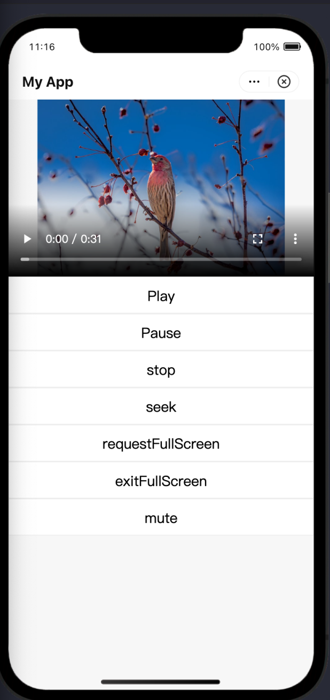

La **my.createVideoContext** API se utiliza para reproducir vídeos en mini-programas. Puedes llamar a esta API para ingresar *videoId* y devolver *videoContext*, donde *videoId* se refiere al atributo de ID personalizado por el desarrollador en la pestaña de vídeo correspondiente, y puedes operar un componente de vídeo a través de *videoContext*.

## Antes de que empieces

Antes de llamar a la API my.createVideocontext, debe tener en cuenta las siguientes cosas:

* La versión GriversDK debe ser al menos 2.48.0.Si la versión es anterior a 2.48.0, llamar a esta API puede causar bloqueos de aplicaciones.
* La Mini Biblioteca Core del Programa (APPX) debe ser la versión 2.0.Para obtener más información sobre cómo actualizar APPX a 2.0, comuníquese con su arquitecto de solución para la documentación.

:::note
Para aprender sobre qué versiones son los APPX y el GriversDK que integran, consulte cómo obtener sus versiones actuales.
:::

* Las animaciones CSS no son compatibles.
* Formato de paquete de video compatible para iOS y Android: MP4
* Formato de codificación compatible para iOS y Android: H.264

## Efecto

La siguiente figura muestra el efecto de la reproducción de video.



## Parámetros

La siguiente tabla enumera los parámetros de solicitud de la API my.createVideocontext.

<table>
    <tr>
        <th>Propiedad</th>
        <th>Tipo</th>
        <th>Descripción</th>
    </tr>
    <tr>
        <td>scr</td>
        <td>String</td>
        <td>La URL del recurso de video.Solo se admiten URL HTTPS.</td>
    </tr>
    <tr>
        <td>poster</td>
        <td>String</td>
        <td>La URL del póster de video.Si este parámetro no se especifica, el póster se establece por defecto como la primera trama del video.</td>
    </tr>
    <tr>
        <td>poster-size</td>
        <td>String</td>
        <td>
            El tamaño para mostrar el póster del vídeo cuando la relación de aspecto del póster es inconsistente con la relación de aspecto del vídeo. Especifica este parámetro siguiendo la misma regla para especificar el parámetro *background-size*. Para obtener más información sobre cómo especificar *background-size*, consulta Tamaño de imágenes: la propiedad 'background-size'.
            <br/>Valor predeterminado: `contain`
        </td>
    </tr>
    <tr>
        <td>initial-time</td>
        <td>String</td>
        <td>
            El momento específico en que el video comienza a reproducirse.La unidad de este parámetro es s (segundo).
        </td>
    </tr>
    <tr>
        <td>controls</td>
        <td>Boolean</td>
        <td>
            Indica si debe mostrar los controles de reproducción predeterminados, como el botón de reproducción, el botón de pausa, la barra de progreso y la longitud del video. 
            Valor por defecto: `true`
        </td>
    </tr>
    <tr>
        <td>autoplay</td>
        <td>Boolean</td>
        <td>
            Indica si reproducir el video automáticamente. 
            Valor por defecto: `false`
        </td>
    </tr>
    <tr>
        <td>direction</td>
        <td>Number</td>
        <td>
            La dirección cuando el video se reproduce en pantalla completa.Los valores válidos son:
            * 0: Indica que el video se reproduce en una dirección vertical.
            * 90: Indica que el video se gira en la dirección en sentido antihorario en 90 grados.
            * -90: Indica que el video se gira en sentido horario en 90 grados.
            <></>
            Si no se especifica este parámetro, la dirección se determina automáticamente por la relación de aspecto del video.
        </td>
    </tr>
    <tr>
        <td>loop</td>
        <td>Boolean</td>
        <td>
            Indica si se debe enojar el video. 
            <></>
            Valor por defecto: `false`
        </td>
    </tr>
    <tr>
        <td>muted</td>
        <td>Boolean</td>
        <td>Indica si reproducir el video en silencio. Valor por defecto: `false`</td>  
    </tr>
    <tr>
        <td>onPlay</td>
        <td>EventHandler</td>
        <td>Reproduce el video cuando el video comienza o continúa reproduciendo.</td>
    </tr>
    <tr>
        <td>onPause</td>
        <td>EventHandler</td>
        <td>Haga una pausa del video cuando el video se detiene para reproducir.</td>
    </tr>
    <tr>
        <td>onEnded</td>
        <td>EventHandler</td>
        <td>Termina el video cuando el video termina de reproducirse.</td>
    </tr>
    <tr>
        <td>onTimeUpdate</td>
        <td>EventHandler</td>
        <td>
            Actualiza el momento en que se reproduce el video.
            La muestra de código devuelta puede ser la siguiente: `event.detail = {currentTime: 'current position of the video playback',userPlayDuration:'user watching duration',videoDuration:'video length'}`
        </td>
    </tr>
    <tr>
        <td>onLoading</td>
        <td>EventHandler</td>
        <td>Carga el video cuando se está cargando el video.</td>
    </tr>
    <tr>
        <td>onError</td>
        <td>EventHandler</td>
        <td>Desencadena el código de error cuando se produce un error cuando se reproduce el video.Para obtener más información sobre los códigos de error, consulte los códigos de error.</td>
    </tr>
    <tr>
        <td>onFullScreenChange</td>
        <td>EventHandler</td>
        <td>
            Entra o abandona el modo de pantalla completa.
            La muestra de código devuelta puede ser la siguiente: `event.detail = {fullScreen, direction}`  , donde la `direction` debe establecerse como `vertical` u `horizontal`.
        </td>
    </tr>
    <tr>
        <td>onUserAction</td>
        <td>EventHandler</td>
        <td>
            El usuario opera la reproducción de video.
            La muestra de código devuelta puede ser la siguiente: `event.detail = {tag:"mute", value:0}`, dónde tag es el elemento que opera el usuario. Valores válidos de tag son:
            * `play`: Indica el botón en la parte inferior para reproducir el video.
            * `centerplay`: Indica el botón en el centro para reproducir el video.
            * `mute`: Indica el botón para silenciar el video.
            * `fullscreen`: Indica el botón para hacer el video de pantalla completa.
        </td>
    </tr>
    <tr>
        <td>onStop</td>
        <td>EventHandler</td>
        <td>Deja de reproducir el video.</td>
    </tr>
    <tr>
        <td>onRenderStart</td>
        <td>EventHandler</td>
        <td>Comienza a reproducir el video cuando se carga el video.</td>
    </tr>
</table>

## Códigos de error

La siguiente tabla enumera los códigos de error, sus descripciones, acciones adicionales y si los códigos de error son compatibles con el sistema Android o iOS.

<table>
    <tr>
        <th>Código de error</th>
        <th>Descripción</th>
        <th>Nuevas medidas</th>
        <th>Android</th>
        <th>iOS</th>
    </tr>
    <tr>
        <td>1</td>
        <td>Excepción desconocida</td>
        <td>Pruebe la llamada API nuevamente.</td>
        <td>✅</td>
        <td>✅</td>
    </tr>
    <tr>
        <td>1002</td>
        <td>Error del sistema de jugadores</td>
        <td>Verifique el sistema de reproductor.</td>
        <td>✅</td>
        <td>✅</td>
    </tr>
    <tr>
        <td>1005</td>
        <td>Error de red</td>
        <td>Consulte la red.</td>
        <td>✅</td>
        <td>🔲</td>
    </tr>
    <tr>
        <td>1006</td>
        <td>Error de metadatos</td>
        <td>Revise los metadatos.</td>
        <td>✅</td>
        <td>✅</td>
    </tr>
    <tr>
        <td>1007</td>
        <td>Error de inicialización del jugador</td>
        <td>Revise el jugador e inicialice nuevamente.</td>
        <td>✅</td>
        <td>🔲</td>
    </tr>
    <tr>
        <td>3001</td>
        <td>Error de renderizado de audio</td>
        <td>Compruebe si el recurso de audio cumple con los requisitos.</td>
        <td>✅</td>
        <td>🔲</td>
    </tr>
    <tr>
        <td>3002</td>
        <td>Error de decodificación de hardware</td>
        <td>Compruebe si la decodificación de hardware funciona.</td>
        <td>✅</td>
        <td>🔲</td>
    </tr>
</table>

## Códigos de muestra

### .axml

Refer to the following sample to learn about how to use AXML to call the API.

```html title="axml"
<view style="width:100%">
  <video
    style="width:100%"
    id="myVideo"
    src="{{video.src}}"
    poster-size="{{video.posterSize}}"
    poster="{{video.poster}}"
    controls="{{video.showAllControls}}"
    loop="{{video.isLooping}}"
    muted="{{video.muteWhenPlaying}}"
    autoplay="{{video.autoPlay}}"
    direction="{{video.directionWhenFullScreen}}"
    initial-time="{{video.initTime}}"
    onPlay="onPlay"
    onPause="onPause"
    onTap="onTap"
    onEnded="onEnded"
    onError="onError"
    onRenderStart="onRenderStart"
    onTimeUpdate="onTimeUpdate"
    onUserAction="onUserAction"
    onFullScreenChange="onFullScreenChange"
    onLoading="onLoading"
  ></video>
  <button type="default" size="defaultSize" onTap="play">Play</button>
  <button type="default" size="defaultSize" onTap="pause">Pause</button>
  <button type="default" size="defaultSize" onTap="stop">stop</button>
  <button type="default" size="defaultSize" onTap="seek">seek</button>
  <button type="default" size="defaultSize" onTap="requestFullScreen">
    requestFullScreen
  </button>
  <button type="default" size="defaultSize" onTap="exitFullScreen">
    exitFullScreen
  </button>
  <button type="default" size="defaultSize" onTap="mute">mute</button>
  <view style="height:1000">
  </view>
</view>
```

## .js

Consulte la siguiente muestra para aprender sobre cómo usar JavaScript para llamar a la API.

```js title="js"
Page({
  data: {
    video: {
      src: 'https://xxx.mp4',
      poster: "https://xxx.jpg",
      posterSize: "contain", //contain, cover
      showAllControls: false,
      isLooping: false,
      muteWhenPlaying: false,
      initTime: 0,
      autoPlay: false,
      directionWhenFullScreen: 0
    }
  },
  onLoad() {
    this.videoContext = my.createVideoContext('myVideo');
  },
  play() {
    this.videoContext.play();
  },
  pause() {
    this.videoContext.pause();
  },
  stop() {
    this.videoContext.stop();
  },
  seek() {
    this.videoContext.seek(15);
  },
  requestFullScreen() {
    this.videoContext.requestFullScreen({
      direction: -90,
    });
  },
  exitFullScreen() {
    this.videoContext.exitFullScreen();
  },
  mute() {
    this.videoContext.mute(false);
  },
  onPlay(e) {
    console.log('video: onPlay');
  },
  onPause(e) {
    console.log('video: onPause');
  },
  onEnded(e) {
    console.log('video: onEnded');
  },
  onError(e) {
    console.log('video: onPlayError, e=' + JSON.stringify(e));
  },
  onRenderStart(e) {
    console.log('video: onRenderStart');
  },
  onTimeUpdate(e) {
    // console.log('video: onTimeUpdate: ' +  JSON.stringify(e));
  },
  onUserAction(e) {
   console.log('video: onUserAction: ' +  JSON.stringify(e));
  },
  onTap(e) {
    console.log('video: onTap: ' +  JSON.stringify(e));
  },
  onFullScreenChange(e) {
    console.log('video: onFullScreenChange: ' +  JSON.stringify(e));
  },
  onLoading(e) {
    console.log('video: onLoading: ' +  JSON.stringify(e));
  },
});
```

## FAQs

### Cuando el usuario ve un video que se cargó y se ve una vez en el componente de video, ¿debe cargarse el video nuevamente?

Si el video se reproduce en un bucle, el caché del video se extrae cuando el usuario lo ve nuevamente;De lo contrario, el video debe cargarse nuevamente.

### ¿Cuándo se borran los videos en el caché?

Cuando la página o el mini programa están cerrados, se borra los videos en el caché.

### ¿Cómo puede el mini programa obtener la longitud del video?

El mini programa puede obtener la longitud del video a través del `onTimeUpdate` parámetro.

### ¿Cómo puedo solucionar problemas?

Da los siguientes pasos para la resolución de problemas:

1. Asegúrese de que el código AXML contenga el parámetro *id*, por ejemplo, `id="your-video-id"`.

2. Asegúrate de que el valor del parámetro *id* no sea una palabra reservada, como drawing-area-root, content-root, RenderView, contenedor TileGrid, contención de pageTiledBacking, o recorte de ancestros.

3. Asegúrate de que el valor del parámetro *id* consista solo en letras, `-`, y `_`, y no contenga caracteres especiales como `*` y `/`.

4. Asegúrate de que el valor del parámetro *id* no sea demasiado largo debido a contener el ID del mini programa o la marca de tiempo Unix actual.

5. Asegúrate de que el valor del parámetro *id* sea único. Por ejemplo, si el valor de *id* es `main-video`, no especifiques ningún valor similar como `main-video-wrapper`; de lo contrario, se generará `WKCompositingView`, lo que puede causar errores en la posición de los componentes en la misma capa.

6. Prueba la propiedad raw-controls para resolver el problema donde el componente de video está posicionado incorrectamente en una capa alta en tu mini programa.

## Apéndice

### Cómo obtener sus versiones actuales

Las actualizaciones del número de versión menor o de parche del Mini Program AppX o GriversDK traen funciones nuevas o mejoradas en elementos básicos, API o características de rendimiento.Para garantizar que estas funciones puedan funcionar en su mini programa, debe aprender sobre qué versiones integra actualmente y considerar la compatibilidad si es necesario.

Consulte el siguiente código de muestra para obtener las versiones actuales de su mini programa AppX y GriversDK, donde las versiones son ambas cadenas en el formato de `major.minor.patch`.

```js title="js"
/**
 * @description Appx version
 * @example "2.8.0"
 */
const sdkVersion = my.SDKVersion;
/**
 * @description GriverSDK version
 * @example "2.48.0"
 */
const griverVersion = my.getSystemInfoSync().griverVersion;
```

Además, puede llamar a la función de comparación para comparar las versiones actuales que integra con las versiones más bajas que se requieren en la sección Begins You Begin.El siguiente código muestra un ejemplo de llamar a la función de comparación.

```js title="js"
/**
 * @param {string} v1
 * @param {string} v2
 * @returns {-1 | 0 | 1}
 */
function compareVersion(v1, v2) {
  var s1 = v1.split(".");
  var s2 = v2.split(".");
  var len = Math.max(s1.length, s2.length);
  for (let i = 0; i < len; i++) {
    var num1 = parseInt(s1[i] || "0");
    var num2 = parseInt(s2[i] || "0");
    if (num1 > num2) {
      return 1;
    } else if (num1 < num2) {
      return -1;
    }
  }
  return 0;
}
// v1 > v2 return 1
1 === compareVersion("2.6.8", "1.24.10");
// v1 = v2 return 0
0 === compareVersion("2.6", "2.6.0"); 
```


