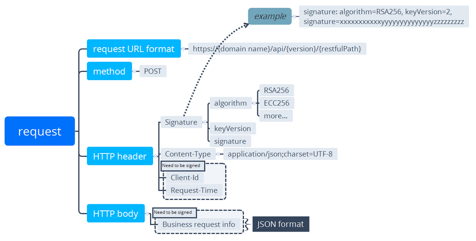
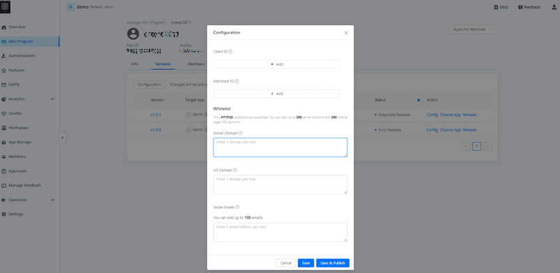
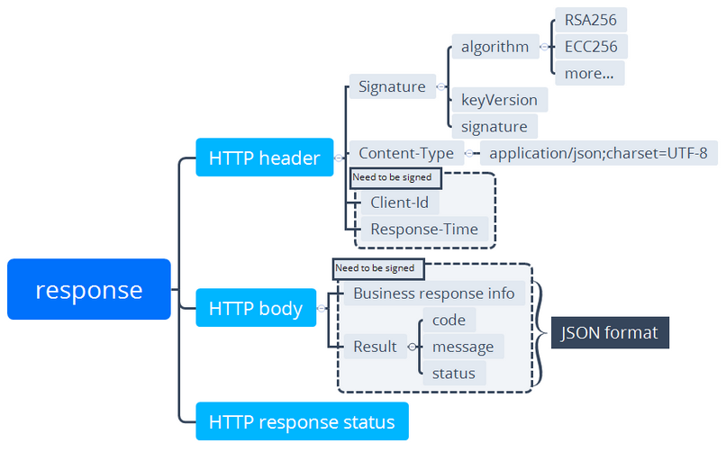

#  Descripción general

Los miniprograms ofrecen un conjunto de OpenAPIS para lograr diversas capacidades, por ejemplo, la capacidad de pago. Puede usar el método de publicación para enviar solicitudes HTTPS y recibir respuestas en consecuencia.

La siguiente sección introduce principalmente la estructura del mensaje y el flujo de trabajo de transmisión de mensajes de extremo a extremo.

## Versionamiento
La versión API actual es ```V2```. La versión se especifica en la URL.Por ejemplo:

```https://{host}/api/open/v2/payments/pay```.

## Estructura de mensajes

Antes de hacer cualquier solicitud, es importante comprender cómo funciona OpenApi y cómo se estructuran las solicitudes y respuestas. Esta sección presenta información general (como estructura de mensajes, campos de mensajes y transmisión de mensajes) de los mensajes en línea entre su sistema y el backend de la billetera.

## Estructura de solicitud (Request) 

La siguiente figura ilustra la estructura de solicitud.



## Solicitar URL 

La URL de solicitud es: ```https://{host}/api/open/{restful_path}```, que tiene la siguiente estructura:

<ul>
    <li>
        **host:** Incluye el host que es el nombre de dominio estándar asignado por el backend de la billetera.
    </li>
    <li>
        **resful_path:** es la ruta a la interfaz, por ejemplo, ```/{version}/payments/pay```
        * **version:**  es la versión de Open API, por ejemploe, ```v1``` or ```v2```. 
    </li>
</ul>

Una interfaz puede identificarse de manera única por ```restful_path```. Por ejemplo, el ```/v1/payments/pay``` es diferente de ```/v2/payments/pay```.


## Método de solicitud (method)

POST El método se utiliza para hacer una solicitud HTTP. 

## Encabezado de solicitud (Header)

El encabezado de solicitud contiene principalmente los siguientes campos.

* Nota: Los nombres de campo son insensibles al caso.

<table>
  <thead>
    <tr>
      <th>Header</th>
      <th>Required</th>
      <th>Code sample </th>
    </tr>
  </thead>
  <tbody>
    <tr>
      <td>Signature</td>
      <td>Yes</td>
      <td>```Signature: algorithm=RSA256, keyVersion=1, signature=****```</td>
    </tr>
    <tr>
      <td>Content-Type</td>
      <td>No</td>
      <td>```Content-Type: application/json; charset=UTF-8```</td>
    </tr>
    <tr>
      <td>Client-Id</td>
      <td>Yes</td>
      <td>```Client-Id: ****```</td>
    </tr>
    <tr>
      <td>Request-Time</td>
      <td>Yes</td>
      <td>```Request-Time: 2019-04-04T12:08:56.253+05:30```</td>
    </tr>
  </tbody>
</table>
              
For details of each header field, see the following description. 

## Firma

La firma contiene pares de valor clave que están separados por coma (,).Cada par de valores clave es una ecuación, que es una clave unida con su valor con un signo igual (=).

Se pueden configurar las siguientes claves:

    * **Algoritmo:** Especifica el algoritmo de firma digital que se utiliza para generar la firma. El valor no es sensible al caso.RSA256 y ECC224 son compatibles, y RSA256 es por defecto.
    * **Versión de clave:** Especifica la versión clave que se utiliza para generar o validar la firma.Por defecto, el valor es la última versión de la clave asociada con el ID Client.
    * **Firma:** Contiene el valor de firma de la respuesta.

Example:

<table>
    <thead>
        <tr>
        <td>
            Signature: algorithm=RSA256, keyVersion=1,
            signature=KEhXthj4bxxxJ801Hqw8kaLvEKc0Rii8KsNUazw7kZgjxyGSPuOZ48058UVJUkkR21iD9JkHBGR
            rWiHPae8ZRPuBagh2H3qu7fxY5GxVDWayJUhUYkr9m%2FOW4UQVmXaQ9yn%2Fw2dCtzwAW0htPHYrKMyrT
            pMk%2BfDDmRflA%2FAMJhQ71yeyhufIA2PCJV8%2FCMOa46303A0WHhH0YPJ9%2FI0UeLVMWlJ1XcBo3Jr
            bRFvcowQwt0lP1XkoPmSLGpBevxxxDE8%2FQ9WnxjPNDfrHnKgV2fp0hpMKVXNM%2BrLHNyMv3MkHg9iTMOD%
            2FFYDAwSd%2B6%xxxx
        </td>
        </tr>
    </thead>
</table>


## Content-Type (Optional)

Content-Type Indica el tipo de medio del cuerpo de la solicitud, según lo definido por RFC2616.En el cual, Charset se usa para generar/validar la firma.

Por ejemplo

<table>
    <thead>
        <tr>
        <td>
            Content-Type: application/json; charset=UTF-8
        </td>
        </tr>
    </thead>
</table>

## Identificación del cliente (Client-Id)

Cliente-ID se usa para identificar a un cliente y se asocia con las claves que se utilizan para la firma.

También en MiniProgram OAuth Scenario, aquí el ID Client también es la identificación del cliente de OAuth, que se llena en la plataforma SaaS de MiniProgram de la siguiente manera:




## Tiempo requerido (Request-Time)

Especifique el momento en que se envía la solicitud, según lo define ISO8601.

Nota: Este campo debe ser al menos preciso para segundos.

```Request-Time: 2019-04-04T12:08:56.253+05:30```


## Cuerpo de solicitud  (Request body)

The request body contains the detailed request information in JSON format. Fields enclosed in the request body vary depending on services. For more information, see the specific API specification document. 

## Estructura de respuesta (Response structure)

Las siguientes figuras ilustran la estructura de respuesta:



## Encabezado de respuestar (Response header )

El encabezado de respuesta lleva la información sobre la respuesta, que contiene principalmente los siguientes campos.

Nota: Los nombres de campo son insensibles al caso.

<table>
  <thead>
    <tr>
      <th>Header</th>
      <th>Required</th>
      <th>Code sample </th>
    </tr>
  </thead>
  <tbody>
    <tr>
      <td>Signature</td>
      <td>Yes</td>
      <td>```Signature: algorithm=RSA256, keyVersion=1, signature=****```</td>
    </tr>
    <tr>
      <td>Content-Type</td>
      <td>No</td>
      <td>```Content-Type: application/json; charset=UTF-8```</td>
    </tr>
    <tr>
      <td>Client-Id</td>
      <td>Yes</td>
      <td>```Client-Id: ****```</td>
    </tr>
    <tr>
      <td>Response-Time</td>
      <td>Yes</td>
      <td>```Request-Time: 2019-04-04T12:08:56.253+05:30```</td>
    </tr>
  </tbody>
</table>

Para obtener detalles de cada campo de encabezado, consulte la siguiente descripción. 

## Firma
Contiene pares de valor clave que están separados por coma (,).Cada par de valores clave es una ecuación, que es una clave unida con su valor con un signo igual (=).

Se pueden configurar las siguientes claves: 

  * **Algoritmo**: Especifica el algoritmo de firma digital que se utiliza para generar la firma. El valor no es sensible al caso. RSA256 y ECC224 son compatibles, y RSA256 es por defecto.
  * **KeyVersion**: Especifica la versión clave que se utiliza para generar o validar la firma.Por defecto, el valor es la última versión de la clave asociada con el ID Client.
  * **Firma**: contiene el valor de la firma de la respuesta.

  Example:

<table>
    <thead>
        <tr>
        <td>
              Signature: algorithm=RSA256, keyVersion=1,
              signature=KEhXthj4bxxxJ801Hqw8kaLvEKc0Rii8KsNUazw7kZgjxyGSPuOZ48058UVJUkkR21iD9JkHBGR
              rWiHPae8ZRPuBagh2H3qu7fxY5GxVDWayJUhUYkr9m%2FOW4UQVmXaQ9yn%2Fw2dCtzwAW0htPHYrKMyrT
              pMk%2BfDDmRflA%2FAMJhQ71yeyhufIA2PCJV8%2FCMOa46303A0WHhH0YPJ9%2FI0UeLVMWlJ1XcBo3Jr
              bRFvcowQwt0lP1XkoPmSLGpBevxxxDE8%2FQ9WnxjPNDfrHnKgV2fp0hpMKVXNM%2BrLHNyMv3MkHg9iTMOD%
              2FFYDAwSd%2B6%xxxx
        </td>
        </tr>
    </thead>
</table>

## Content-Type (Optional)

El tipo de contenido indica el tipo de medio del cuerpo de la respuesta, según lo definido por RFC2616. En el cual, Charset se usa para generar/validar la firma.Por ejemplo:

```Content-Type: Aplicación/JSON;Charset = UTF-8```

## Identificación del cliente (Client-Id)

Client-ID se utiliza para identificar a un cliente y se asocia con las claves que se utilizan para la firma. 

## Tiempo de respuesta (Response-Time)

Especifica el momento en que se devuelve la respuesta, según lo definido por ISO8601.

Nota: Este campo debe ser al menos preciso para segundos.

```Response-Time: 2019-04-04T14:08:56.253+05:30```


## Cuerpo de respuesta  (Response body)

El cuerpo de respuesta contiene la información que responde al cliente. Los campos en esta sección varían según los servicios.sin embargo, el ```result``` El objeto, que indica el resultado de una llamada API, siempre está contenido.

Cuando el estado del resultado ( ```resultStatus```) falló, desconocido o aceptado, el código de resultado( ```resultCode``` ) significa un código de error y el mensaje de resultado( ```resultMessage``` ) significa un mensaje de error, que se utiliza para el manejo de errores. Para obtener más información sobre los códigos de error, consulte el capítulo Códigos de error.

<table>
  <thead>
    <tr>
      <th>Campo</th>
      <th>Tipo de dato</th>
      <th>Requerida </th>
      <th>Descripción</th>
    </tr>
  </thead>
  <tbody>
    <tr>
      <td>resultStatus</td>
      <td>String</td>
      <td>No</td>
      <td>Estado de resultado.Los valores válidos son:
            S: exitoso
            F: Falló
            U: Desconocido
            R: Aceptado, aún no tener éxito, pero puede proceder con algunas acciones.</td>
    </tr>
    <tr>
      <td>resultCode</td>
      <td>String</td>
      <td>No</td>
      <td>Código de resultados.
          Longitud máxima: 64 caracteres</td>
    </tr>
    <tr>
      <td>resultMessage</td>
      <td>String</td>
      <td>No</td>
      <td>Mensaje de resultado que describe el código de resultado en detalle.
          Longitud máxima: 256 caracteres</td>
    </tr>
  </tbody>
</table>

## Flujo de trabajo de transmisión de mensajes

La siguiente figura es un ejemplo que ilustra el flujo de trabajo de transmisión de mensajes en MiniProgram.


## Procedimiento general

Siga el procedimiento general para llamar a una API.

## Preparations

Para evitar algunos posibles errores que pueda recibir en la respuesta, considere los siguientes factores:

    Understand API idempontency     

## 1. Construir una solicitud

Construya una solicitud cumpliendo con la estructura de solicitud, incluidos el encabezado de solicitud y el cuerpo.

Para garantizar la seguridad de la transmisión de mensajes, realice las siguientes medidas de seguridad al construir una solicitud. Para más detalles, consulte el Capítulo de seguridad de transmisión de mensajes.

        Debe firmar una solicitud.La firma de mensajes y la validación de firma son obligatorios para todas las solicitudes y respuestas.
        Codifique una solicitud para evitar errores o ambigüedad que pueda ser causada por caracteres especiales encerrados en una solicitud. Para obtener más información, consulte el Capítulo de codificación de mensajes.

## 2. Enviar una solicitud

Puede enviar una solicitud con sus plataformas o herramientas preferidas, por ejemplo, comando postman o curl.

## 3. Verifique la respuesta

La respuesta generalmente se devuelve en formato JSON o XML.Para obtener detalles sobre la respuesta, consulte la sección Estructura de respuesta. Después de recibir la respuesta, valida la firma de la respuesta.

## 4. Verifique el código de estado

Los datos de respuesta pueden variar según los servicios.Sin embargo, siempre se incluye el campo de resultados, que indica el resultado de una llamada API. Si se produce un error cuando llama a una API, se devuelve una respuesta de error, donde el objeto de resultado indica el código de error y el mensaje de error para que pueda solucionar problemas. Para obtener más información, consulte el Capítulo del Código de error.