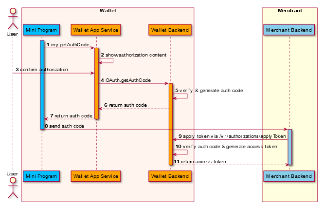

## /v1/authorizations/applyToken

POST ```/v1/authorizations/applyToken```

La ```applyToken``` La interfaz se utiliza para obtener el token de acceso.Esta interfaz se puede usar en los siguientes casos:

    * Después de que el comerciante recibe AuthCode de MiniProgram, el comerciante usa esta interfaz para solicitar el token de acceso desde la billetera electrónica. En este escenario, la interfaz generalmente debe usarse con la interfaz de preparación de autorización.
    * Cuando el token original expira, el comerciante solicita un nuevo token de acceso utilizando el token de actualización. En este escenario, esta interfaz se puede usar de forma independiente.


## Message structure

### Petición


<table>
    <tr>
     <th>Propiedad</th>
      <th>Tipo de datos</th>
      <th>Requerida</th>
      <th>Descripción</th>
    </tr>
    <tr>
      <td>referenceClientId</td>
      <td>String	</td>
      <td>No </td>
      <td>In Mini-Program scenario, Es el identificador único del miniprograma autorizado por el usuario.
      El ReferenceClientID representa la ID de clien de siguiente nivel.Cuando se deben asignar múltiples códigos de autores al mismo cliente, se pueden pasar diferentes referencias de referencias para distinguirlos.
      Max.Longitud: 128 caracteres. </td>
    </tr>
    <tr>
      <td>grantType</td>
      <td>String</td>
      <td>Yes</td>
      <td> Indica qué parámetro se utilizará para obtener el token de acceso.Los valores posibles son:
            **Authorization_code**: el ```AuthCode``` se utilizará para recuperar el AccessToken.
            **Refresh_token**: el ```RefreshToken``` se utilizará para recuperar el AccessToken.
            Max.Longitud: 16 caracteres.</td>
    </tr>
    <tr>
      <td>authCode</td>
      <td>String</td>
      <td>No</td>
      <td>Se requiere cuando GrantType es autorización_code.
        El código de autorización, que utiliza clientes confidenciales y públicos para intercambiar un código de autorización por un token de acceso. Después de que el usuario regrese al cliente a través de la API mini-Programa, el mini-Programa obtendrá el código de autorización de la respuesta y lo usará para solicitar un token de acceso.
        Max.Longitud: 32 caracteres.</td>
    </tr>
    <tr>
      <td>refreshToken</td>
      <td>String </td>
      <td>No</td>
      <td>Se requiere RefreshToken cuando GrantType es refrescante.
        El token de actualización, que utiliza el cliente de Auth para intercambiar un nuevo token de acceso cuando expira el token de acceso. Al usar el token de actualización, se pueden obtener nuevos tokens de acceso sin más interacción con el usuario.
        Max.Longitud: 128 caracteres.</td>
    </tr>
     <tr>
      <td>extendInfo</td>
      <td>String </td>
      <td>No</td>
      <td>La información extendida, la billetera y el comerciante pueden poner información extendida aquí.</td>
    </tr>
</table>


### Respuesta

<table>
    <tr>
      <th>Propiedad</th>
      <th>Tipo de datos</th>
      <th>Requerida</th>
      <th>Descripción</th>
    </tr>
    <tr>
      <td>result</td>
      <td>Result</td>
      <td>Yes</td>
      <td>El resultado de la solicitud, que contiene información relacionada con el resultado de la solicitud, como los códigos de estado y error.</td>
    </tr>
    <tr>
      <td>accessToken</td>
      <td>String </td>
      <td>No</td>
      <td> Un token de acceso que se puede utilizar para acceder al alcance de recursos del usuario. Cuando la aplicación de autorización es exitosa [result.resultStatus == s], el cliente de autenticación podría usar AccessToken para acceder al alcance de recursos del usuario correspondiente.
      Max.Longitud: 128 caracteres.</td>
    </tr>
    <tr>
      <td>accessTokenExpiryTime</td>
      <td>String/Datetime</td>
      <td>No</td>
      <td>Tiempo de vencimiento del token de acceso, que sigue al estándar [ISO 8601](https://www.iso.org/iso-8601-date-and-time-format.html). Después de este tiempo, AuthClient no podrá usar este token para deducir de la cuenta del usuario. TSu parámetro debe devolverse cuando la aplicación de autorización es exitosa **[result.resultStatus == S]**,  y el accesstoken no será válido después
      **accessTokenExpiryTime**.</td>
    </tr>
    <tr>
      <td>refreshToken</td>
      <td>String </td>
      <td>No</td>
      <td>El token de actualización que utiliza el cliente de Auth para intercambiar un nuevo token de acceso cuando expira el token de acceso.Al usar el token de actualización, se pueden obtener nuevos tokens de acceso sin más interacción con el usuario.
    Este parámetro debe devolverse cuando la aplicación de autorización es exitosa**[result.resultStatus == S]**, y el comerciante puede usar el **refreshToken** solicitar un nuevo AccessToken.
    Max.Longitud: 128 caracteres.</td>
    </tr>
    <tr>
      <td>refreshTokenExpiryTime</td>
      <td>String/Datetime</td>
      <td>No</td>
      <td>Actualice el tiempo de vencimiento del token, después de lo cual el cliente de Auth no puede usar este token para recuperar un nuevo token de acceso. El valor sigue el estándar [ISO 8601](https://www.iso.org/iso-8601-date-and-time-format.html). Este parámetro debe devolverse cuando la aplicación de autorización es exitosa **[result.resultStatus == S]**,  y el comerciante no podrá usar el refreshToken Para recuperar un nuevo **accessToken** after **refreshTokenExpiryTime**.</td>
    </tr>
    <tr>
      <td>customerId</td>
      <td>String</td>
      <td>No</td>
      <td>ID de propietario de recursos, tal vez ID de usuario, ID de aplicación de la aplicación del comerciante, ID de comerciante.Max.Longitud: 64 caracteres.</td>
    </tr>
    <tr>
      <td>extendInfo	</td>
      <td>String </td>
      <td>No</td>
      <td>La información extendida, la billetera y el comerciante pueden poner información extendida aquí.Max.Longitud: 4096 caracteres.</td>
    </tr>
</table>

## Lógica del proceso de resultados

Para diferentes resultados de solicitud, se deben realizar diferentes acciones. Consulte la siguiente lista para más detalles:

    Si el valor del resultado.  **result.resultStatus** es S, la solicitud de solicitud de token de autorización es exitosa. El comerciante puede usar el token de acceso para acceder al alcance de recursos del usuario correspondiente.
    Si el valor del resultado. **result.resultStatus** es F o U, Authclient puede guiar al usuario a intentarlo nuevamente.

### Resultado

<table>
    <tr>
      <th>resultStatus</th>
      <th>resultCode</th>
      <th>resultMessage</th>
    </tr>
    <tr>
      <td>S	</td>
      <td>SUCCESS	</td>
      <td>Éxito.</td>
    </tr>
    <tr>
      <td>U	</td>
      <td>UNKNOWN_EXCEPTION</td>
      <td>Se falló una llamada API, que es causada por razones desconocidas.</td>
    </tr>
    <tr>
      <td>U	</td>
      <td>REQUEST_TRAFFIC_EXCEED_LIMI</td>
      <td>The request traffic exceeds the limit.</td>
    </tr>
    <tr>
      <td>F	</td>
      <td>PROCESS_FAIL	</td>
      <td>Se produjo una falla comercial general.No vuelva a intentarlo.</td>
    </tr>
    <tr>
      <td>F	</td>
      <td>PARAM_ILLEGAL	</td>
      <td>Existen parámetros ilegales. Por ejemplo, una entrada no numérica o una fecha no válida.</td>
    </tr>
    <tr>
      <td>F	</td>
      <td>ACCESS_DENIED	</td>
      <td>Se niega el acceso.</td>
    </tr>
    <tr>
      <td>F	</td>
      <td>INVALID_API	</td>
      <td>La API llamada es inválida o no activa. </td>
    </tr>
    <tr>
      <td>F	</td>
      <td>AUTH_CLIENT_UNSUPPORTED_GRANT_TYPE	</td>
      <td>El cliente de autores no admite este tipo de subvención.</td>
    </tr>
    <tr>
      <td>F	</td>
      <td>INVALID_AUTH_CLIENT</td>
      <td>El cliente de autenticación no es válido.</td>
    </tr>
    <tr>
      <td>F	</td>
      <td>INVALID_AUTH_CLIENT_STATUS	</td>
      <td>Estado del cliente de autenticación no válido.</td>
    </tr>
    <tr>
      <td>F	</td>
      <td>INVALID_REFRESH_TOKEN	</td>
      <td>El token de actualización no es válido.</td>
    </tr>
    <tr>
      <td>F	</td>
      <td>EXPIRED_REFRESH_TOKEN	</td>
      <td>El token de actualización está expirado.</td>
    </tr>
    <tr>
      <td>F	</td>
      <td>USED_REFRESH_TOKEN</td>
      <td>Se ha utilizado el token de actualización.</td>
    </tr>
    <tr>
      <td>F	</td>
      <td>INVALID_CODE</td>
      <td>El código de autorización no es válido.</td>
    </tr>
    <tr>
      <td>F	</td>
      <td>USED_CODE</td>
      <td>Se ha utilizado el código de autorización.</td>
    </tr>
    <tr>
      <td>F	</td>
      <td>EXPIRED_CODE</td>
      <td>El código de autorización ha caducado.</td>
    </tr>
     <tr>
      <td>F	</td>
      <td>REFERENCE_CLIENT_ID_NOT_MATCH</td>
      <td>La identificación del cliente de referencia no coincide.</td>
    </tr>
     <tr>
      <td>F</td>
      <td>EXPIRED_AGENT_TOKEN</td>
      <td>El token de acceso del mini programa está expirado.</td>
    </tr>
     <tr>
      <td>F</td>
      <td>INVALID_AGENT_TOKEN	</td>
      <td>El token de acceso del mini programa no es válido.</td>
    </tr>
</table>

## Sample

La aplicación Token de autorización se utiliza para intercambiar el token de acceso en función del código de autenticación después de obtener el código de autenticación.



   1. El programa MINI llama a la interfaz ```my.getAuthCode``` para obtener el código de autorización de E Wallet.(Paso 1)
   2. E-Wallet Devuelve el código de autorización al programa MINI (Paso 7)
   3. El programa MINI envía código de autorización al servidor comercial (paso 8)
   4. El servidor comerciante llama a la interfaz ```/v1/autorizations/ApplyToken``` para obtener el token de acceso desde el servidor E-Wallet y el servidor de balletera E devuelve el token de acceso y la identificación del cliente al servidor comercial (paso 9 y paso 11).

Nota: Otros pasos están cubiertos por la billetera electrónica.

## Request 

A. Recuperar **accessToken** con **authCode**
```js
{
  "referenceClientId": "305XST2CSG0N4P0xxxx",
  "grantType": "AUTHORIZATION_CODE",
  "authCode": "2810111301lGZcM9CjlF91WH00039190xxxx",
  "extendInfo": "{\"customerBelongsTo\":\"siteNameExample\"}"
}
```
B.Recuperar el **accessToken**  con **refreshToken**

```js
{
  "grantType": "REFRESH_TOKEN",
  "refreshToken": "2810111301lGZcM9CjlF91WH00039190xxxx",
  "extendInfo": "{\"customerBelongsTo\":\"siteNameExample\"}"
}
```
 * **Authcode** es de my.getAuthcode js-api, puede obtener el código ```authcode``` en la devolución de llamada de éxito. Cuando GrantType == Authorization_Code significa que estamos solicitando el acceso de acceso de ```authcode```.
 * **RefreshToken** se obtiene de la respuesta de la llamada de aplicación de acceso de acceso anterior.mientras que GrantType == refresh_token significa que estamos solicitando el AccessToken proporcionando el RefreshToken.
 *  **ExtendInfo**, incluye Key - customerBelongsTo  la billetera electrónica que usa el cliente.Correspondiente al campo 'Sitename' que obtuvo de la API 'my.getSiteInfo', en el escenario de mini programa esto es obligatorio.

## Response 

```js

{
  "result": {
    "resultCode": "SUCCESS",
    "resultStatus": "S",
    "resultMessage": "success"  
  },
  "accessToken": "281010033AB2F588D14B43238637264FCA5AAF35xxxx",
  "accessTokenExpiryTime": "2019-06-06T12:12:12+08:00",
  "refreshToken": "2810100334F62CBC577F468AAC87CFC6C9107811xxxx",
  "refreshTokenExpiryTime": "2019-06-08T12:12:12+08:00",
  "customerId":"1000001119398804xxxx"
}
```
 *   **result.resultStatus==S** muestra que la aplicación es exitosa,
 *   **AuthClient** puede hacer uso de AccessToken para acceder al alcance de recursos del usuario antes 2019-06-06T12:12:12+08:00 **[accessTokenExpiryTime]**.
 *   **AuthClient**  puede utilizar el token de actualización para solicitar un nuevo token de acceso antes 2019-06-08T12:12:12+08:00 **[refreshTokenExpiryTime]**. 

