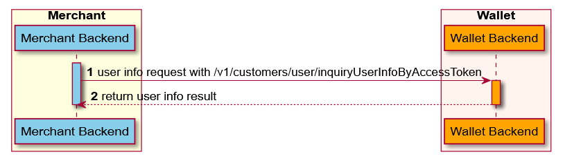

POST ```/v1/customers/user/inquiryUserInfoByAccessToken ```

La ```inquiryUserInfoByAccessToken``` La API se utiliza para el lado comercial para obtener la información relacionada con el usuario después de obtener la autorización del usuario.

## Message structure

### Request


<table>
    <tr>
      <th>Propiedad</th>
      <th>Tipo de datos</th>
      <th>Requerido</th>
      <th>Descripción</th>
    </tr>
     <tr>
      <td>accessToken	</td>
      <td>String 	</td>
      <td>Yes</td>
      <td>Un token de acceso que se puede usar para acceder al alcance del recurso del usuario.
      Max.Longitud: 128 caracteres.</td>
    </tr>
    <tr>
      <td>extendInfo	</td>
      <td>String</td>
      <td>No</td>
      <td>La información extendida, la billetera y el comerciante pueden poner información extendida aquí.
      Max.Longitud: 4096 caracteres.</td>
    </tr>
    <tr>
      <td>authClientId </td>
      <td>String </td>
      <td>No</td>
      <td>La ID única asignada por la billetera para identificar a un cliente.
      Max.Longitud: 128 caracteres</td>
    </tr>
</table>


### Response

<table>
    <tr>
       <th>Propiedad</th>
      <th>Tipo de datos</th>
      <th>Requerido</th>
      <th>Descripción</th>
    </tr>
     <tr>
      <td>result</td>
      <td>Result</td>
      <td>Yes</td>
      <td>El resultado de la solicitud, que contiene información relacionada con el resultado de la solicitud, como los códigos de estado y error.</td>
    </tr>
    <tr>
      <td>userInfo</td>
      <td>OpenUserInfo</td>
      <td></td>
      <td>Información de abrir el usuario.</td>
    </tr>
</table>


### Result process logic

Para diferentes resultados de solicitud, se deben realizar diferentes acciones.Consulte la siguiente lista para más detalles:

*    Si el valor de **result.resultStatus**es **S**, Eso significa que la consulta de información del usuario es exitosa, el comerciante puede usar el AccessToken para acceder al alcance de recursos del usuario correspondiente.
*    Si el valor de **esult.resultStatus** es **F**, Eso significa que la consulta de información del usuario está fallida, la razón fallida puede referirse al parámetro del código de resultado.
*   Si el valor de **result.resultStatus** es **U**, tHat significa que se produce una excepción desconocida en el lado de la billetera, el comerciante puede volver a intentarlo.

### Result

<table>
    <tr>
      <th>No</th>
      <th>Estado de resultado</th>
      <th>código de resultado</th>
      <th>Mensaje de resultado</th>
    </tr>
     <tr>
      <td>1</td>
      <td>S	</td>
      <td>SUCCESS	</td>
      <td>Éxito.</td>
    </tr>
    <tr>
      <td>2</td>
      <td>U	</td>
      <td>UNKNOWN_EXCEPTION	</td>
      <td>Se falló una llamada de API, que es causada por razones desconocidas.</td>
    </tr>
    <tr>
      <td>3</td>
      <td>U	</td>
      <td>REQUEST_TRAFFIC_EXCEED_LIMIT	</td>
      <td>El tráfico de solicitud excede el límite.</td>
    </tr>
    <tr>
      <td>4</td>
      <td>F	</td>
      <td>PROCESS_FAIL	</td>
      <td>Se produjo una falla comercial general.No vuelva a intentarlo.</td>
    </tr>
    <tr>
      <td>5</td>
      <td>F	</td>
      <td>PARAM_ILLEGAL	</td>
      <td>Existen parámetros ilegales.Por ejemplo, una entrada no numérica o una fecha no válida.</td>
    </tr>
    <tr>
      <td>6</td>
      <td>F	</td>
      <td>ACCESS_DENIED	</td>
      <td>Se niega el acceso.</td>
    </tr>
    <tr>
      <td>7</td>
      <td>F	</td>
      <td>INVALID_API	</td>
      <td>La API llamada es inválida o no activa.</td>
    </tr>
    <tr>
      <td>8</td>
      <td>F	</td>
      <td>INVALID_ACCESS_TOKEN	</td>
      <td>El token de acceso no es válido.</td>
    </tr>
    <tr>
      <td>9</td>
      <td>F	</td>
      <td>INVALID_AUTH_CLIENT	</td>
      <td>La identificación del cliente de autenticación no es válida.</td>
    </tr>
    <tr>
      <td>10</td>
      <td>F	</td>
      <td>EXPIRED_ACCESS_TOKEN	</td>
      <td>El token de acceso está expirado.</td>
    </tr>
    <tr>
      <td>11</td>
      <td>F</td>
      <td>EXPIRED_AGENT_TOKEN</td>
      <td>El token de acceso del mini programa está expirado.</td>
    </tr>
    <tr>
      <td>12</td>
      <td>F</td>
      <td>INVALID_AGENT_TOKEN</td>
      <td>El token de acceso del mini programa no es válido.</td>
    </tr>
</table>


### Muestra

Información del usuario de consulta a través del token de acceso, el token de acceso se genera a través de OAuth después de que la autorización sea exitosa.



 1.   Merchant calls ```/v1/customers/user/inquiryUserInfoByAccessToken``` Interfaz con ```access token``` (Paso 1)
 2.  Wallet Server devuelve información del usuario al comerciante basado en el token de acceso (Paso 2).

### Request 

```js
{
  "accessToken": "281010033AB2F588D14B43238637264FCA5AAF35xxxx",
  "extendInfo": "{\"customerBelongsTo\":\"siteNameExample\"}"
}
```


 *   **extendInfo*, Incluye la llave - *customerBelongsTo* la billetera electrónica que usa el cliente. Correspondiente al campo 'siteName' tsombrero obtenido de la API 'my.getSiteInfo',En el mini escenario del programa, esto es obligatorio.

### Response 


```js
{
 "result": {
    "resultCode":"SUCCESS",
    "resultStatus":"S",
    "resultMessage":"success"
  },
  "userInfo": {
    "userId": "1000001119398804xxxx",
    "loginIdInfos": [
      {
        "loginId": "1116874199xxxx",
        "loginIdType": "MOBILE_PHONE",
        "extendInfo": "{}"
      }
    ],
    "status": "ACTIVE",
    "nickName": "Jack",
    "userName": {
      "fullName": "Jack Sparrow"
    },
    "avatar": "http://example.com/avatar.htm?avatarId=FBF16F91-28FB-47EC-B9BE-27B285C23CD3xxxx",
    "gender": "MALE",
    "birthday": "2020-07-25",
    "nationality": "US",
    "contactInfos": [
      {
        "contactNo": "1116874199xxxx",
        "contactType": "MOBILE_PHONE",
        "extendInfo": "{}"
      }
    ],
    "extendInfo": "{}"
  }
}
```
