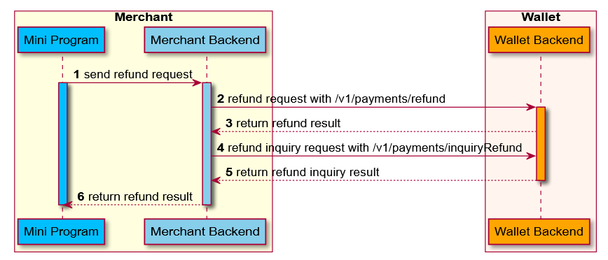

POST ```/v1/payments/inquiryRefund```

La ```refund``` La API se usa para preguntar el resultado de reembolso, generalmente cuando no puede recibir el resultado de reembolso después de un largo período de tiempo.Como:

Nota:

 *  Después de que el comerciante inicie el reembolso y no pueda recibir el resultado de reembolso después de un largo período de tiempo, puede encuestar la interfaz de consulta de reembolso de AMS.
 * El comerciante utiliza InviryRefund para determinar el estado de reembolso en el escenario de procesamiento de reembolso asíncrono.
 * Intervalo de redondeo, recomendado 5s una vez, hasta 1 minuto.
## Message structure

### Request

<table>
    <tr>
      <th>Propiedad</th>
      <th>Tipo de datos</th>
      <th>Requerido</th>
      <th>Descripción</th>
    </tr>
     <tr>
      <td>partnerId	</td>
      <td>String </td>
      <td>Yes</td>
      <td>El socio asignado por la billetera.
      Max. Longitud: 32 caracteres. </td>
    </tr>
    <tr>
      <td>refundId</td>
      <td>String 	</td>
      <td>No</td>
      <td> La identificación única de un reembolso generado por la billetera.
    Max. Longitud: 64 caracteres.</td>
    </tr>
    <tr>
      <td>refundRequestId	</td>
      <td>String</td>
      <td>No</td>
      <td>La identificación única de un reembolso generado por el comerciante.
        Max. Longitud: 64 caracteres.</td>
    </tr>
    <tr>
      <td>extendInfo</td>
      <td>String 	</td>
      <td>No</td>
      <td>La información extendida, la billetera y el comerciante pueden poner información extendida aquí.
        Max. Longitud: 4096 caracteres.</td>
    </tr>
</table>


### Response


<table>
    <tr>
      <th>Propiedad</th>
      <th>Tipo de datos</th>
      <th>Requerido</th>
      <th>Descripción</th>
    </tr>
     <tr>
      <td>result</td>
      <td>Result</td>
      <td>Yes</td>
      <td>El resultado de la solicitud, que contiene información relacionada con el resultado de la solicitud, como los códigos de error y de error.</td>
    </tr>
    <tr>
      <td>refundId</td>
      <td>String</td>
      <td>No</td>
      <td>La identificación única de un reembolso generado por la billetera.
        Max.Longitud: 64 caracteres.</td>
    </tr>
    <tr>
      <td>refundRequestId</td>
      <td>String </td>
      <td>No</td>
      <td>La identificación única de un reembolso generado por el comerciante.
        Max.Longitud: 64 caracteres.</td>
    </tr>
     <tr>
      <td>refundAmount</td>
      <td>Amount</td>
      <td>No</td>
      <td>Cantidad de reembolso para la página de visualización de registros de consumo de usuario.</td>
    </tr>
    <tr>
      <td>refundReason</td>
      <td>String </td>
      <td>No</td>
      <td>Razón de reembolso.
        Max.Longitud: 256 caracteres.</td>
    </tr>
     <tr>
      <td>refundTime</td>
      <td>String/Datetime</td>
      <td>No</td>
      <td>Deducir dinero del tiempo de éxito comercial, después de entonces comenzará a reembolsar dinero al usuario.que sigue al [ISO 8601](https://www.iso.org/iso-8601-date-and-time-format.html). estándar.</td>
    </tr>
    <tr>
      <td>refundStatus</td>
      <td>String</td>
      <td>No</td>
      <td>Procesamiento: el reembolso está procesando
      Éxito - Reembolso del éxito.
      Fail - El reembolso falló.</td>
    </tr>
    <tr>
      <td>refundFailReason</td>
      <td>String</td>
      <td>No</td>
      <td>El motivo de fallas de la orden de reembolso cuando el estado de reembolso es falla.Max.Longitud: 256 caracteres.</td>
    </tr>
    <tr>
      <td>extendInfo</td>
      <td>String</td>
      <td>No</td>
      <td>La información extendida, la billetera y el comerciante pueden poner información extendida aquí.
      Max.Longitud: 4096 caracteres.</td>
    </tr>
</table>


### Result Process Logic

Para diferentes resultados de solicitud, se deben realizar diferentes acciones.Consulte la siguiente lista para más detalles:

 *   Si el valor de **result.resultStatus** es **S**, tEl reembolso de la investigación es exitosa. Y tienes que comprobar **refundStatus:**

    * si**refundStatus** es **PROCESSING**, significa que el reembolso se está procesando;
    * si **refundStatus** es **SUCCESS**, Significa el éxito de reembolso;
    * si **refundStatus** es **FAIL**, significa que el reembolso falló.
 * Si el valor de **result.resultStatus** es**F**, La consulta de reembolso es fallas.Cuando**resultCode** es **REFUND_NOT_EXIST**, Significa que el reembolso aún no se acepta y puede tratarse como insuficiencia de reembolso. Por la otra razón de falla, se recomienda la intervención humana.
 * Si el valor de **result.resultStatus** es **U**, La consulta de reembolso es una excepción desconocida. El fallo del procesamiento ocurre, probablemente debido asystem / network issues,  El comerciante puede volver a intentarlo.

### Result

<table>
    <tr>
      <th>No</th>
      <th>ResultStatus</th>
      <th>código de resultado</th>
      <th>resultado</th>
    </tr>
     <tr>
      <td>1</td>
      <td>S	</td>
      <td>SUCCESS</td>
      <td>Éxito</td>
    </tr>
    <tr>
      <td>2</td>
      <td>U	</td>
      <td>UNKNOWN_EXCEPTION	</td>
      <td>Se falló una llamada API, que es causada por razones desconocidas.</td>
    </tr>
    <tr>
      <td>3</td>
      <td>U	</td>
      <td>REQUEST_TRAFFIC_EXCEED_LIMIT	</td>
      <td>El tráfico de solicitud excede el límite.</td>
    </tr>
    <tr>
      <td>4</td>
      <td>F	</td>
      <td>REFUND_NOT_EXIST	</td>
      <td>El reembolso no existe.</td>
    </tr>
    <tr>
      <td>5</td>
      <td>F	</td>
      <td>INVALID_API	</td>
      <td>La API llamada es inválida o no activa.</td>
    </tr>
    <tr>
      <td>6</td>
      <td>F	</td>
      <td>PARAM_ILLEGAL	</td>
      <td>Parámetros ilegales.Por ejemplo, entrada no numérica, fecha no válida.</td>
    </tr>
    <tr>
      <td>7</td>
      <td>F	</td>
      <td>PROCESS_FAIL	</td>
      <td>Se produjo una falla comercial general.No vuelva a intentarlo.</td>
    </tr>
    <tr>
      <td>8</td>
      <td>F	</td>
      <td>ACCESS_DENIED	</td>
      <td>Se niega el acceso.</td>
    </tr>
    <tr>
      <td>9</td>
      <td>F</td>
      <td>EXPIRED_AGENT_TOKEN</td>
      <td>El token de acceso del mini programa está expirado.</td>
    </tr>
    <tr>
      <td>10</td>
      <td>F</td>
      <td>INVALID_AGENT_TOKEN	</td>
      <td>El token de acceso del mini programa no es válido.</td>
    </tr>
</table>


## Sample

Por ejemplo, un usuario coreano compra una mercancía de 100 USD en un comerciante japonés con pago transfronterizo.

El comerciante reembolsa el dinero, pero no devuelve el resultado del reembolso.Entonces el comerciante comienza a investigar el resultado del reembolso.




  1.  El usuario podría comenzar la solicitud de reembolso del Mini Programa o el Cajero Mercante （Paso 1).
  2.  El servidor comercial llamado /v1/payments/refund interfaz para reembolsar (paso 2).
  3.  E-Wallet Devuelve el resultado de reembolso al servidor comercial (paso 3).
  4.  También el servidor comercial podría llamar /v1/payments/inquiryRefund interfaz para consultar el resultado de reembolso (Paso 4).
  5.  El resultado de la consulta de reembolso de devoluciones de ballets en el servidor comercial (paso 5).
  6.  El comerciante debe devolver el resultado de reembolso al Mini Programa o al Cajero Mercante (Paso 6).


### Request   

```js
{
 "refundId": "1022188000000000001xxxx",
 "refundRequestId":"20200101234567890132xxxx",
 "partnerId":"1022172000000000001xxxx",
 "extendInfo": "{\"customerBelongsTo\":\"siteNameExample\"}"
}
```

 *   **refundId**  refundId regresar por billetera.
 *   **refundRequestId** El únicoid de un reembolso generado por el comerciante.
 *   **partnerId** El socio asignado por la billetera.
 *   **extendInfo**, Incluye la llave- **customerBelongsTo** la billetera electrónica que usa el cliente. Correspondiente al campo 'siteName' el obtenido de la API'my.getSiteInfo'.

Note:

Esta interfaz admite consulta con**refundId** o**refundRequestId**. **paymentId** tiene una prioridad más alta que **refundRequestId**, lo que significa que si ofrece ambos **refundId** y **refundRequestId**, usaremos **refundId** e ignorar **refundRequestId**.

### Response 

```js
{
 "result": {
    "resultCode":"SUCCESS",
    "resultStatus":"S",
    "resultMessage":"success"
  },
 "refundId":"20200101234567890144444xxxx",
 "refundRequestId": "20200101234567890155555xxxx",
 "refundAmount":{
    "value":"100",
    "currency":"USD"
 },
 "refundReason":"refund reason.",
 "refundTime":"2020-01-02T12:01:01+08:30",
 "refundStatus":"SUCCESS",
 "refundFailReason":"the fail reason of refund order when refundStatus is FAIL.",
 "extendInfo":""
}
```

*    **result.resultStatus==S** muestra que el reembolso es exitoso.
*    **refundId** refundId regresar por billetera.
*    **refundRequestId**ID de solicitud de reembolso de comerciante.
*    **refundAmount** Monto de reembolso por comerciante.
*    **refundReason**  describe la razón de reembolso.
*    **refundTime** Tiempo de finalización del proceso de reembolso, eso significa deducir del éxito comercial.
*    **refundStatus**  estado de reembolso.
*    **refundStatus.PROCESSING:** El reembolso es procesar.
*    **refundStatus.SUCCESS:** Reembolso del éxito.
*    **refundStatus.FAIL:** El reembolso falló.
*    **refundFailReason**  El motivo de fallas de la orden de reembolso cuando el reembolso es erroneo.