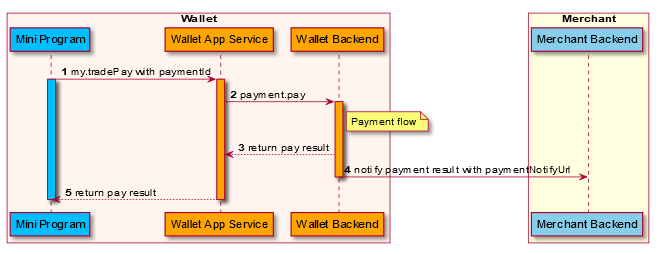

POST ```/v1/payments/notifyPayment```

The``` notifyPayment``` La API se utiliza para notificar al resultado del pago a merchant/partner.

Nota:

1) notificar merchant/partner El resultado del pago cuando el procesamiento de pago alcanza el estado final (éxito/fallas).

2) No todo escenario merchant/partner necesidad recibe este notificar.Tales como escenario de pago de sincronización (B Scan C, pago de acuerdo).

## Message structure

### Request


<table>
    <tr>
      <th>Propiedad</th>
      <th>Tipo de datos</th>
      <th>Requerido</th>
      <th>Descripción</th>
    </tr>
     <tr>
      <td>partnerId</td>
      <td>String </td>
      <td>Yes</td>
      <td>El socio asignado por la billetera.
      Max.Longitud: 32 caracteres.</td>
    </tr>
    <tr>
      <td>paymentId</td>
      <td>String </td>
      <td>Yes</td>
      <td>La identificación única de un pago generado por la billetera.Max.Longitud: 64 caracteres.
      Max. length: 64 characters.</td>
    </tr>
    <tr>
      <td>paymentAmount</td>
      <td>[Amount](../Diccionario%20de%20datos%20para%20v1.md</td>
      <td>Yes</td>
      <td>Monto del pedido para la visualización de registros de consumo de usuario, página de resultados de pago.</td>
    </tr>
    <tr>
      <td>paymentTime</td>
      <td>String/Datetime</td>
      <td>No</td>
      <td>Tiempo de éxito del pago, que sigue al estándar [ISO 8601](https://www.iso.org/iso-8601-date-and-time-format.html).</td>
    </tr>
    <tr>
      <td>paymentStatus</td>
      <td>String</td>
      <td>Yes</td>
      <td>```SUCCESS```: el orden es sucedido.
      ```Fallas``` - el orden fallece. </td>
    </tr>
    <tr>
      <td>paymentFailReason</td>
      <td>String </td>
      <td>No</td>
      <td>La orden de pago de la orden de pago cuando el pago de pagos es fallado.
      Max.Longitud: 256 caracteres.</td>
    </tr>
    <tr>
      <td>extendInfo</td>
      <td>String </td>
      <td>No</td>
      <td>La información extendida, la billetera y el comerciante pueden poner información extendida aquí.
      Max.Longitud: 4096 caracteres.</td>
    </tr>
</table>


### Response

<table>
    <tr>
      <th>Propiedad</th>
      <th>Tipo de datos</th>
      <th>Requerido</th>
      <th>Descripción</th>
    </tr>
     <tr>
      <td>result</td>
      <td>[Result](../Diccionario%20de%20datos%20para%20v1.md)</td>
      <td>Yes</td>
      <td>El resultado de la solicitud, que contiene información relacionada con el resultado de la solicitud, como los códigos de estado y error.</td>
    </tr>
</table>

### Result Process Logic

    Si result.resultStatus == S, Significa que el comerciante/socio ya recibió esta notificación.
    Si result.resultStatus == F, significa merchant/partnermanejar esta notificación falló.
    Si result.resultStatus==U, significa merchant/partner Manejar esta notificación Ocurre una excepción desconocida, la billetera volverá a intentarlo si obtiene la respuesta.
    Si otra respuesta (almost never occur),La billetera procesará como U.
### Result

<table>
    <tr>
      <th>No</th>
      <th>Estado de resultados</th>
      <th>código de resultado</th>
      <th>resultado</th>
    </tr>
     <tr>
      <td>1</td>
      <td>S</td>
      <td>SUCCESS</td>
      <td>Éxito.</td>
    </tr>
    <tr>
      <td>2</td>
      <td>U</td>
      <td>UNKNOWN_EXCEPTION</td>
      <td>Se falló una llamada API, que es causada por razones desconocidas.</td>
    </tr>
    <tr>
      <td>3</td>
      <td>U</td>
      <td>REQUEST_TRAFFIC_EXCEED_LIMIT</td>
      <td>El tráfico de solicitud excede el límite.</td>
    </tr>
    <tr>
      <td>4</td>
      <td>F</td>
      <td>REPEAT_REQ_INCONSISTENT</td>
      <td>Envío repetido, y las solicitudes son inconsistentes.</td>
    </tr>
     <tr>
      <td>5</td>
      <td>F</td>
      <td>PROCESS_FAIL</td>
      <td>Se produjo una falla comercial general.No vuelva a intentarlo.</td>
    </tr>
    <tr>
      <td>6</td>
      <td>F</td>
      <td>INVALID_API</td>
      <td>La API llamada es inválida o no activa.</td>
    </tr>
     <tr>
      <td>7</td>
      <td>F</td>
      <td>PARAM_ILLEGAL</td>
      <td>Parámetros ilegales. Por ejemplo, entrada no numérica, fecha no válida.</td>
    </tr>
</table>

### Sample



1.    El programa mini llama ```my.tradePay``` interfaz para hacer el pago (paso 1).
2.    La aplicación E-Wallet devuelve el resultado del pago al Mini Programa (Paso 5).
3.    E-wallet notifies the payment result with paymentNotifyUrl provided by merchant (Step 4).

Por ejemplo, un usuario de billetera compra una mercancía de 100 USD en un comerciante/socio, después de que el usuario termine el pago en la página de la billetera, la billetera enviará una notificación de estado de pago a merchant/partner.

### Payment

**A. Request sample with payment success**

```js
{
  "partnerId": "P000000000000001xxxx",
  "paymentId": "201911271907410100070000009999xxxx",
  "paymentRequestId": "2019112719074101000700000088881xxxx",
  "paymentAmount": {
    "currency": "USD",
    "value": "10000"
  },
  "paymentTime": "2019-11-27T12:02:01+08:30",
  "paymentStatus": "SUCCESS"
}
```


 *   **partnerId** es el identificador de un merchant/partner, asignado por la billetera.
 *   **paymentId** se genera por billetera, identifica de manera única el pago.
 *   **paymentRequestId** se genera por merchant/partner, Identifica de forma única este pago.En el pago notificar la solicitud, paymentRequestId debería ser el paymentRequestId en la solicitud de pago de origen.
 *   **paymentAmount** describe el monto de 100 USD ya recopilado por la billetera de la cuenta de usuario para este pago.
 *   **paymentTime** es la fecha de éxito de esta transacción.
 *   **paymentStatus** es el estado de pago en la billetera.El éxito significa que la transacción ya tiene éxito.

**B.** 
```js
{
  "partnerId": "P000000000000001xxxx",
  "paymentId": "201911271907410100070000009999xxxx",
  "paymentRequestId": "2019112719074101000700000088881xxxx",
  "paymentAmount": {
    "currency": "USD",
    "value": "10000"
  },
  "paymentCreateTime": "2019-11-27T12:01:01+08:30",
  "paymentTime": "2019-11-27T12:02:01+08:30",
  "paymentStatus": "FAIL",
  "paymentFailReason":"Order payment expired."
}
```

 *   **paymentStatus** es el estado de pago en la billetera.Fail significa que esta transacción ya falló, por lo general, la falla del pago se debe a este pago ya expirado.
 *   **paymentFailReason** Utilizado para completar el motivo de fracaso de pago, solo el estado de pago es fallido devolverá este parámetro.

### Response 

```js
{
 "result": {
    "resultCode":"SUCCESS",
    "resultStatus":"S",
    "resultMessage":"success"
  }
 }
```

*   **result.resultStatus==S** muestra que merchant/partner ya recibí esta notificación.