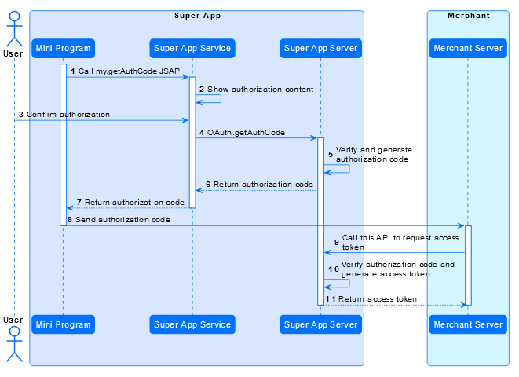

POST ```/v2/authorizations/applyToken```

Con esta llamada de API, un comerciante puede obtener un token de acceso de la super aplicación.Luego, los usuarios autorizan al comerciante a proporcionar servicios en el programa mini.

   
<table>
  <tbody>
    <tr>
      <td>
      **Nota:**
       ``` 
      * Antes de llamar a esta API, llame al [my.getAuthCode](../../../../JSAPI/) JSAPI para obtener un código de autorización del Super App como parámetro de solicitud.Luego llame a esta API para intercambiar un token de acceso desde la Super App.
      * Cuando expire el token de acceso original, use el token de actualización para intercambiar por un nuevo token de acceso directamente.En este escenario, esta API se puede usar de forma independiente.
      * Un token de acceso debe mantenerse solo en el servidor comercial, lo que significa que no debe devolverse al Mini Programa.
      ```
      </td>
    </tr>
  </tbody>
</table>

### Structure

Un mensaje consiste en un encabezado y un cuerpo.Las siguientes secciones se centran en la estructura del cuerpo.Para la estructura del encabezado, ver:

  *  [Request header](../../../Descrición%20general.md)
  *  [Response header](../../../Descrición%20general.md)

#### Parámetros de solicitud


<table>
 <tr>
   <th>Campo</th>
   <th>Tipo de datos</th>
   <th>Requerido</th>
   <th>Descripción</th>
   <th>Ejemplo</th>
 </tr>
  <tr>
   <td>appId</td>
   <td>String</td>
   <td>Yes	</td>
   <td>
   Indica la ID única asignada por la plataforma Mini Program para identificar un miniprogram.
    - Longitud máxima: 32 caracteres
    - Personajes no permitidos: ¿caracteres especiales como @ #?

Nota: Obtenga este campo a través del [my.getAppIdSync](../../../../JSAPI/Básica/my.getAppIdSync.md) JSAPI o plataforma de mini programa.
</td>
   <td>"3333010071465913xxx"</td>
 </tr>
 <tr>
   <td>authClientId </td>
   <td>String </td>
   <td>Yes</td>
   <td>
    Indica la ID única asignada por la super aplicación para identificar a un comerciante autorizado.
  - Longitud máxima: 128 caracteres
  - Personajes no permitidos: caracteres especiales como @ #? 
   </td>
   <td>"202016726873874774774xxxx"</td>
 </tr>
 <tr>
   <td>grantType</td>
   <td>String </td>
   <td>Yes</td>
   <td>
    Indica la forma en que el comerciante autorizado obtiene un token de acceso.Los valores válidos son: 
  -  ```AUTHORIZATION_CODE:``` Intercambio por un token de acceso.
  -  ```REFRESH_TOKEN: Exchange``` Para un nuevo token de acceso cuando el original expire.
   </td>
   <td>"AUTHORIZATION_CODE"</td>
 </tr>
 <tr>
   <td>customerBelongsTo</td>
   <td>String </td>
   <td>No</td>
   <td>
    Indica la super aplicación que usa un usuario.Los valores válidos son:
    - ```ALIPAY_CN```: alipayCn
    - ```ALIPAY_HK```: alipayHk
    - ```ALIPAY_MO```: Alipay Mo
    - ```TNG```: Touch 'n Go
    - ```GCASH```: Gcash
    - ```DANA```:  Dana
    - ```KAKAOPAY```:  KakaoPay
    - ```BKASH```: bKash
    - ```CHOPE```: Chope
    - ```TRUEMONEY```: TrueMoney
   </td>
   <td>"TNG"</td>
 </tr>
  <tr>
   <td>authCode</td>
   <td>String</td>
   <td>No</td>
   <td>
   El código de autorización se utiliza para intercambiar un token de acceso.Los mini programas pueden obtener un código de autorización a través del **my.getAuthCode** JSAPI y luego envíelo al comerciante. Luego, el comerciante está autorizado a usar el código de autorización para intercambiar por un token de acceso.
  - Longitud máxima: 64 caracteres
  - Personajes no permitidos: ¿caracteres especiales como @ #?
  -  Puede ser ```Null```.

   ** Nota **: Este campo se requiere cuando el valor de GrantType es ```AUTHORIZATION_CODE```.
   </td>
   <td>"2810111301lGZcM9CjlF91WH00039190xxxx"</td>
 </tr>
 <tr>
   <td>refreshToken</td>
   <td>String </td>
   <td>No</td>
   <td>
   El token de actualización se utiliza para intercambiar un nuevo token de acceso cuando el original expira. Con el token de actualización, se puede obtener un nuevo token de acceso sin más interacción con el usuario.
   - Longitud máxima: 128 caracteres
   - Personajes no permitidos: ¿caracteres especiales como @ #?
   - Puede ser ```Null```.

    **Note**: This field is required when the value of grantType is ```REFRESH_TOKEN.``` 
   </td>
   <td>"2810111301lGZcM9CjlF91WH00039190xxxx"</td>
 </tr>
 <tr>
   <td>extendInfo</td>
   <td>String</td>
   <td>No</td>
   <td>
  Indica la información extendida sobre esta API.
 - Longitud máxima: 4096 caracteres
 - Personajes no permitidos: ¿caracteres especiales como @ #?
 -  Puede ser ```Null```.
   </td>
   <td>    ``` {
    "memo": "memo"
    }```</td>
 </tr>
</table>

#### Parámetros de respuesta

<table>
 <tr>
   <th>Campo</th>
   <th>Tipo de datos</th>
   <th>Requerido</th>
   <th>Descripción</th>
   <th>Ejemplo</th>
 </tr>
  <tr>
   <td>result</td>
   <td>[Result](../Diccionario%20de%20datos%20para%20v2.md)</td>
   <td>Yes</td>
   <td>Indica el resultado de la solicitud, como los códigos de estado y de error.</td>
   <td>
   ```js   
   {
        "resultCode": "SUCCESS",
        "resultStatus": "S",
        "resultMessage": "success"
    }
    ```
    </td>
 </tr>
 <tr>
   <td>accessToken</td>
   <td>String</td>
   <td>No</td>
   <td>
   El token de acceso se utiliza para acceder a la información del usuario. Para obtener la información específica a la que se puede acceder, consulte el[my.getAuthCode](../) JSAPI. 
    - Longitud máxima: 128 caracteres
    - Personajes no permitidos: ¿caracteres especiales como @ #?
    - Puede ser```Null```.

   ** Nota **: Este campo debe devolverse cuando la solicitud de autorización es exitosa.
   </td>
   <td>"281010033AB2F588D14B43238637264FCA5AAF35xxxx"</td>
 </tr>
 <tr>
   <td>accessTokenExpiryTime</td>
   <td>Datetime</td>
   <td>No</td>
   <td>
   Indica cuándo expira un token de acceso.Por ejemplo, en el escenario de pago, una vez que expira el token de acceso, el comerciante autorizado no puede usar este token para perseguir la cuenta del usuario.
   El valor sigue el [ISO 8601](https://www.iso.org/iso-8601-date-and-time-format.html) sformato estandar.Por ejemplo, "2019-11-27T12: 01: 01+08: 30".

   ** Nota **: Este campo debe devolverse cuando la solicitud de autorización sea exitosa. 
   </td>
   <td>"2019-06-06T12:12:12+08:00"</td>
 </tr>
 <tr>
   <td>refreshToken</td>
   <td>String</td>
   <td>No</td>
   <td>
   El token de actualización se utiliza para intercambiar un nuevo token de acceso cuando el original expira.Con el token de actualización, se puede obtener un nuevo token de acceso sin más interacción con el usuario.
    - Longitud máxima: 128 caracteres
    - Personajes no permitidos: ¿caracteres especiales como @ #?
    - Puede ser ```Null```.

    ** Nota **: Este campo debe devolverse cuando la solicitud de autorización es exitosa.
   </td>
   <td>"2810100334F62CBC577F468AAC87CFC6C9107811xxxx"</td>
 </tr>
 <tr>
   <td>refreshTokenExpiryTime</td>
   <td>Datetime</td>
   <td>No</td>
   <td>
   Indica cuándo expira el token de actualización. Una vez que el token de actualización expira, el comerciante autorizado no puede usar este token para intercambiar por un nuevo token de acceso.
   El valor sigue el [ISO 8601](https://www.iso.org/iso-8601-date-and-time-format.html) formato estandar.Por ejemplo, "2019-11-27T12: 01: 01+08: 30".

   **Note** : Este campo debe devolverse cuando la solicitud de autorización sea exitosa. 
   </td>
   <td>"2019-06-08T12:12:12+08:00"</td>
 </tr>
 <tr>
   <td>customerId</td>
   <td>String</td>
   <td>Yes</td>
   <td>
  ID de propietario de recursos, que puede ser ID de usuario, ID de aplicación de la aplicación del comerciante o ID de comerciante.
   - Longitud máxima: 64 caracteres
   - personajes no permitidos: caracteres especiales como ```@```, ```#```, and ```?``` 
   </td>
   <td>"1000001119398804xxxx"</td>
 </tr>
 <tr>
   <td>extendInfo</td>
   <td>String</td>
   <td>No</td>
   <td>
  Indica la información extendida sobre esta API.
    - Longitud máxima: 4096 caracteres
    - Personajes no permitidos: caracteres especiales como @, #y?
    - Puede ser ```Null```.
   </td>
   <td>N/A</td>
 </tr>
</table>

### Result process logic

En la respuesta, el campo Result.ResultStatus indica el resultado del procesamiento de una solicitud. La siguiente tabla describe cada estado de resultado:

<table>
	<tr>
	  <th>Estado de resultados</th>
	  <th>Descripción </th>
	</tr>
	<tr>
	  <td>S</td>
	  <td>La solicitud de autorización es exitosa.
      El resultado correspondiente. Resultcode es ```SUCCESS``` y el resultado. ```SUCCESS```.</td>
	</tr>
	<tr>
	  <td>U</td>
	  <td>Se desconoce el estado de la solicitud de autorización.
      The corresponding result.resultCode is ```UNKNOWN_EXCEPTION``` y result.resultMessage es "An La llamada de API está fallida, que es causado por razones desconocidas.".
   Para más detalles, consulte el [Common error codes](../) section..</td>
	</tr>
    <tr>
	  <td>F</td>
	  <td>La solicitud de autorización fallas.
          El resultado correspondiente.Resultcode y el resultado. ResultMessage hijo varios basados en diferentes situaciones. Para más detalles, consulte la siguiente sección [Códigos de error](../).</td>
	</tr>
</table>

### Error codes

Los códigos de error generalmente se clasifican en las siguientes categorías:

  *  [Common error codes](../) son comunes para todos los mini programa Openapis en V2.
  *  API-specific Los códigos de error se enumeran en la siguiente tabla.

<table>
    <tr>
      <th>Código de error</th>
      <th>Estado de resultados</th>
      <th>Mensaje de error</th>
      <th>Nuevas medidas</th>
    </tr>
     <tr>
      <td>AUTH_CLIENT_UNSUPPORTED_GRANT_TYPE</td>
      <td>F</td>
      <td>El comerciante autorizado no apoya este tipo de subvención.</td>
      <td>Use un válido grantType como``` AUTHORIZATION_CODE``` o ```REFRESH_TOKEN```. </td>
    </tr>
    <tr>
      <td>INVALID_AUTH_CLIENT</td>
      <td>F</td>
      <td>O el comerciante autorizado no existe o el comerciante no está a bordo de la aplicación nativa.</td>
      <td>Utilice un AuthClientid válido asignado por la Super App</td>
    </tr>
    <tr>
      <td>INVALID_AUTH_CLIENT_STATUS</td>
      <td>F</td>
      <td>El estado del comerciante autorizado no es válido.</td>
      <td>Póngase en contacto con el soporte técnico para solucionar el problema.</td>
    </tr>
    <tr>
      <td>INVALID_REFRESH_TOKEN</td>
      <td>F</td>
      <td>El token de actualización no existe.</td>
      <td>Obtenga un nuevo token de actualización a través de esta API.</td>
    </tr>
    <tr>
      <td>EXPIRED_REFRESH_TOKEN</td>
      <td>F</td>
      <td>El token de actualización expira.</td>
      <td>Obtenga un nuevo código de autorización de la aplicación Super a través de my.getAuthCode JSAPI y luego obtenga un nuevo token de actualización a través de esta API.  </td>
    </tr>
    <tr>
      <td>USED_REFRESH_TOKEN</td>
      <td>F</td>
      <td>Se ha utilizado el token de actualización.</td>
      <td>Obtenga un nuevo token de actualización a través de esta API.</td>
    </tr>
    <tr>
      <td>INVALID_AUTHCODE</td>
      <td>F</td>
      <td>El código de autorización no existe.</td>
      <td>Obtenga un nuevo código de autorización del Super App a través de my.getAuthCode JSAPI.</td>
    </tr>
    <tr>
      <td>USED_AUTHCODE</td>
      <td>F</td>
      <td>Se ha utilizado el código de autorización.</td>
      <td>Obtenga un nuevo código de autorización de la aplicación Super a través de my.getAuthCode JSAPI.</td>
    </tr>
     <tr>
      <td>EXPIRED_AUTHCODE</td>
      <td>F</td>
      <td>El código de autorización expira.</td>
      <td>Obtenga un nuevo código de autorización del Super App a través de my.getAuthCode JSAPI.</td>
    </tr>
</table>

    
### Samples 

El flujo de datos para obtener un token de acceso se ilustra como se muestra a continuación:




  1.  El programa Mini llama al **my.getAuthcode** JSAPI para solicitar un código de autorización de la superpección Super.
  2.  La Super App procesa la solicitud y muestra la información que debe autorizarse.
  3.  El usuario confirma la autorización en la Super App.
  4.  El servicio de Super App procesa la información de autorización al servidor Super App.
  5.  El servidor Super App verifica la información de autorización y luego genera el código de autorización.
  6.  El servidor Super App devuelve el código de autorización al servicio Super App.
  7.  El Servicio de Super App devuelve el código de autorización al programa MINI.
  8.  El programa MINI envía el código de autorización al servidor comercial.
  9.  El servidor comercial llama a esta API para intercambiar un token de acceso desde el servidor Super App.
  10. El servidor Super App verifica el código de autorización y genera el token de acceso.
  11. La Super App devuelve el token de acceso al servidor comercial.

#### Petición 

* Utilice un código de autorización para intercambiar un token de unión Unicética.

```js
{
  "appId":"3333010071465913xxx",
  "authClientId": "202016726873874774774xxxx",
  "grantType": "AUTHORIZATION_CODE",
  "authCode": "2810111301lGZcM9CjlF91WH00039190xxxx"
}
```
El mini programa (```3333010071465913xxx```) Llama al **my.getAuthcode** JSAPI para obtener el código de autorización (```2810111301lGZcM9CjlF91WH00039190xxxx```) y luego envíe el código de autorización al comerciante (```202016726873874774774xxxx```). El comerciante utiliza el código de autorización para intercambiar un token de acceso como GrantType es ```AUTHORIZATION_CODE```.

* Use a refresh token to exchange for an access token

```js
{
  "grantType": "REFRESH_TOKEN",
  "refreshToken": "2810111301lGZcM9CjlF91WH00039190xxxx"
}
```

El valor de GrantType es refrescante, lo que significa que el comerciante puede obtener un token de acceso por el token de actualización (```2810111301lGZcM9CjlF91WH00039190xxxx```).

#### Respuesta 

```js
{
    "result": {
        "resultCode": "SUCCESS",
        "resultStatus": "S",
        "resultMessage": "success"
    },
    "accessToken": "281010033AB2F588D14B43238637264FCA5AAF35xxxx",
    "accessTokenExpiryTime": "2019-06-06T12:12:12+08:00",
    "refreshToken": "2810100334F62CBC577F468AAC87CFC6C9107811xxxx",
    "refreshTokenExpiryTime": "2019-06-08T12:12:12+08:00",
    "customerId": "1000001119398804xxxx"
}
```

  *  result.resultStatus is ```S```, que muestra la solicitud de obtener un token de acceso es exitoso.
  *  El comerciante autorizado puede usar el token de acceso (```281010033AB2F588D14B43238637264FCA5AAF35xxxx```) antes accessTokenExpiryTime (```2019-06-06T12:12:12+08:00```).
    ```1000001119398804xxxx``` es el usuario que autoriza al comerciante.
    El comerciante autorizado puede usar el token de actualización(```2810100334F62CBC577F468AAC87CFC6C9107811xxxx```) para intercambiar un nuevo token de acceso antes refreshTokenExpiryTime (```2019-06-08T12:12:12+08:0```). 

### Related links

[my.getAuthCode](../)

[my.getAppIdSync](../)