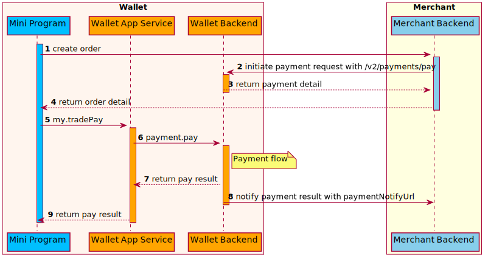

# /v2/payments/pay

POST `/v2/payments/pay`

La API de `pay` se utiliza para iniciar una solicitud de pago a las billeteras.

**Nota:** Un pago que tiene lugar en las billeteras.

1）El comerciante/socio inicia una solicitud de pago para la billetera a través de esta interfaz.

2） La billetera manejará diferentes escenarios de pago según los parámetros de la solicitud.

Actualmente, esta API admite los siguientes escenarios:

- Pago de cajero: generalmente utilizado en el escenario de pago en línea.En este escenario, el comerciante/socio llamará a esta API para crear un pedido, y la billetera devolverá la URL de la página del cajero al comerciante/socio, y luego redirigirá a esta página del cajero.Entonces el usuario puede finalizar el pago en la página del cajero.

## Estructura de mensajes

### Petición

<table>
  <tr>
    <th>Propiedad</th>
    <th>Tipo de datos</th>
    <th>Requerido</th>
    <th>Descripción</th>
    <th>Ejemplo</th>
  </tr>
  <tr>
    <td>appId</td>
    <td>String </td>
    <td>Yes</td>
    <td>
        The Mini Program app ID.
        Max. length: 32 characters.
    </td>
    <td>"3333010071465913xxx"</td>
  </tr>
  <tr>
    <td>productCode</td>
    <td>String </td>
    <td>No</td>
    <td>
    The product code, AGREEMENT_PAYMENT, IN_STORE_PAYMENT, CASHIER_PAYMENT 
    Max. length: 32 characters.
    </td>
    <td>"CASHIER_PAYMENT"</td>
  </tr>
  <tr>
    <td>  salesCode</td>
    <td>String </td>
    <td>No</td>
    <td>
   Definido por billeteras.La billetera utiliza el `salesCode` para obtener la configuración del contrato que incluye tarifa, información de limitación, etc.
    Max.Longitud: 32 caracteres.
    </td>
    <td>"202011271xxx"</td>
  </tr>
  <tr>
    <td>  paymentRequestId</td>
    <td>String </td>
    <td>Yes</td>
    <td>
    La identificación única de un pago generado por los comerciantes.
    - Máx.Longitud: 64 caracteres.
    - Este campo se utiliza para el control de [idempotencia](/). Para las solicitudes de pago que se inician con el mismo `PaymentRequestid` y alcanzan un estado final (S o F), la billetera debe devolver el resultado único.
    </td>
    <td>"2019112719074101000700000077771xxxx"</td>
  </tr>
  <tr>
    <td>  monto del pago</td>
    <td>[Amount](/)</td>
    <td>Sí</td>
    <td>El monto del pedido, que muestra los registros de consumo de los usuarios, la página de resultados de pago.</td>
    <td>
    ```
      {
        "currency": "USD",
        "value": "10000"
      }
      ```
 </td>
  </tr>

  <tr>
    <td>Order</td>
    <td>[Order](/)</td>
    <td>No</td>
    <td>
      Los detalles del orden de compra, como comerciante, comprador, bienes, etc. La información en el pedido solo se usa para mostrar la página de resultados de pago del usuario y el historial de transacciones, los informes de regulación, etc. No utilizará el monto en el pedido deOperación de fondo.
    </td>
    <td>
```js
      {
      "referenceOrderId":"OrderID_0101010101xxxx",
      "orderDescription":"SHOES",
      "orderAmount":{
        "currency": "USD",
        "value": "10000"
      },

      "orderCreateTime": "2020-01-01T12:01:01+08:30",
      "merchant":{
          "referenceMerchantId":"M00000000001xxxx",
          "merchantMCC":"1405",
          "merchantName":"UGG Technology Limited",
          "merchantDisplayName":"UGG",
          "merchantAddress":{
             "region":"MY",
             "city":"KL"
          }
       },

      "env": {
          "osType": "IOS",
          "terminalType": "APP"
         }

}

````
    </td>
  </tr>
  <tr>
    <td>paymentMethod</td>
    <td>[PaymentMethod](/)</td>
    <td>No</td>
    <td>Se utiliza para recolectar fondos por billeteras.</td>
    <td>
```js
      {
        "paymentMethodType":"ID_000001xxxx",
        "paymentMethodId":"1"
       }
````

    </td>

  </tr>
  <tr>
    <td>paymentFactor</td>
    <td>[PaymentFactor](/)</td>
    <td>No</td>
    <td>En el escenario de mini programa, es valor fijo, formato de mapa.</td>
    <td>
``` 
{
   "needSurcharge": true,
   "isPaymentEvaluation": false
} 
``` 
    </td>
  </tr>
  <tr>
    <td>paymentExpiryTime</td>
    <td>String/Datetime</td>
    <td>No</td>
    <td>La orden de pago de la orden de pago definida por Merchant, que sigue el estándar [ISO 8601](/).</td>
    <td>"2020-06-08T12:12:12+08:00"</td>
  </tr>
  <tr>
    <td>paymentRedirectUrl</td>
    <td>String </td>
    <td>No</td>
    <td>La URL de redirección definida por los comerciantes.max.Longitud: 1024 caracteres.</td>
    <td>"https://www.merchant.com/redirectxxx"</td>
  </tr>
  <tr>
    <td>paymentNotifyUrl</td>
    <td>String </td>
    <td>No</td>
    <td>La URL de notificación de éxito de pago definida por los comerciantes.max.Longitud: 1024 caracteres.</td>
    <td>"https://www.merchant.com/paymentNotifyxxx" </td>
  </tr>
  <tr>
    <td>voidNotifyUrl</td>
    <td>String(2048)</td>
    <td>No</td>
    <td>se enviará la URL a la que se enviará una notificación nula.</td>
    <td></td>
  </tr>
  <tr>
    <td>extendInfo</td>
    <td>String </td>
    <td>No</td>
    <td>La extensa información.La billetera y el comerciante pueden poner información extensa en esta propiedad.Max.Longitud: 4096 caracteres.</td>
    <td>"This is additional information"</td>
  </tr>
</table>

## Respuesta

<table>
  <tr>
    <th>Propiedad</th>
    <th>Tipo de datos</th>
    <th>Requerido</th>
    <th>Descripción</th>
    <th>Ejemplo</th>
  </tr>
 <tr>
  <td>result</td>
  <td>[Result](/)</td>
  <td>Yes</td>
  <td>El resultado de la solicitud, que contiene información relacionada con el resultado de la solicitud, como los códigos de estado y error.</td>
  <td>   
    ```js
    {
        "resultCode": "SUCCESS",
        "resultStatus": "S",
        "resultMessage": "success"  
      }
    ```
  </td>
 </tr>
 <tr>
  <td>paymentId</td>
  <td>String </td>
  <td>No</td>
  <td>La identificación única de un pago generado por la billetera. Max.Longitud: 64 caracteres.</td>
  <td>"4374784884773748478499xxxx"</td>
 </tr>
 <tr>
  <td>paymentTime</td>
  <td>String/Datetime</td>
  <td>No</td>
  <td>Tiempo de éxito del pago, que sigue al estándar [ISO 8601](/).</td>
  <td>"2020-01-08T12:12:12+08:00"</td>
 </tr>
 <tr>
  <td>redirectActionForm</td>
  <td>[RedirectActionForm](/)</td>
  <td>No</td>
  <td>Indica una URL de redirección.</td>
  <td>
    ```js
{
    "method":"POST",
    "redirectionUrl":"https://www.wallet.com/cashier?orderId=xxxxxxx"
}
```
  </td>
 </tr>
 <tr>
  <td>authExpiryTime</td>
  <td>String/Datetime</td>
  <td>No</td>
  <td>El tiempo de vencimiento de la autorización solo tiene valor cuando PaymentFactor.ISauthorizationPayment es verdadero.</td>
  <td>"2020-07-08T12:12:12+08:00"</td>
 </tr>
 <tr>
  <td>extendInfo</td>
  <td>String </td>
  <td>No</td>
  <td>La extensa información.La billetera y el comerciante pueden poner información extensa en esta propiedad.max.Longitud: 4096 caracteres.</td>
  <td>"This is additional information"</td>
 </tr>
</table>

## Lógica del proceso de resultados

En la respuesta, el campo Result.ResultStatus indica el resultado de procesar una solicitud de la siguiente manera.

<table>
  <tr>
    <th>ResultStatus</th>
    <th>Descripción</th>
  </tr>
  <tr>
    <td>S</td>
    <td>
      El resultado correspondiente. Resultcode es "éxito" y el `result.resultMessage` es "SUCCESS".
      Eso significa que esta transacción es exitosa.El comerciante/socio puede actualizar la transacción al éxito.Lo que debe tener en cuenta es:
      - En el escenario de evaluación de pagos, 's' solo significa que la evaluación es exitosa y que no existe una transferencia de fondos real.
      - En el escenario de pago de autorización, 's' solo significa que la autorización es exitosa y necesita esperar a que la operación de captura finalice la transacción (finalice el flujo final del fondo).
    </td>
  </tr>
  <tr>
      <td>A</td>
      <td>
      El resultado correspondiente `result.resultCode` es "ACCEPT"; y el `result.resultMessage` La capacidad de recurso varía según las diferentes situaciones.
      Eso significa que la transacción ya es aceptada por las billeteras.El comerciante/socio debe continuar la siguiente operación de acuerdo con la respuesta de formación redirectación, como mostrar el código de pedido a los usuarios o redirigir a la página de cajero de la billetera.
      </td>
  </tr>
  <tr>
      <td>U</td>
      <td>
        El resultado correspondiente `result.resultCode` es "UNKNOWN_EXCEPTION" y resultado. El recurso es "una llamada API fallada, que es causada por razones desconocidas".Para más detalles, consulte la sección [Códigos de error comunes](/).
        Eso significa que la excepción desconocida se produce en el lado de la billetera.El comerciante/socio puede consultar el resultado del pago o esperar la notificación del estado de pago para obtener el resultado de pago real.Lo que debe tener en cuenta es:
        - No se puede consultar el escenario de evaluación de pagos.
        - El estado de 'U' no puede configurarse para fallar o tener éxito en el sistema comerciante/socio.
        - El estado de 'U' no puede reembolsar a los usuarios fuera de línea (tal vez hará la pérdida de fondos).
      </td>
    </tr>
    <tr>
      <td>F</td>
      <td>
        Eso significa que esta transacción falló. El resultado correspondiente `result.resultCode` y `result.resultMessage` varía según las diferentes situaciones.Para obtener más detalles, consulte la siguiente sección [Códigos de error](/).
        Por lo general, las transacciones `f` no pueden volver a tener éxito si usan la misma solicitud de pago para llamar a las billeteras.
      </td>
    </tr>
  </table>


##Códigos de error
Los códigos de error generalmente se clasifican en las siguientes categorías:

- Códigos de error comunes: son comunes para todos los mini programa Openapis.
- Códigos de error específicos de API: se enumeran en la siguiente tabla.

<table>
    <tr>
        <th>resultStatus</th>
        <th>resultCode</th>
        <th>resultMessage</th>
    </tr>
    <tr>
        <td>U</td>
        <td>PAYMENT_IN_PROCESS</td>
        <td>El pago aún está en proceso.</td>
    </tr>
    <tr>
        <td>A</td>
        <td>ACCEPT</td>
        <td>Necesita las siguientes acciones de acuerdo con RedirectActionFormfield.</td>
    </tr>
    <tr>
        <td>F</td>
        <td>REPEAT_REQ_INCONSISTENT</td>
        <td>La presentación repetida y las solicitudes son inconsistentes.</td>
    </tr>
    <tr>
        <td>F</td>
        <td>PAYMENT_AMOUNT_EXCEED_LIMIT</td>
        <td>El monto del pago excede el límite.</td>
    </tr>
    <tr>
        <td>F</td>
        <td>USER_NOT_EXIST</td>
        <td>No existe ese usuario.</td>
    </tr>
    <tr>
        <td>F</td>
        <td>USER_STATUS_ABNORMAL</td>
        <td>El estado del usuario es anormal.</td>
    </tr>
    <tr>
        <td>F</td>
        <td>USER_BALANCE_NOT_ENOUGH</td>
        <td>El saldo del usuario no es suficiente para este pago.</td>
    </tr>
    <tr>
        <td>F</td>
        <td>PARTNER_NOT_EXIST</td>
        <td>La pareja no existe.</td>
    </tr>
    <tr>
        <td>F</td>
        <td>PARTNER_STATUS_ABNORMAL</td>
        <td>Estado de la pareja anormal.</td>
    </tr>
    <tr>
        <td>F</td>
        <td>RISK_REJECT</td>
        <td>Riesgo de rechazo.</td>
    </tr>
    <tr>
        <td>F</td>
        <td>CURRENCY_NOT_SUPPORT</td>
        <td>La moneda no es compatible.</td>
    </tr>
    <tr>
        <td>F</td>
        <td>ORDER_STATUS_INVALID</td>
        <td>El pedido está en estado no válido como cerrado.</td>
    </tr>
    <tr>
        <td>F</td>
        <td>INVALID_ACCESS_TOKEN</td>
        <td>Accesstoken inválido.</td>
    </tr>
    <tr>
        <td>F</td>
        <td>USER_AMOUNT_EXCEED_LIMIT</td>
        <td>El monto del pago excede el límite de la cantidad del usuario.</td>
    </tr>
    <tr>
        <td>F</td>
        <td>AUTH_CODE_ALREADY_USED</td>
        <td>Código de autenticación ya utilizado.</td>
    </tr>
    <tr>
        <td>F</td>
        <td>INVALID_CODE</td>
        <td>Auth Code ilegal.</td>
    </tr>
    <tr>
        <td>F</td>
        <td>EXPIRED_AGENT_TOKEN</td>
        <td>El token de agente del mini programa está expirado.</td>
    </tr>
    <tr>
        <td>F</td>
        <td>INVALID_AGENT_TOKEN</td>
        <td>El token de agente del mini programa no es válido.</td>
    </tr>
</table>


## Ejemplo
### Pago de cajero
Por ejemplo, un usuario compra 100 USD bueno en el comerciante/socio (generalmente el comerciante en línea), el comerciante/socio llama a esta API para crear primero la orden de pago, la billetera devolverá la identificación de la orden de pago y la URL de la página de la billetera a la página de la página de la billetera alcomerciante/socio, entonces comerciante/socio puede redirigir al usuario a la página de la billetera con la API `my.tradePay`.



1. El mini programa crea un pedido.
2. El servidor comercial llama a esta interfaz de pago con Payment NotifyUrl al flujo de pago inicial.
3. El servidor E-Wallet devuelve información de detalle de pago con PaymentId al servidor comercial.
4. El servidor comercial pasa la información de los detalles de pago al programa MINI.
5. El programa Mini llama a la interfaz My.Tradepay para realizar el pago.
6. Cuando el pago alcanza el estado final, el servidor E-Wallet notifica el servidor comercial del resultado de pago con PaymentNotifyUrl proporcionado en el Paso 2 (Paso 8).
7. También la aplicación de billetera electrónica devuelve el resultado de pago al Mini Programa (Paso 9).

### Petición

```js
{

    "appId": "3333010071465913xxx", 
    "paymentRequestId": "2019112719074101000700000077771xxxx",
    "productCode": "CASHIER_PAYMENT",
    "paymentAmount": {
        "currency": "USD",
        "value": "10000"
    },
    "order":{
      "referenceOrderId":"OrderID_0101010101xxxx",
      "orderDescription":"SHOES",
      "orderAmount":{
        "currency": "USD",
        "value": "10000"
      },
      "orderCreateTime": "2020-01-01T12:01:01+08:30",
      "merchant":{
          "referenceMerchantId":"M00000000001xxxx",
          "merchantMCC":"1405",
          "merchantName":"UGG Technology Limited",
          "merchantDisplayName":"UGG",
          "merchantAddress":{
             "region":"MY",
             "city":"KL"
          }
       },
      "env": {
          "osType": "IOS",
          "terminalType": "APP"
         } 
     },
    "paymentRedirectUrl":"https://www.merchant.com/redirectxxx",
    "paymentNotifyUrl":"https://www.merchant.com/paymentNotifyxxx"    
}
```

- **paymentRequestId** es generado por el comerciante/socio, que identifica de manera única el pago.La billetera debe hacer uso de PaymentRequestid para el control ideMpotent.Por ejemplo, si el pago con PaymentRequestid == 20191127190741010007000000777771 ha sido procesado correctamente por la billetera, cuando el comerciante/socio usa el mismo PayleRequestid para el pago, la billetera responderá con un pago exitoso.

- **productCode** es el código del producto, incluidos los in_store_payment, cajero_payment e información de acuerdo_payment

- **paymentRedirectUrl** es la URL de redirección definida por el comerciante/socio.En el escenario de pago del cajero, después de que el usuario terminó el pago en la página de la billetera, la billetera dirigirá de regreso al comerciante en función de esta URL.

- **paymentNotifyUrl** es la URL definida por el comerciante/socio.En el escenario de pago del cajero, después de que el usuario terminó el pago en la página de la billetera, la billetera notificará al comerciante el resultado del pago en función de esta URL.

- **paymentAmount** Describe la cantidad de 100 USD que se recopilará por la billetera de la cuenta del usuario para este pago.

- **order** dDescribe los detalles del pedido de la compra de la mercancía 100cny por parte del usuario del comerciante.Como el comerciante, el comprador, los bienes, etc. se incluyen en orden.La información en el pedido solo se usa para mostrar la página de resultados de pago del usuario y el historial de transacciones, los informes de regulación, etc. No utilizará el monto en el pedido de operación del fondo


### Respuesta
```js
{
 "result": {
    "resultCode":"ACCEPT",
    "resultStatus":"A",
    "resultMessage":"accept"
 },
 "paymentId": "4374784884773748478499xxxx",
 "redirectActionForm":{
    "method":"POST",
    "redirectionUrl":"https://www.wallet.com/cashier?orderId=xxxxxxx"
 }
}
```

- **result.resultStatus ==A** muestra que el pago es aceptar el éxito.Después de que el usuario finalice el pago en la página del cajero, el pago cambiará al éxito.
- **pAymentId** es generado por billetera, identifica de manera única el pago.
- **redirectActionForm** Devuelve la URL de la página del cajero al comerciante/socio.Después de que el comerciante/socio reciba el resultado de aceptación, que será redirigido a esta URL.