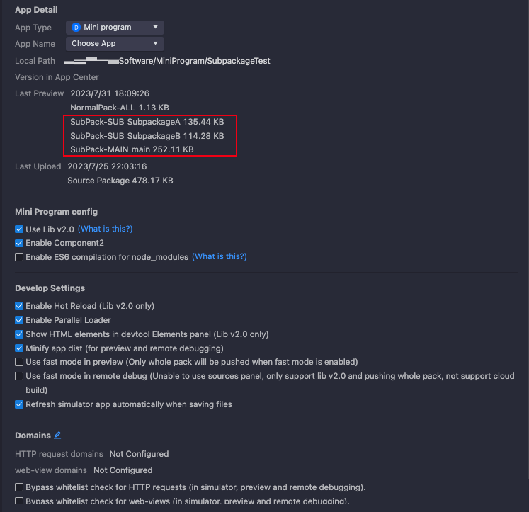

# Subpackage loading

La carga de subpackage permite a los desarrolladores de mini-programas segmentar los recursos de mini-programa en un paquete principal y múltiples subpackages.Esta segmentación permite que IAPminiprogram SDK cargue solo el paquete principal cuando el usuario ingresa al mini programa, mientras que los subpackages se cargan a pedido cuando el usuario accede a los recursos relevantes.Se recomienda utilizar la carga de subpackage para los siguientes escenarios:

- Su mini programa se lenta lentamente debido a un gran tamaño de paquete.
- Estás desarrollando el mini programa en todos los equipos.

Esta guía ofrece instrucciones paso a paso sobre cómo habilitar la carga de subpackage en su mini programa.

## Requisitos previos
Para habilitar la carga de subpackage, debe cumplir con los siguientes requisitos:

- Su Mini Program Studio (IDE) debe ser la versión 3.2.1032 o posterior.Puede descargar la última versión en el Mini Portal de la plataforma del programa.
- Su biblioteca de núcleo de mini-programa (también conocida como APPX o LIB) debe ser la versión 2.0 o posterior.Puede comunicarse con su arquitecto de solución para las instrucciones de actualización.
- La super aplicación donde se ejecuta su mini programa necesita integrar IAPminiprogram SDK versión 2.47.0 o posterior.

## Procedimientos
Los desarrolladores de MiniProgram pueden completar los siguientes dos pasos para habilitar la carga de subpackage en el Mini program:

- [Paso 1: Declarar una estructura de subpackage](/)
- [Paso 2: iniciar una compilación de paquetes](/)

## Step 1: Declare a subpackage structure
Para especificar los directorios que pertenecen a cada subpackage, debe completar los siguientes tres pasos para declarar una estructura de subpackage.

1. Abra su proyecto mini-programa.
2. Localice y abra el archivo App.json.
3. En el archivo App.json, declare la estructura de subpackage definiendo el parámetro de subpackages.El siguiente código de muestra muestra cómo definir este parámetro:

```js
{
  "pages": ["pages/index", "pages/common"],
  "subPackages": [
    {
      "root": "packageA",
      "pages": ["pages/page1", "pages/page2"]
    },
    {
      "root": "packageB",
      "pages": ["pages/page3", "pages/page4"]
    }
  ]
}
```
El código de muestra anterior se basa en la siguiente estructura del archivo:
```
├── app.acss
├── app.js
├── app.json
├── packageA
│   └── pages
│       ├── page1
│       └── page2
├── packageB
│   └── pages
│       ├── page3
│       └── page4
└── pages
    ├── common
    └── index
```

Como puede ver en el código de muestra, el valor del parámetro de subpackages es una matriz de objetos.Cada objeto representa un subpackaje.Consulte la siguiente tabla para obtener los detalles del objeto:

<table>
  <tr>
    <th>Campo</th>
    <th>Tipo de datos</th>
    <th>Requerido</th>
    <th>Descripción</th>
  </tr>
  <tr>
    <td>root</td>
    <td>String</td>
    <td>M</td>
    <td>El directorio raíz de las páginas que se incluyen en el subpackaje.Al especificar este parámetro, no puede usar un subdirectorio de otro subpackaje porque cada subpackaje debe ser independiente.</td>
  </tr>
  <tr>
    <td>pages</td>
    <td>`Array<String>`</td>
    <td>M</td>
    <td>Los caminos de las páginas que se incluyen en el subpackage.Al especificar este parámetro, no puede duplicar las rutas de la página en el paquete principal u otros subpackages.</td>
  </tr>
</table>

Al declarar la estructura de subpacaje, también debe aprender las siguientes reglas de envasado y referencia:

- La plataforma Mini del programa empaqueta cualquier directorios que se especifiquen fuera del parámetro de subpackages en el paquete principal de forma predeterminada.
- Debe colocar la página de inicio y las páginas de barras de pestañas en el paquete principal.También se recomienda incluir otros recursos centrales de uso frecuente en este paquete.
- Los subpackages pueden hacer referencia solo a los recursos (por ejemplo, imágenes y scripts JS) que están contenidos en su propio paquete y el paquete principal.Esto significa que los subpackages no pueden hacer referencia a los recursos que pertenecen a otros subpackages.
- La plataforma MINI del programa empaqueta el paquete principal y cada subpackage por separado.Por lo tanto, el mismo módulo JS puede existir tanto en el paquete principal como en los subpackages.


## Paso 2: iniciar una compilación de paquetes
Debe iniciar una compilación de paquetes para ejecutar su mini programa con la estructura de subpacaje especificada anteriormente aplicada.Para iniciar la compilación, haga clic en cualquiera de los siguientes tres botones en Mini Program Studio:

- **Preview**
- **Debug**
- **Upload Version**

## Otras acciones
Después de habilitar la carga de subpackage, puede optar por establecer reglas de precarga para los subpackages y ver los tamaños de los paquetes para un rendimiento óptimo.

## Establecer reglas de precarga para subpackages
Puede establecer reglas de precarga de subpackage para habilitar el SDK para precargar subpackages específicos cuando el usuario accede a una página en particular.Esto puede mejorar la velocidad de transición de la página y se recomienda para subpackages que contienen páginas visitadas con frecuencia.

Para establecer las reglas de precarga, puede especificar el parámetro PreloadRule en el archivo app.json con el siguiente código de muestra:

```js
{
  "pages": ["pages/index"],
  "subPackages": [
    {
      "root": "sub1",
      "pages": ["page1"]
    },
    {
      "root": "sub2",
      "pages": ["page2"]
    },
    {
      "root": "sub3",
      "pages": ["page3"]
    },
    {
      "root": "path/sub4",
      "pages": ["page4"]
    }
  ],
  "preloadRule": {
    "pages/index": {
      "network": "all",
      "packages": ["sub1"]
    },
    "sub1/page1": {
      "packages": ["sub2", "sub3"]
    },
    "sub3/page3": {
      "network": "wifi",
      "packages": ["path/sub4"]
    }
  }
}
```

El valor del parámetro Preloadrule se especifica con pares de valor clave.Para cada par de valores clave, la clave es la ruta de la página en la que ingresa el usuario, y el valor es un objeto que indica la configuración de precarga de subpackage en esa página.Consulte la siguiente tabla sobre cómo especificar la configuración:

<table>
  <tr>
    <th>Field</th>
    <th>Data type</th>
    <th>Required</th>
    <th>Description</th>
  </tr>
  <tr>
    <td>packages</td>
    <td>`Array<String>`</td>
    <td>M</td>
    <td>Los subpackages se precargarán.Especifique este parámetro con el mismo valor que el parámetro Subpackages.Root.</td>
  </tr>
  <tr>
    <td>network</td>
    <td>String</td>
    <td>O</td>
    <td>
    TLas condiciones de red bajo las cuales se preceden los subpackages.Los valores válidos son:
      - `all`: Precarga los subpackages en cualquier conexión de red.
      - `wifi`: PRecargar los subpackages solo con una red Wi-Fi.
      Si no especifica este parámetro, su valor predeterminado es todo.
    </td>
  </tr>
</table>


## View package sizes
Para mejorar la experiencia de carga y evitar posibles bloqueos de aplicaciones, se recomienda mantener el tamaño del paquete principal o cada subpackaje dentro de 2 MB.Después de la declaración, puede ver los tamaños de los paquetes haciendo clic en los detalles en Mini Program Studio.La siguiente imagen muestra una página de detalles de muestra:To enhance the loading experience and avoid potential app crashes, it is recommended to keep the size of the main package or each subpackage within 2 MB. After the declaration, you can view the package sizes by clicking Details in Mini Program Studio. The following image shows a sample detail page:



## Preguntas frecuentes
### ¿Qué pasa si la versión SDK es anterior a la requerida?
La plataforma Mini Program puede manejar la compatibilidad hacia atrás compilando y construyendo el código fuente en los siguientes dos tipos de paquetes:

- Un paquete de código fuente completo para los SDK que no admiten la carga de subpackage.
- Un paquete de código fuente subpacado para los SDK que admiten la carga de subpackage.


### ¿Qué debo hacer si el tamaño del paquete es demasiado grande?
Se recomienda mantener el tamaño del paquete principal o cada subpackaje dentro de 2 MB.Si el tamaño de su paquete excede el límite, puede reducirlo almacenando algunos recursos (como imágenes) en el servidor.Si el tamaño del paquete sigue siendo un problema, puede segmentar los recursos aún más con más subpackages.


