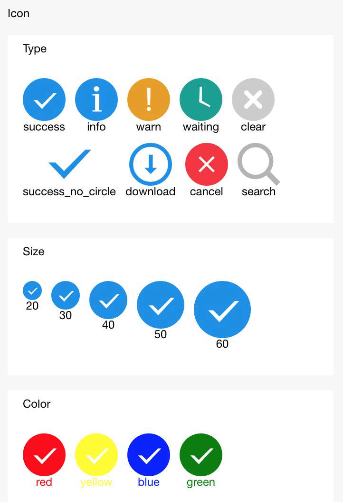

# icon

Icono

<table>
  <thead>
    <tr>
      <th>Propiedad</th>
      <th>Tipo</th>
      <th>Predeterminado</th>
      <th>Descripción</th>
    </tr>
  </thead>
  <tbody>
    <tr>
      <td>type</td>
      <td>String</td>
      <td></td>
      <td>Tipo de icono, valor efectivo: info, warn, waiting, cancel, download, search, clear, success, success_no_circle, loading.</td>
    </tr>
    <tr>
      <td>size</td>
      <td>Number</td>
      <td>23</td>
      <td>Tamaño del icono, en px.</td>
    </tr>
    <tr>
      <td>color</td>
      <td>Color</td>
      <td></td>
      <td>Color del icono, igual que el color css.</td>
    </tr>
  </tbody>
</table>

## Captura de pantalla



## Código de Ejemplo

```xml
<block a:for="{{iconType}}">
  <view class="item">
    <icon type="{{item}}" aria-label="{{item}}" size="45"/>
    <text>{{item}}</text>
  </view>
</block>
<block a:for="{{iconSize}}">
  <view class="item">
    <icon type="success" size="{{item}}"/>
    <text>{{item}}</text>
  </view>
</block>
<block a:for="{{iconColor}}">
  <view class="item">
    <icon type="success" size="45" color="{{item}}"/>
    <text style="color:{{item}}">{{item}}</text>
  </view>
</block>
```

```js
Page({
  data: {
    iconSize: [20, 30, 40, 50, 60],
    iconColor: [
      'rojo', 'amarillo', 'azul', 'verde'
    ],
    iconType: [
      'éxito',
      'info',
      'advertencia',
      'espera',
      'borrar',
      'éxito_sin_círculo',
      'descargar',
      'cancelar',
      'buscar',
    ]
  }
})
```