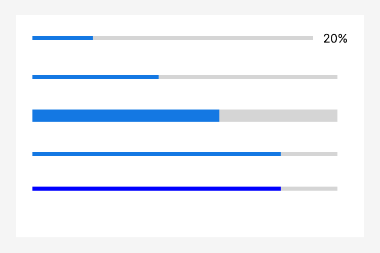

# progress

Barra de progreso.

<table>
  <thead>
    <tr>
      <th>Property</th>
      <th>Type</th>
      <th>Por Defecto</th>
      <th>Descripción</th>
    </tr>
  </thead>
  <tbody>
    <tr>
      <td>percent</td>
      <td>Float</td>
      <td></td>
      <td>Porcentaje (0~100).</td>
    </tr>
    <tr>
      <td>show-info</td>
      <td>Booleano</td>
      <td>false</td>
      <td>Mostrar el valor del porcentaje en el lado derecho.</td>
    </tr>
    <tr>
      <td>stroke-width</td>
      <td>Número</td>
      <td>6</td>
      <td>Ancho de la línea, en píxeles.</td>
    </tr>
    <tr>
      <td>active-color</td>
      <td>Color</td>
      <td>#09BB07</td>
      <td>Color de la barra de progreso seleccionada.</td>
    </tr>
    <tr>
      <td>background-color</td>
      <td>Color</td>
      <td></td>
      <td>Color de la barra de progreso no seleccionada.</td>
    </tr>
    <tr>
      <td>active</td>
      <td>Booleano</td>
      <td>false</td>
      <td>Animación de carga de izquierda a derecha o no.</td>
    </tr>
  </tbody>
</table>

Captura de pantalla



Código de ejemplo

```xml
<progress percent="20" show-info/>
<progress percent="40" active/>
<progress percent="60" stroke-width="10"/>
<progress percent="80" active/>
<progress percent="80" color="#10AEFF"/>
```
