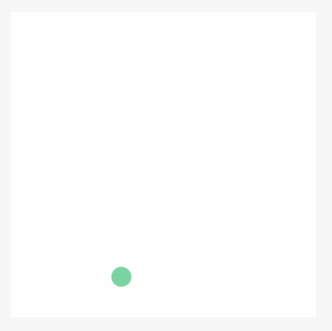

# canvas

Canvas.

<table>
  <thead>
    <tr>
      <th>Property</th>
      <th>Type</th>
      <th>Default</th>
      <th>Description</th>
    </tr>
  </thead>
  <tbody>
    <tr>
      <td>id</td>
      <td>String</td>
      <td></td>
      <td>Identificador único del componente.</td>
    </tr>
    <tr>
      <td>style</td>
      <td>String</td>
      <td></td>
      <td></td>
    </tr>
    <tr>
      <td>class</td>
      <td>String</td>
      <td></td>
      <td></td>
    </tr>
    <tr>
      <td>width</td>
      <td>String</td>
      <td>atributo de ancho del canvas</td>
      <td></td>
    </tr>
    <tr>
      <td>height</td>
      <td>String</td>
      <td>atributo de alto del canvas</td>
      <td></td>
    </tr>
    <tr>
      <td>disable-scroll</td>
      <td>Boolean</td>
      <td>false</td>
      <td>Prohibir el desplazamiento de la pantalla y el tirar para refrescar.</td>
    </tr>
    <tr>
      <td>onTap</td>
      <td>EventHandle</td>
      <td></td>
      <td>Clic.</td>
    </tr>
    <tr>
      <td>onTouchStart</td>
      <td>EventHandle</td>
      <td></td>
      <td>Inicio de la acción de toque.</td>
    </tr>
    <tr>
      <td>onTouchMove</td>
      <td>EventHandle</td>
      <td></td>
      <td>Mover después del toque.</td>
    </tr>
    <tr>
      <td>onTouchEnd</td>
      <td>EventHandle</td>
      <td></td>
      <td>Fin de la acción de toque.</td>
    </tr>
    <tr>
      <td>onTouchCancel</td>
      <td>EventHandle</td>
      <td></td>
      <td>Acción de toque interrumpida, como recordatorio de llamada entrante, ventana emergente.</td>
    </tr>
    <tr>
      <td>onLongTap</td>
      <td>EventHandle</td>
      <td></td>
      <td>Activado en pulsación larga durante 500ms, luego la acción de movimiento no activa el desplazamiento de la pantalla.</td>
    </tr>
  </tbody>
</table>

**Nota:**

- La pestaña de canvas tiene un ancho predeterminado de 300px y una altura de 225px
- En la misma página, el id no puede repetirse.
- Para una visualización más fina en dpr más altos, use la configuración de atributos para acercar y use el estilo para alejar el canvas. por ejemplo:

```xml
<!-- getSystemInfoSync().pixelRatio === 2 -->
<canvas width="200" height="200" style="width:100px;height:100px;"/>
```

### Captura de pantalla:



### Código de ejemplo:

```xml
<canvas
  id="canvas"
  class="canvas"
  onTouchStart="log"
  onTouchMove="log"
  onTouchEnd="log"
/>
```

```js
Page({
  onReady() {
    this.point = {
      x: Math.random() * 295,
      y: Math.random() * 295,
      dx: Math.random() * 5,
      dy: Math.random() * 5,
      r: Math.round(Math.random() * 255 | 0),
      g: Math.round(Math.random() * 255 | 0),
      b: Math.round(Math.random() * 255 | 0),
    };
    this.interval = setInterval(this.draw.bind(this), 17);
  },
  draw() {
    var ctx = my.createCanvasContext('canvas');
    ctx.setFillStyle('#FFF');
    ctx.fillRect(0, 0, 305, 305);
    ctx.beginPath();
    ctx.arc(this.point.x, this.point.y, 10, 0, 2 * Math.PI);
    ctx.setFillStyle("rgb(" + this.point.r + ", " + this.point.g + ", " + this.point.b + ")");
    ctx.fill();
    ctx.draw();
    this.point.x += this.point.dx;
    this.point.y += this.point.dy;
    if (this.point.x <= 5 || this.point.x >= 295) {
      this.point.dx = -this.point.dx;
      this.point.r = Math.round(Math.random() * 255 | 0);
      this.point.g = Math.round(Math.random() * 255 | 0);
      this

.point.b = Math.round(Math.random() * 255 | 0);
    }
    if (this.point.y <= 5 || this.point.y >= 295) {
      this.point.dy = -this.point.dy;
      this.point.r = Math.round(Math.random() * 255 | 0);
      this.point.g = Math.round(Math.random() * 255 | 0);
      this.point.b = Math.round(Math.random() * 255 | 0);
    }
  },
  drawBall() {
  },
  log(e) {
    if (e.touches && e.touches[0]) {
      console.log(e.type, e.touches[0].x, e.touches[0].y);
    } else {
      console.log(e.type);
    }
  },
  onUnload() {
    clearInterval(this.interval)
  }
})
```