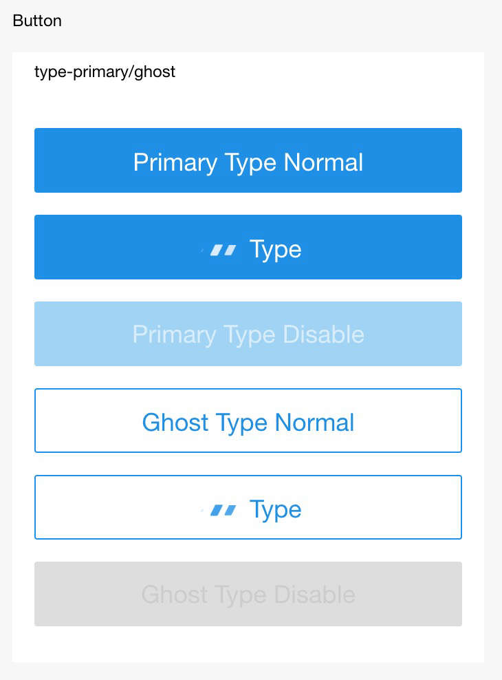

# Botón

## Propiedad

<table>
  <thead>
    <tr>
      <th>Propiedad</th>
      <th>Tipo</th>
      <th>Por defecto</th>
      <th>Descripción</th>
    </tr>
  </thead>
  <tbody>
    <tr>
      <td>size</td>
      <td>String</td>
      <td>default</td>
      <td>Valor efectivo por defecto, mini.</td>
    </tr>
    <tr>
      <td>type</td>
      <td>String</td>
      <td>default</td>
      <td>Tipo de estilo del botón, valor efectivo primary, default, warn.</td>
    </tr>
    <tr>
      <td>plain</td>
      <td>Boolean</td>
      <td>false</td>
      <td>Hueco o no.</td>
    </tr>
    <tr>
      <td>disabled</td>
      <td>Boolean</td>
      <td>false</td>
      <td>Desactivado o no.</td>
    </tr>
    <tr>
      <td>loading</td>
      <td>Boolean</td>
      <td>false</td>
      <td>Texto del botón precedido por un icono de carga o no.</td>
    </tr>
    <tr>
      <td>hover-class</td>
      <td>String</td>
      <td>button-hover</td>
      <td>Clase de estilo presionado del botón hover-class="none" indica que no hay efecto presionado.</td>
    </tr>
    <tr>
      <td>hover-start-time</td>
      <td>Number</td>
      <td>20</td>
      <td>Estado presionado mostrado en un período después de ser presionado, en milisegundos.</td>
    </tr>
    <tr>
      <td>hover-stay-time</td>
      <td>Number</td>
      <td>70</td>
      <td>Tiempo de retención del estado presionado después de ser liberado, en milisegundos.</td>
    </tr>
    <tr>
      <td>form-type</td>
      <td>String</td>
      <td></td>
      <td>Valor efectivo submit y reset, usado para componente, haciendo clic se activa evento submit/reset respectivamente.</td>
    </tr>
    <tr>
      <td>onTap</td>
      <td>EventHandle</td>
      <td></td>
      <td>Hacer clic.</td>
    </tr>
    <tr>
      <td>open-type</td>
      <td>String</td>
      <td></td>
      <td>Capacidad de apertura.</td>
    </tr>
    <tr>
      <td>scope</td>
      <td>String</td>
      <td></td>
      <td>Válido cuando open-type es getAuthorize.</td>
    </tr>
  </tbody>
</table>

### Valores Válidos de open-type

<table>
  <thead>
    <tr>
      <th>Valor</th>
      <th>Descripción</th>
    </tr>
  </thead>
  <tbody>
    <tr>
      <td>getAuthorize</td>
      <td>Soporta autorización de Mini Programa.</td>
    </tr>
  </tbody>
</table>

### Valores Válidos de Scope

<p>Cuando ```open-type``` es ```getAuthorize```, podemos establecer el ámbito en el siguiente valor:</p>

<table>
  <thead>
    <tr>
      <th>Valor</th>
      <th>Descripción</th>
    </tr>
  </thead>
  <tbody>
    <tr>
      <td>userInfo</td>
      <td>Obtener información básica del usuario.</td>
    </tr>
    <tr>
      <td>phoneNumber</td>
      <td>Obtener el número de teléfono del usuario.</td>
    </tr>
  </tbody>
</table>

## Captura de Pantalla



## Código de Ejemplo

```xml
<view class="page">
  <view class="section">
    <view class="title">Tipo</view>
    <button type="default">por defecto</button>
    <button type="primary">primario</button>
    <button type="warn">advertencia</button>
  </view>
  <view class="section" style="background:#ddd;">
    <view class="title">Misceláneo</view>
    <button type="default" plain>hueco</button>
    <button type="default" disabled>desactivado</button>
    <button type="default" loading={{true}}>cargando</button>
    <button type="default" hover-class="red">hover-rojo</button>
  </view>
  <view class="section">
    <view class="title">Tamaño</view>
    <button type="default" size="mini">mini</button>
  </view>
  <view class="section">
    <view class="title">Tipo</view>
    <form onSubmit="onSubmit" onReset="onReset">
      <button form-type="submit">enviar</button>
      <button form-type="reset">restablecer</button>
    </form>
  </view>
</view>