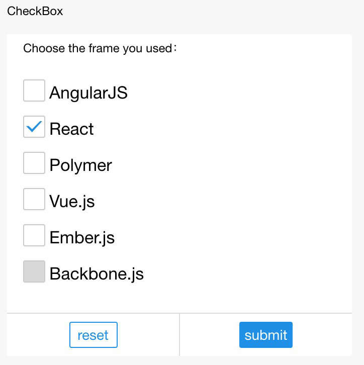

# Checkbox

## checkbox-group

Grupo selector múltiple

<table>
  <thead>
    <tr>
      <th>Propiedad</th>
      <th>Tipo</th>
      <th>Descripción</th>
    </tr>
  </thead>
  <tbody>
    <tr>
      <td>name</td>
      <td>String</td>
      <td>Nombre del componente, usado para formar la presentación para obtener datos.</td>
    </tr>
    <tr>
      <td>onChange</td>
      <td>EventHandle</td>
      <td>Se activa al cambiar el elemento marcado, ```detail = {value: Valor del elemento de casilla de verificación marcado}```.</td>
    </tr>
  </tbody>
</table>

## checkbox

Elección múltiple

<table>
  <thead>
    <tr>
      <th>Propiedad</th>
      <th>Tipo</th>
      <th>Por defecto</th>
      <th>Descripción</th>
    </tr>
  </thead>
  <tbody>
    <tr>
      <td>valor</td>
      <td>String</td>
      <td></td>
      <td>Valor del componente, valor llevado en el evento de cambio cuando está marcado.</td>
    </tr>
    <tr>
      <td>marcado</td>
      <td>Booleano</td>
      <td>falso</td>
      <td>Marcado o no, usado para establecer marcado por defecto.</td>
    </tr>
    <tr>
      <td>desactivado</td>
      <td>Booleano</td>
      <td>falso</td>
      <td>Desactivado o no.</td>
    </tr>
    <tr>
      <td>onChange</td>
      <td>EventHandle</td>
      <td></td>
      <td>Se activa al cambiar del componente, ```detail = {value: ¿La casilla de verificación está marcada o no?}```.</td>
    </tr>
    <tr>
      <td>color</td>
      <td>Color</td>
      <td></td>
      <td>Color de la casilla de verificación.</td>
    </tr>
  </tbody>
</table>

### Captura de pantalla



### Código de ejemplo

```css
.checkbox {
  display: block;
  margin-bottom: 20rpx;
}
.checkbox-text {
  font-size:34rpx;
  line-height: 1.2;
}
```

```xml
<checkbox-group onChange="onChange">
  <label class="checkbox" a:for="{{items}}">
    <checkbox value="{{item.name}}" checked="{{item.checked}}" disabled="{{item.disabled}}" />
    <text class="checkbox-text">{{item.value}}</text>
  </label>
</checkbox-group>
```

```js
Page({
  data: {
    items: [
      {name: 'angular', value: 'AngularJS'},
      {name: 'react', value: 'React', checked: true},
      {name: 'polymer', value: 'Polymer'},
      {name: 'vue', value: 'Vue.js'},
      {name: 'ember', value: 'Ember.js'},
      {name: 'backbone', value: 'Backbone.js', disabled: true},
    ],
  },
  onChange(e) {
    my.alert({
      title: `Estás seleccionando el framework ${e.detail.value}`,
    });
  },
});
```