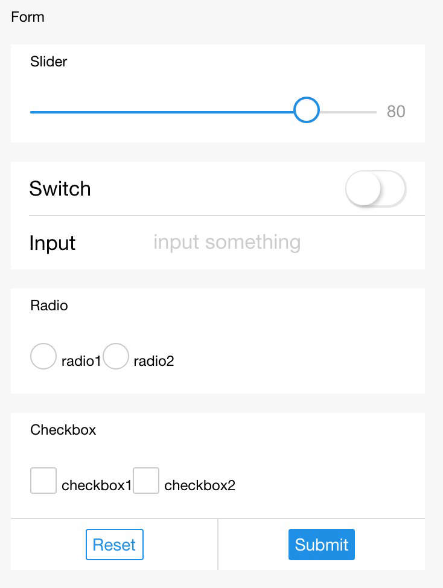

# Formulario

El formulario se utiliza para enviar los componentes de entrada del usuario, como textarea, switch, input, checkbox-group, slider, radio-group, picker y otros componentes en el componente. Al hacer clic en el componente de botón con "form" como formulario y "form-type" como "submit", se envía la presentación del valor "value" en el componente de formulario. Es necesario agregar "name" en el componente de formulario como la clave.

<table>
  <thead>
    <tr>
      <th>Propiedad</th>
      <th>Tipo</th>
      <th>Descripción</th>
    </tr>
  </thead>
  <tbody>
    <tr>
      <td>onSubmit</td>
      <td>EventHandle</td>
      <td>Transportar datos en el formulario desencadena el evento de envío, ```event.detail = {value : {'name': 'dao14'}, buttonTarget: {'dataset': 'buttonDataset'} }```.</td>
    </tr>
    <tr>
      <td>onReset</td>
      <td>EventHandle</td>
      <td>Desencadena el evento de reinicio al restablecer el formulario.</td>
    </tr>
  </tbody>
</table>

### Captura de pantalla


### Código de ejemplo

```xml
<form onSubmit="formSubmit" onReset="formReset">
  <view class="section section_gap">
    <view class="section__title">switch</view>
    <switch name="switch"/>
  </view>
  <view class="section section_gap">
    <view class="section__title">slider</view>
    <slider name="slider" show-value ></slider>
  </view>
  <view class="section">
    <view class="section__title">input</view>
    <input name="input" placeholder="por favor ingrese aquí" />
  </view>
  <view class="section section_gap">
    <view class="section__title">radio</view>
    <radio-group name="radio-group">
      <label><radio value="radio1"/>radio1</label>
      <label><radio value="radio2"/>radio2</label>
    </radio-group>
  </view>
  <view class="section section_gap">
    <view class="section__title">checkbox</view>
    <checkbox-group name="checkbox">
      <label><checkbox value="checkbox1"/>checkbox1</label>
      <label><checkbox value="checkbox2"/>checkbox2</label>
    </checkbox-group>
  </view>
  <view class="btn-area">
    <button formType="submit">Enviar</button>
    <button formType="reset">Reiniciar</button>
  </view>
</form>
```

```js
Page({
  formSubmit: function(e) {
    console.log('El formulario tiene un evento de envío, llevando datos ', e.detail.value)
  },
  formReset: function() {
    console.log('El formulario tiene un evento de reinicio')
  }
})
```