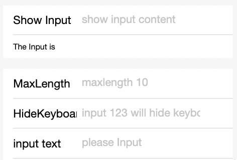

# Input

campo de entrada de texto

#### Propiedades

<table>
  <thead>
    <tr>
      <th>Propiedad</th>
      <th>Tipo</th>
      <th>Valor predeterminado</th>
      <th>Descripción</th>
    </tr>
  </thead>
  <tbody>
    <tr>
      <td>value</td>
      <td>String</td>
      <td></td>
      <td>Contenido inicial.</td>
    </tr>
    <tr>
      <td>name</td>
      <td>String</td>
      <td></td>
      <td>Nombre del componente, utilizado para el envío de datos obtenidos en el formulario.</td>
    </tr>
    <tr>
      <td>type</td>
      <td>String</td>
      <td>text</td>
      <td>
        El tipo de datos que los usuarios pueden ingresar en el campo de entrada. Los valores válidos son:
        - text: Entrada de texto de una sola línea.
        - number: Números (0-9) y guiones (-).
        - digit: Números (0-9) y puntos decimales (.).
      </td>
    </tr>
    <tr>
      <td>password</td>
      <td>Boolean</td>
      <td>false</td>
      <td>¿Es de tipo contraseña o no?</td>
    </tr>
    <tr>
      <td>placeholder</td>
      <td>String</td>
      <td></td>
      <td>Marcador de posición.</td>
    </tr>
    <tr>
      <td>placeholder-style</td>
      <td>String</td>
      <td></td>
      <td>Especifica el estilo del marcador de posición.</td>
    </tr>
    <tr>
      <td>placeholder-class</td>
      <td>String</td>
      <td></td>
      <td>Especifica la clase de estilo del marcador de posición.</td>
    </tr>
    <tr>
      <td>disabled</td>
      <td>Boolean</td>
      <td>false</td>
      <td>¿Desactivado o no?</td>
    </tr>
    <tr>
      <td>maxlength</td>
      <td>Number</td>
      <td>140</td>
      <td>Longitud máxima.</td>
    </tr>
    <tr>
      <td>cursor</td>
      <td>Number</td>
      <td></td>
      <td>Ubicación del cursor al especificar el foco.</td>
    </tr>
    <tr>
      <td>onInput</td>
      <td>Evento</td>
      <td></td>
      <td>Activa el evento de entrada al escribir en el teclado, ``````event.detail = {valor: valor}.``````</td>
    </tr>
    <tr>
      <td>onConfirm</td>
      <td>Evento</td>
      <td></td>
      <td>Activa al hacer clic en la finalización del teclado, ```event.detail = {valor: valor}.```</td>
    </tr>
    <tr>
      <td>onFocus</td>
      <td>Evento</td>
      <td></td>
      <td>Activa al obtener el foco, ```event.detail = {valor: valor}.```</td>
    </tr>
    <tr>
      <td>onBlur</td>
      <td>Evento</td>
      <td></td>
      <td>Activa al perder el foco, ```event.detail = {valor: valor}.```</td>
    </tr>
  </tbody>
</table>

**Nota (Para iOS):**
Debido a las restricciones del sistema iOS, el componente de entrada tiene los siguientes problemas conocidos:

- El cursor de entrada podría no estar alineado con el elemento de entrada.
- El teclado podría ocultarse al mantener presionado el área de entrada.

Para resolver estos problemas, agregue `enableNative={{false}}` al elemento de entrada de su código de MiniProgram para degradar a elementos HTML5 puros.

Ahora, la propiedad `enableNative` está establecida en `false`. En este caso, el tipo `number` ya no es compatible y solo se admite la entrada de tipo texto para las entradas.

#### Captura de pantalla



#### Código de ejemplo

```xml
<input maxlength="10" placeholder="Longitud máxima de entrada 10" />
<input onInput="bindKeyInput" placeholder="entrada sincronizada con la vista"/>
<input password type="text" placeholder="Esta es una casilla de entrada de contraseña" />
```

```js
Page({
  data: {
    inputValue: '',
  },
  bindKeyInput(e) {
    this.setData({
      inputValue: e.detail.value,


    });
  },
});
```