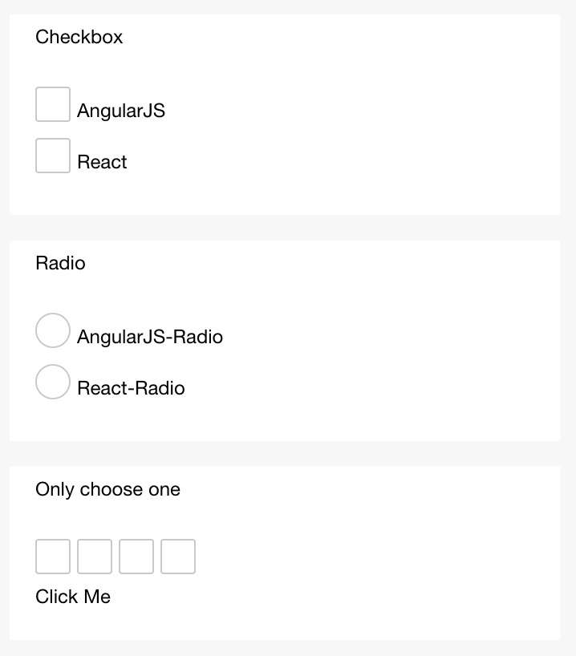

# Label

La etiqueta se puede utilizar para mejorar la disponibilidad del componente de formulario. Utiliza el atributo 'for' para encontrar el 'id' del componente relacionado o colocar el componente debajo de la etiqueta. Cuando se hace clic, el enfoque está en el componente relacionado. La prioridad de 'for' es mayor que la del componente interno. Cuando hay múltiples componentes internos, el primer componente se activa de forma predeterminada. Actualmente, los siguientes controles pueden estar vinculados: checkbox, radio, input, textarea.

### Propiedad

<table>
  <thead>
    <tr>
      <th>Propiedad</th>
      <th>Tipo</th>
      <th>Descripción</th>
    </tr>
  </thead>
  <tbody>
    <tr>
      <td>for</td>
      <td>String</td>
      <td>ID del componente límite.</td>
    </tr>
  </tbody>
</table>

### Captura de pantalla



### Ejemplo de Código

```xml
<view class="section">
  <view class="title">Checkbox, la etiqueta cubre el checkbox</view>
    <checkbox-group>
      <view>
        <label>
          <checkbox value="aaa" />
          <text>aaa</text>
        </label>
      </view>
      <view>
        <label>
          <checkbox value="bbb" />
          <text>bbb</text>
        </label>
      </view>
    </checkbox-group>
  </view>
</view>
<view class="section">
  <view class="title">Radio, asociando con el atributo 'for'</view>
    <radio-group>
      <view>
        <radio id="aaa" value="aaa" />
        <label for="aaa">aaa</label>
      </view>
      <view>
        <radio id="bbb" value="bbb" />
        <label for="bbb">bbb</label>
      </view>
    </radio-group>
  </view>
</view>
<view class="section">
  <view class="title">selecciona solo uno cuando se hacen clic en múltiples checkboxes</view>
    <label>
      <checkbox>Marcame</checkbox>
      <checkbox>No marcado</checkbox>
      <checkbox>No marcado</checkbox>
      <checkbox>No marcado</checkbox>
      <view>
        <text>Haz clic en mí</text>
      </view>
    </label>
  </view>
</view>
```