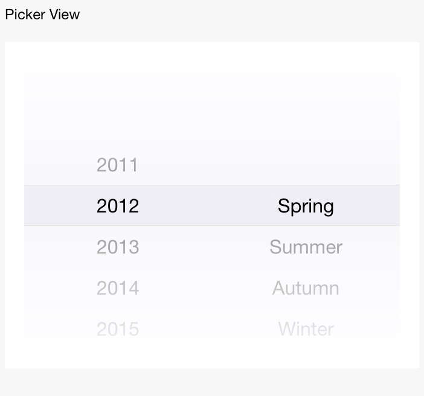

# picker-view

Selector de desplazamiento incrustado en la página.

<table>
  <thead>
    <tr>
      <th>Propiedad</th>
      <th>Tipo</th>
      <th>Descripción</th>
    </tr>
  </thead>
  <tbody>
    <tr>
      <td>value</td>
      <td>Number Array</td>
      <td>El número indica el índice correspondiente a la columna de picker-view (empezando desde 0).</td>
    </tr>
    <tr>
      <td>indicator-style</td>
      <td>String</td>
      <td>Estilo de la caja seleccionada.</td>
    </tr>
    <tr>
      <td>onChange</td>
      <td>EventHandle</td>
      <td>Se dispara cuando cambia el valor de la selección de desplazamiento. ```event.detail = {value: valor}```; value es una matriz que indica el índice de la columna de picker-view en picker-view, comenzando desde 0.</td>
    </tr>
  </tbody>
</table>

:::note[Nota:]
    Solo se puede colocar el componente dentro. Los otros nodos no se mostrarán. No coloque el componente en el nodo oculto o de visualización nula. Para el requisito de ocultación, use `a:if` para cambiar.
:::


No haga esto:

```xml
<view hidden><picker-view/></view>
```

Recomendado:

```xml
<view a:if="{{xx}}"><picker-view/></view>
```

## Captura de Pantalla



## Código de Ejemplo

```xml
<div class="pv-container">
  <div class="pv-left">
    <picker-view value="{{value}}" onChange="onChange">
      <picker-view-column>
        <div>2013</div>
        <div>2014</div>
      </picker-view-column>
      <picker-view-column>
        <div>Primavera</div>
        <div>Verano</div>
      </picker-view-column>
    </picker-view>
  </div>
  <div class="pv-right">
    {{value}}
  </div>
</div>
```

```js
Page({
  data: {},
  onChange(e) {
    console.log(e.detail.value);
    this.setData({
      value: e.detail.value,
    });
  },
});
```