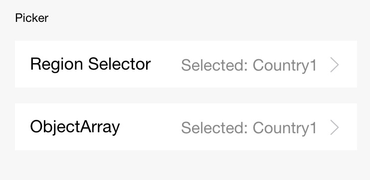

## Picker

Desplazamiento del selector emergente desde abajo

<table>
  <thead>
    <tr>
      <th>Propiedad</th>
      <th>Tipo</th>
      <th>Por defecto</th>
      <th>Descripción</th>
    </tr>
  </thead>
  <tbody>
    <tr>
      <td>rango</td>
      <td>```String[] / Object[]```</td>
      <td>```[]```</td>
      <td>Para String[], indica una lista de cadenas seleccionables; para Object[], especifica el rango-clave para indicar los campos seleccionables.</td>
    </tr>
    <tr>
      <td>rango-clave</td>
      <td>String</td>
      <td></td>
      <td>Cuando el rango es un Object[], el rango-clave se usa para especificar el valor clave en el Object como el contenido que muestra el selector.</td>
    </tr>
    <tr>
      <td>valor</td>
      <td>Número</td>
      <td></td>
      <td>Indica cuál está seleccionado en el rango (subíndice comenzando desde 0).</td>
    </tr>
    <tr>
      <td>enCambio</td>
      <td>Manejador de eventos</td>
      <td></td>
      <td>Se activa cuando cambia el valor, ```event.detail = {valor: valor}```.</td>
    </tr>
    <tr>
      <td>deshabilitado</td>
      <td>Boolean</td>
      <td>false</td>
      <td>Deshabilitar o no.</td>
    </tr>
  </tbody>
</table>

### Captura de pantalla



### Código de muestra

```xml
<view class="section">
  <view class="section-title"> selector de región</view>
  <picker onChange="bindPickerChange" value="{{index}}" range="{{array}}">
    <view class="picker">
      Selección actual{{array[index]}}
    </view>
  </picker>
  
  <picker onChange="bindObjPickerChange" value="{{arrIndex}}" range="{{objectArray}}" range-key="name">
    <view class="row">
      <view class="row-title">ObjectArray</view>
      <view class="row-extra">Selección actual:{{objectArray[arrIndex].name}}</view>
      <image class="row-arrow" src="/imagen/flechaderecha.png" mode="aspectFill" />
    </view>
  </picker>
</view>
```

```js
Page({
  data: {
    array: ['País1', 'País2', 'País3', 'País4'],
    objectArray: [
      {
        id: 0,
        name: 'País1',
      },
      {
        id: 1,
        name: 'País2',
      },
      {
        id: 2,
        name: 'País3',
      },
      {
        id: 3,
        name: 'País4',
      },
    ],
    arrIndex: 0,
    index: 0
  },
  bindPickerChange(e) {
    console.log('el selector envía cambio de selección, valor llevado ', e.detail.value);
    this.setData({
      index: e.detail.value,
    });
  },
  bindObjPickerChange(e) {
    console.log('el selector envía cambio de selección, valor llevado ', e.detail.value);
    this.setData({
      arrIndex: e.detail.value,
    });
  },
});
```