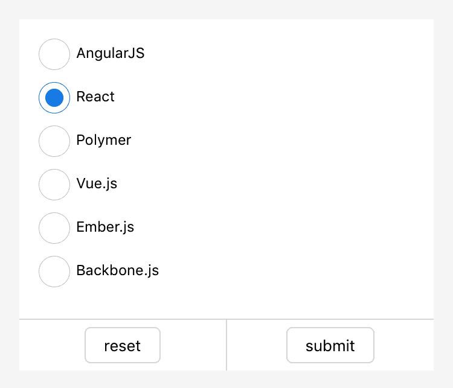

# Radio

## radio-group

Grupo de selectores de Radio.

<table>
    <thead>
        <tr>
            <th>Propiedades</th>
            <th>Tipo</th>
            <th>Descripción</th>
        </tr>
    </thead>
    <tbody>
        <tr>
            <td>onChange</td>
            <td>EventHandle</td>
            <td>Se activa cuando cambia el elemento seleccionado. ```event.detail = {value: valor del radio seleccionado}```.</td>
        </tr>
        <tr>
            <td>name</td>
            <td>String</td>
            <td>Nombre del componente, utilizado para el envío de datos del formulario obtenidos.</td>
        </tr>
    </tbody>
</table>

## radio

Elemento de radio.

<table>
    <thead>
        <tr>
            <th>Propiedades</th>
            <th>Tipo</th>
            <th>Por Defecto</th>
            <th>Descripción</th>
        </tr>
    </thead>
    <tbody>
        <tr>
            <td>value</td>
            <td>String</td>
            <td></td>
            <td>Valor del componente, valor transportado en el evento de cambio cuando se selecciona.</td>
        </tr>
        <tr>
            <td>checked</td>
            <td>Boolean</td>
            <td>false</td>
            <td>Seleccionado o no en el momento actual.</td>
        </tr>
        <tr>
            <td>disabled</td>
            <td>Boolean</td>
            <td>false</td>
            <td>Deshabilitado o no.</td>
        </tr>
        <tr>
            <td>color</td>
            <td>Color</td>
            <td></td>
            <td>Color del radio.</td>
        </tr>
    </tbody>
</table>

## Captura de pantalla



## Código de Ejemplo

```xml
<radio-group class="radio-group" onChange="radioChange">
  <label class="radio" a:for="{{items}}">
    <radio value="{{item.name}}" checked="{{item.checked}}"/>{{item.value}}
  </label>
</radio-group>
```

```js
Page({
  data: {
    items: [
      {name: 'angular', value: 'AngularJS'},
      {name: 'react', value: 'React', checked: true},
      {name: 'polymer', value: 'Polymer'},
      {name: 'vue', value: 'Vue.js'},
      {name: 'ember', value: 'Ember.js'},
      {name: 'backbone', value: 'Backbone.js'},
    ]
  },
  radioChange: function(e) {
    console.log('Estás seleccionando el framework:', e.detail.value)
  }
})
```
