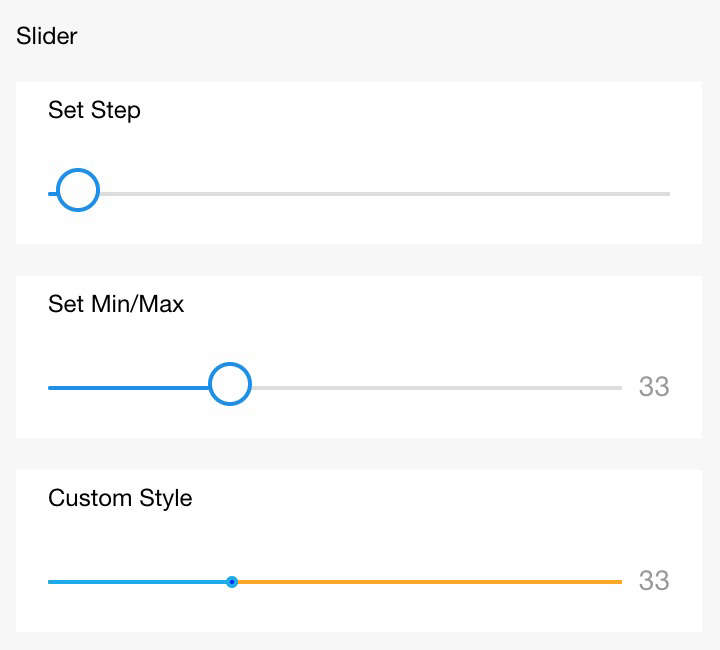

# Slider

Selector de diapositivas

<table>
    <thead>
      <tr>
        <th>Propiedad</th>
        <th>Tipo</th>
        <th>Por defecto</th>
        <th>Descripción</th>
      </tr>
    </thead>
    <tbody>
      <tr>
        <td>name</td>
        <td>String</td>
        <td></td>
        <td>Nombre del componente, usado para enviar el formulario y obtener datos.</td>
      </tr>
      <tr>
        <td>min</td>
        <td>Number</td>
        <td>0</td>
        <td>Mínimo.</td>
      </tr>
      <tr>
        <td>max</td>
        <td>Number</td>
        <td>100</td>
        <td>Máximo.</td>
      </tr>
      <tr>
        <td>step</td>
        <td>Number</td>
        <td>1</td>
        <td>Paso, debe ser mayor que 0 y puede dividirse exactamente por (max - min).</td>
      </tr>
      <tr>
        <td>disabled</td>
        <td>Boolean</td>
        <td>false</td>
        <td>Desactivado o no.</td>
      </tr>
      <tr>
        <td>value</td>
        <td>Number</td>
        <td>0</td>
        <td>Valor actual.</td>
      </tr>
      <tr>
        <td>show-value</td>
        <td>Boolean</td>
        <td>false</td>
        <td>Mostrar valor actual o no.</td>
      </tr>
      <tr>
        <td>active-color</td>
        <td>String</td>
        <td>#108ee9</td>
        <td>Color seleccionado.</td>
      </tr>
      <tr>
        <td>background-color</td>
        <td>String</td>
        <td>#ddd</td>
        <td>Color de fondo de la barra.</td>
      </tr>
      <tr>
        <td>track-size</td>
        <td>Number</td>
        <td>4</td>
        <td>Altura de la línea de seguimiento.</td>
      </tr>
      <tr>
        <td>handle-size</td>
        <td>Number</td>
        <td>22</td>
        <td>Tamaño del control deslizante.</td>
      </tr>
      <tr>
        <td>handle-color</td>
        <td>String</td>
        <td>#fff</td>
        <td>Color de relleno del control deslizante.</td>
      </tr>
      <tr>
        <td>onChange</td>
        <td>EventHandle</td>
        <td></td>
        <td>Desencadenado al completarse un arrastre, ```event.detail = {value: value}```.</td>
      </tr>
      <tr>
        <td>onChanging</td>
        <td>EventHandle</td>
        <td></td>
        <td>Evento desencadenado durante el proceso de arrastre, ```event.detail = {value: value}```.</td>
      </tr>
    </tbody>
</table>

### Captura de pantalla



### Código de ejemplo
```xml
<view class="section section-gap">
  <text class="section-title">Configurar paso</text>
  <view class="body-view">
    <slider value="60" onChange="sliderChange" step="5"/>
  </view>
</view>
<view class="section section-gap">
  <text class="section-title">Mostrar valor actual</text>
  <view class="body-view">
    <slider value="50" show-value/>
  </view>
</view>
<view class="section section-gap">
  <text class="section-title">Configurar mínimo/máximo</text>
  <view class="body-view">
    <slider value="100" min="50" max="200" show-value/>
  </view>
</view>
<view class="page-section">
  <view class="page-section-title">Estilo personalizado</view>
  <view class="page-section-demo">
    <slider value="33" onChange="slider4change" min="25" max="50" show-value
    backgroundColor="#FFAA00" activeColor="#00aaee" trackSize="2" handleSize="6" handleColor="blue" />
  </view>
</view>
```

```js
Page({
  sliderChange(e) {
    console.log('cambio de deslizador:', e.detail.value)
  }
})
```