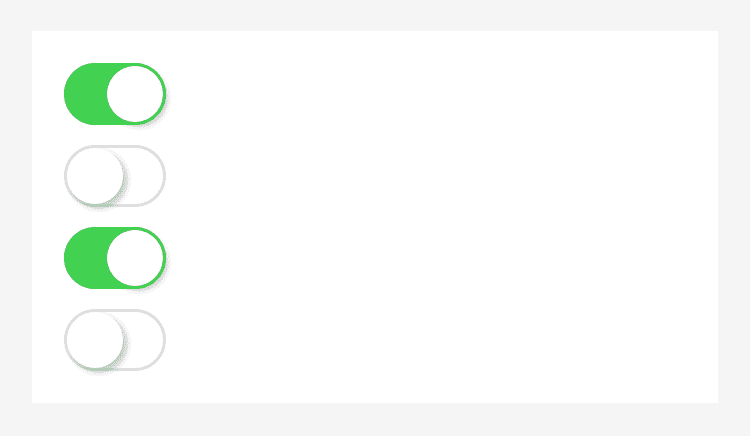

# Switch.

Switch

<table>
  <tr>
    <th>Propiedad</th>
    <th>Tipo</th>
    <th>Descripción</th>
  </tr>
  <tr>
    <td>name</td>
    <td>String</td>
    <td>Se utiliza para el envío en formularios para obtener datos.</td>
  </tr>
  <tr>
    <td>checked</td>
    <td>Boolean</td>
    <td>Marcado o no.</td>
  </tr>
  <tr>
    <td>disabled</td>
    <td>Boolean</td>
    <td>Deshabilitado o no.</td>
  </tr>
  <tr>
    <td>color</td>
    <td>String</td>
    <td>Color del componente.</td>
  </tr>
  <tr>
    <td>onChange</td>
    <td>EventHandle</td>
    <td>Se activa cuando cambia el estado de marcado. ```event.detail={ value:checked }```.</td>
  </tr>
  <tr>
    <td>color</td>
    <td>Color</td>
    <td>Color del switch.</td>
  </tr>
</table>


### Captura de pantalla



### Ejemplo de código

```xml
<view class="page">
  <view class="switch-list">
    <view class="switch-item">
      <switch checked onChange="switchChange"/>
    </view>
  </view>
</view>
```

```js
Page({
  switchChange (e){
    console.log('Evento switchChange, valor:', e.detail.value)
  },
})
```