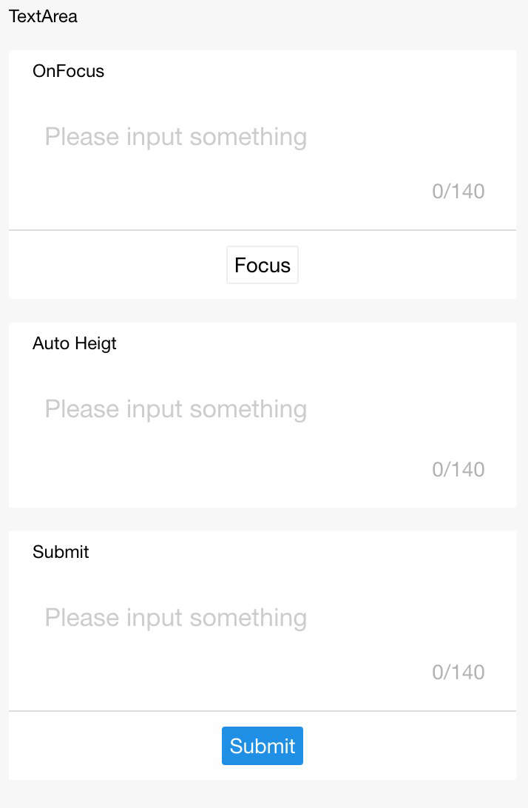

# Textarea

Caja de entrada de varias filas

<table>
  <thead>
    <tr>
      <th>Propiedad</th>
      <th>Tipo</th>
      <th>Por defecto</th>
      <th>Descripción</th>
    </tr>
  </thead>
  <tbody>
    <tr>
      <td>name</td>
      <td>String</td>
      <td></td>
      <td>Nombre del componente, utilizado para el envío de formulario para obtener datos.</td>
    </tr>
    <tr>
      <td>value</td>
      <td>String</td>
      <td></td>
      <td>Contenido inicial.</td>
    </tr>
    <tr>
      <td>placeholder</td>
      <td>String</td>
      <td></td>
      <td>Marcador de posición.</td>
    </tr>
    <tr>
      <td>placeholder-style</td>
      <td>String</td>
      <td></td>
      <td>Especifica el estilo del marcador de posición.</td>
    </tr>
    <tr>
      <td>placeholder-class</td>
      <td>String</td>
      <td></td>
      <td>Especifica la clase de estilo del marcador de posición.</td>
    </tr>
    <tr>
      <td>disabled</td>
      <td>Boolean</td>
      <td>false</td>
      <td>Deshabilitar o no.</td>
    </tr>
    <tr>
      <td>maxlength</td>
      <td>Number</td>
      <td>140</td>
      <td>Longitud máxima, sin límite de longitud cuando se establece en -1.</td>
    </tr>
    <tr>
      <td>focus</td>
      <td>Boolean</td>
      <td>false</td>
      <td>Obtener enfoque.</td>
    </tr>
    <tr>
      <td>auto-height</td>
      <td>Boolean</td>
      <td>false</td>
      <td>Usar altura automática o no.</td>
    </tr>
    <tr>
      <td>show-count</td>
      <td>Boolean</td>
      <td>true</td>
      <td>Renderizar estadísticas de recuento de palabras o no.</td>
    </tr>
    <tr>
      <td>controlled</td>
      <td>Boolean</td>
      <td>false</td>
      <td>¿Es componente controlado o no? Cuando es true, el contenido del valor está completamente controlado por setData.</td>
    </tr>
    <tr>
      <td>onInput</td>
      <td>EventHandle</td>
      <td></td>
      <td>Desencadenar en la entrada del teclado, ```event.detail = {value: value}```, puede devolver directamente una cadena para reemplazar el contenido en la caja de entrada.</td>
    </tr>
    <tr>
      <td>onFocus</td>
      <td>EventHandle</td>
      <td></td>
      <td>Desencadenar al obtener el foco de la caja de entrada, ```event.detail = {value: value}```.</td>
    </tr>
    <tr>
      <td>onBlur</td>
      <td>EventHandle</td>
      <td></td>
      <td>Desencadenar al perder el foco de la caja de entrada, ```event.detail = {value: value}```.</td>
    </tr>
    <tr>
      <td>onConfirm</td>
      <td>EventHandle</td>
      <td></td>
      <td>Desencadenar al hacer clic en la finalización, ```event.detail = {value: value}```.</td>
    </tr>
  </tbody>
</table>

### Captura de pantalla



### Código de ejemplo

```html
<view class="section">
  <textarea onBlur="bindTextAreaBlur" auto-height placeholder="Altura automática" />
</view>
<view class="section">
  <textarea placeholder="Obtener enfoque solo cuando se hace clic en este botón" focus="{{focus}}" />
  <view class="btn-area">
    <button onTap="bindButtonTap">Tener la caja de entrada con enfoque</button>
  </view>
</view>
<view class="section">
  <form onSubmit="bindFormSubmit">
    <textarea placeholder="textarea en el formulario" name="textarea"/>
    <button form-type="submit"> Enviar </button>
  </form>
</view>
```

```js
Page({
  data: {
    focus: false,
    inputValue: ''
  },
  bindButtonTap() {
    this.setData({
      focus: true
    })
  },
  bindTextAreaBlur: function(e) {
    console.log(e.detail.value)
  },
  bindFormSubmit: function(e) {
    console.log(e.detail.value.textarea)
  }
})
```