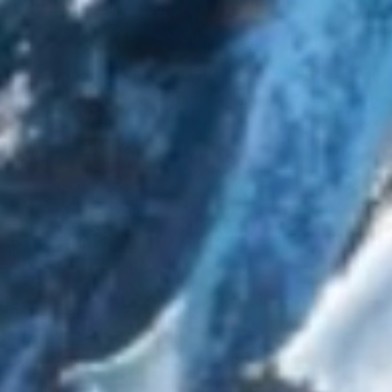
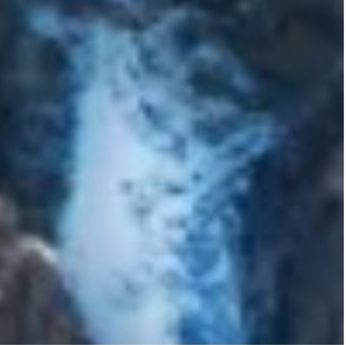

# image

### Propiedades

<table>
  <thead>
    <tr>
      <th>Propiedad</th>
      <th>Tipo</th>
      <th>Predeterminado</th>
      <th>Descripción</th>
    </tr>
  </thead>
  <tbody>
    <tr>
      <td>src</td>
      <td>String</td>
      <td>-</td>
      <td>La URL de la imagen.</td>
    </tr>
    <tr>
      <td>mode</td>
      <td>String</td>
      <td>```scaleToFill```</td>
      <td>El modo de la imagen.</td>
    </tr>
    <tr>
      <td>class</td>
      <td>String</td>
      <td>-</td>
      <td>El estilo externo.</td>
    </tr>
    <tr>
      <td>style</td>
      <td>String</td>
      <td>-</td>
      <td>El estilo en línea.</td>
    </tr>
    <tr>
      <td>lazy-load</td>
      <td>Boolean</td>
      <td>```false```</td>
      <td>Habilita la carga perezosa de una imagen. No se admite en escenarios donde se desean ocultar elementos en CSS. Por ejemplo, cuando se usa el atributo _display: none_ o el atributo _visibility: hidden_ para ocultar un elemento en CSS, la carga perezosa no funciona.</td>
    </tr>
    <tr>
      <td>default-source</td>
      <td>String</td>
      <td>-</td>
      <td>La URL de la imagen predeterminada. Si se establece esta propiedad, primero se muestra la imagen predeterminada, y luego se representa la imagen correspondiente después de que se haya cargado correctamente la imagen especificada por _src_.</td>
    </tr>
    <tr>
      <td>onLoad</td>
      <td>EventHandle</td>
      <td>-</td>
      <td>Se activa cuando la carga de la imagen está completa, que es un objeto de evento: ```event.detail = {height:'image height px', width:'image width px'}```.</td>
    </tr>
    <tr>
      <td>onError</td>
      <td>EventHandle</td>
      <td>-</td>
      <td>Se activa cuando se produce un error en la carga de la imagen, que es un objeto de evento: ```event.detail = {errMsg: 'something wrong'}```.</td>
    </tr>
    <tr>
      <td>onTap</td>
      <td>EventHandle</td>
      <td>-</td>
      <td>Se activa al hacer clic en una imagen; pasa eventos de clic al componente principal.</td>
    </tr>
    <tr>
      <td>catchTap</td>
      <td>EventHandle</td>
      <td>-</td>
      <td>Se activa al hacer clic en una imagen; no pasa eventos de clic al componente principal.</td>
    </tr>
  </tbody>
</table>

_Nota: Por defecto, el ancho del componente de imagen es de 300px y la altura es de 225px._

### Modo

Existen 13 modos, 4 de los cuales son modos de escalado y 9 son modos de recorte.

#### Modo de Escalado

<table>
  <thead>
    <tr>
      <th>Propiedad</th>
      <th>Descripción</th>
    </tr>
  </thead>
  <tbody>
    <tr>
      <td>scaleToFill</td>
      <td>Estira la imagen para llenar el espacio disponible sin mantener la relación de aspecto.</td>
    </tr>
    <tr>
      <td>aspectFit</td>
      <td>Estira la imagen para mostrar completamente los lados largos manteniendo su relación de aspecto. En otras palabras, se muestra toda la imagen por completo.</td>
    </tr>
    <tr>
      <td>aspectFill</td>
      <td>Estira la imagen para mostrar completamente los lados cortos manteniendo su relación de aspecto. En otras palabras, la imagen se muestra completa en la dirección horizontal o vertical, recortando cualquier parte que no quepa.</td>
    </tr>
    <tr>
      <td>widthFix</td>
      <td>El ancho no se cambia y la altura se ajusta automáticamente manteniendo su relación de aspecto.</td>
    </tr>
  </tbody>
</table>


#### Modo de Recorte

<table>
  <thead>
    <tr>
      <th>Propiedad</th>
      <th>Descripción</th>
    </tr>
  </thead>
  <tbody>
    <tr>
      <td>top</td>
      <td>Muestra solo el área superior sin escalar la imagen.</td>
    </tr>
    <tr>
      <td>bottom</td>
      <td>Muestra solo el área inferior sin escalar la imagen.</td>
    </tr>
    <tr>
      <td>center</td>
      <td>Muestra solo el área central sin escalar la imagen.</td>
    </tr>
    <tr>
      <td>left</td>
      <td>Muestra solo el área izquierda sin escalar la imagen.</td>
    </tr>
    <tr>
      <td>right</td>
      <td>Muestra solo el área derecha sin escalar la imagen.</td>
    </tr>
    <tr>
      <td>top left</td>
      <td>Muestra solo el área superior izquierda sin escalar la imagen.</td>
    </tr>
    <tr>
      <td>top right</td>
      <td>Muestra solo el área superior derecha sin escalar la imagen.</td>
    </tr>
    <tr>
      <td>bottom left</td>
      <td>Muestra solo el área inferior izquierda sin escalar la imagen.</td>
    </tr>
    <tr>
      <td>bottom right</td>
      <td>Muestra solo el área inferior derecha sin escalar la imagen.</td>
    </tr>
  </tbody>
</table>

**Nota:** La altura de la imagen no puede establecerse como ```auto```. Si se requiere que la altura de la imagen sea automática, simplemente establezca el modo como ```widthFix```.

### Capturas de pantalla

#### Imagen original


#### scaleToFill

Ajusta la imagen completamente sin mantener la relación de aspecto:


#### aspectFit

Estira la imagen para mostrar completamente los lados largos mientras mantiene su relación de aspecto:


#### aspectFill

Estira la imagen para mostrar completamente los lados cortos manteniendo su relación de aspecto:


#### widthFix 

El ancho no cambia y la altura se ajusta automáticamente manteniendo su relación de aspecto:


#### top 

Muestra solo el área superior sin escalar la imagen:


#### bottom 

Muestra solo el área inferior sin escalar la imagen:


#### center

Muestra solo el área central sin escalar la imagen:

  

#### left

Muestra solo el área izquierda sin escalar la imagen:

  

#### right

Muestra solo el área derecha sin escalar la imagen:

  

#### top left

Muestra solo el área superior izquierda sin escalar la imagen:

  

#### top right

Muestra solo el área superior derecha sin escalar la imagen:

  

#### bottom left

Muestra solo el área inferior izquierda sin escalar la imagen:

  

#### bottom right

Muestra solo el área inferior derecha sin escalar la imagen:

  

### Código de ejemplo

```xml
<view class="section" a:for="{{array}}" a:for-item="item">
  <view class="title">{{item.text}}</view>
  <image style="background-color: #eeeeee; width: 300px; height:300px;" mode="{{item.mode}}" src="{{src}}" onError="imageError" onLoad="imageLoad" />
</view>
```

```js
Page({
  data: {
    array: [{
      mode: 'scaleToFill',
      text: 'scaleToFill: scale without aspect ratio and fit image completely’
    }, {
      mode: 'aspectFit',
      text: 'aspectFit: scale with aspect ratio and show fully long side’
    }, {
      mode: 'aspectFill',
      text: 'aspectFill: scale with aspect ratio and ensure short side to be displayed fully.’
    }, {
      mode: 'top',
      text: 'top: Not scaling image, showing only top area’
    }, {
      mode: 'bottom',
      text: 'bottom: Not scaling image, showing only bottom area’
    }, {
      mode: 'center',
      text: 'center: Not scaling image, showing only central area’
    }, {
      mode: 'left',
      text: 'left: Not scaling image, showing only left area’
    }, {
      mode: 'right',
      text: ‘right: Not scaling image, showing only right area’
    }, {
      mode: 'top left',
      text: ‘top left: Not scaling image, showing only top left area’
    }, {
      mode: 'top right',
      text: ‘top right: Not scaling image, showing only top right area’
    }, {
      mode: 'bottom left',
      text: ‘bottom left: Not scaling image, showing only bottom left area’
    }, {
      mode: 'bottom right',
      text: ‘bottom right: Not scaling image, showing only bottom right area’
    }],

    src: './2.png'
  },
  imageError: function (e) {
    console.log('image3 error happened', e.detail.errMsg)
  },
  imageLoad: function (e) {
    console.log('image loaded successfully', e);
  }
})
``` 