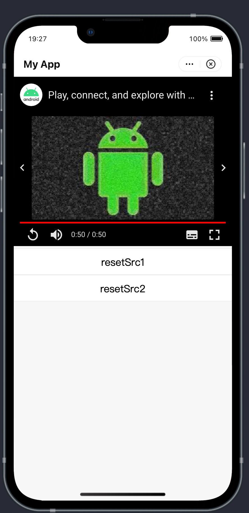

# Reproductor de YouTube

Lee este tema para aprender cómo reproducir videos de YouTube en mini-programas utilizando el componente `<youtube-player>`.

## Requisitos previos
Antes de comenzar, debes tener en cuenta lo siguiente:

- La biblioteca principal del mini programa (AppX) debe ser la versión 2.8.9. Para obtener más información sobre cómo actualizar Appx a 2.8.9, comunícate con tu Arquitecto de Soluciones para obtener la documentación.

:::info[Nota]
Para conocer las versiones de AppX y el SDK que integres, consulta Obtener tus versiones actuales de la biblioteca principal y el SDK de IAPMiniProgram.
:::

- Formato de paquete de video compatible tanto para iOS como para Android: formatos de video de YouTube.
- Los JSAPIs no son compatibles para operar el reproductor.

## Experiencia de usuario
La siguiente figura muestra la experiencia del usuario de la reproducción del `<youtube-player>`.



## Códigos de muestra
Consulta los siguientes códigos de muestra del componente `<youtube-player>`:

```xml
<view style="width:100%">
  <youtube-player 
    id="myVideo"
    style="{{style}}"
    videoId={{videoId}}
    playerVars={{playerVars}}
  ></youtube-player>
  <button type="default" size="defaultSize" onTap="resetSrc1">resetSrc1</button>
  <button type="default" size="defaultSize" onTap="resetSrc2">resetSrc2</button>
</view>
```

```js
Page({
  data: {
    videoId: 'xxx',
    style: "height:300;width:100%;left:10",
    playerVars: {
      'autoplay': 1, 
      'modestbranding': 1
    }
  },
  onLoad() {
  },
  resetSrc1() {
    this.setData({
      videoId: "xxx",
      style: "background-color:white;height:400;width:100%;margin-top:200",
    })
  },
  resetSrc2() {
    this.setData({
      videoId: "xxx",
      style: "background-color:white;height:300;width:100%;margin-top:100",
    })
  }
});
```

## Parámetros
| Propiedad  | Tipo    | Requerido | Descripción                                                   |
|------------|---------|-----------|---------------------------------------------------------------|
| id         | String  | Sí        | El ID único que se utiliza para identificar el componente `<youtube-player>`. |
| estilo     | String  | Sí        | El estilo en línea.                                           |
| videoId    | String  | Sí        | El ID único que se utiliza para identificar el video de YouTube. |
| playerVars | Objeto  | No        | Los parámetros del reproductor de Youtube. Para obtener más información sobre los parámetros secundarios del objeto playVars, consulta Parámetros admitidos. |

## Preguntas frecuentes
1. **¿Por qué el parámetro de reproducción automática no tiene efecto en el sistema iOS?**

   El parámetro de reproducción automática no tiene efecto en el sistema iOS porque el propio sistema iOS tiene restricciones sobre la reproducción automática de videos en páginas web. Para obtener más información sobre las políticas, consulta [Nuevas políticas de ```<video>``` para iOS](https://developer.apple.com/documentation/webkit/creating_and_playing_videos_in_safari/playing_media_in_safari).

2. **¿Por qué los modos de pantalla completa de Android y iOS son diferentes?**
   Los modos de pantalla completa se implementan a través de las APIs de YouTube. Para obtener más información, consulta [APIs de YouTube](https://developers.google.com/youtube/iframe_api_reference).

3. **¿Por qué la función de intercambio de videos de Android y iOS está restringida?**
   El Reproductor de YouTube está incrustado en mini-programas a través del elemento HTML `<iframe>`. Para garantizar la seguridad de los mini-programas, tu mini-programa debe prohibir la redirección de `<iframe>` al implementar este elemento, lo que conduce a restricciones en funciones relacionadas, como el intercambio de videos y ver videos en la aplicación Reproductor de YouTube.