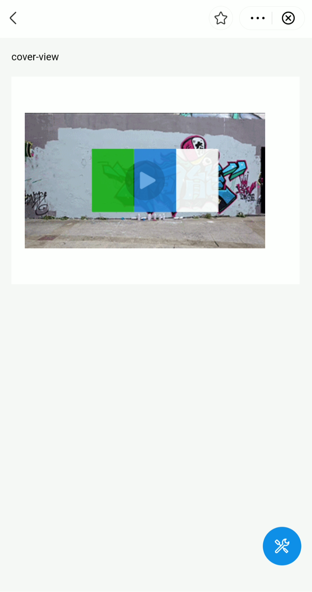

# cover-view

El componente ```cover-view``` permite a los desarrolladores de mini programas superponer vistas de texto sobre componentes nativos para proporcionar textos informativos. Puedes personalizar la vista de texto a través de CSS (Hoja de estilo en cascada) y agregarla a los siguientes componentes nativos:

- mapa
- lienzo
- video
- reproductor en vivo
- lottie

# Antes de empezar

Antes de implementar el componente ```cover-view```, considera las siguientes pautas:

- Verifica el soporte para el componente en la versión del super app de destino llamando al JSAPI ```my.canIUse```. Puedes usar el siguiente código:
  ```javascript
  my.canIUse('cover-view')
  ```
- Entiende que el comportamiento del componente ```cover-view``` puede diferir según los dispositivos. Se recomienda probar en dispositivos reales para garantizar una experiencia de usuario óptima.

# Experiencia de usuario

La siguiente figura muestra una vista de texto compuesta por tres partes, cada una con un color de fondo verde, azul y blanco, respectivamente.



# Parámetros

| Propiedad | Tipo        | Descripción                                     | Requerido |
|-----------|-------------|-------------------------------------------------|-----------|
| onTap     | EventHandle | El callback que se ejecuta cuando el usuario hace clic en la vista de texto. | No        |

# Códigos de ejemplo

Los siguientes códigos de ejemplo definen una vista de texto que corresponde al ejemplo proporcionado en la Experiencia de usuario.

## .axml

Define la estructura de la página con el siguiente código de ejemplo en el archivo AXML:

```xml
<view class="page">
  <view class="page-description">cover-view</view>
  <view class="page-section">
    <view class="page-section-demo" style="position: relative;">
      <video
        src="{{ src }}"
        class="video"
        id="video"
        poster="https://zos.alipayobjects.com/rmsportal/SSWkSLDrrgsLFDfsjzTZ.png"
      >
      </video>
      <cover-view class="cover-view">
        <cover-view class="cover-view-item cover-view-item-1"></cover-view>
        <cover-view class="cover-view-item cover-view-item-2"></cover-view>
        <cover-view class="cover-view-item cover-view-item-3"></cover-view>
      </cover-view>
    </view>
  </view>
</view>
```

## .acss

Define la hoja de estilos de la página con el siguiente código de ejemplo en el archivo ACSS:

```css
.cover-view {
  position: absolute;
  top: calc(50% - 75rpx);
  left: calc(50% - 150rpx);
  display:flex;
  flex-direction:row;
  background-color: rgba(0, 0, 0, 0);
}

.cover-view-item{
  width: 100rpx;
  height: 150rpx;
  font-size: 26rpx;
}

.cover-view-item-1 {
  background-color: rgba(26, 173, 25, 0.7);
}

.cover-view-item-2 {
  background-color: rgba(39, 130, 215, 0.7);
}

.cover-view-item-3 {
  background-color: rgba(255, 255, 255, 0.7);
}
```

## .js

Define la lógica de la página con el siguiente código de ejemplo en el archivo JS:

```js
Page({
  data: {
  }
});
```

## .json

Define las configuraciones de la página con el siguiente código de ejemplo en el archivo JSON:

```js
{
  "defaultTitle": "cover view"
}
```

# Preguntas frecuentes

## ¿El ```cover-view``` soporta esquinas redondeadas y sombras?

Sí, el componente ```cover-view``` soporta esquinas redondeadas y sombras. Puedes especificar estas propiedades en el archivo ACSS utilizando el siguiente código de ejemplo:

```css
/* Esquinas redondeadas */
border-radius: 15%;

/* Sombras */
box-shadow: 10px 10px 5px #888888;
```
