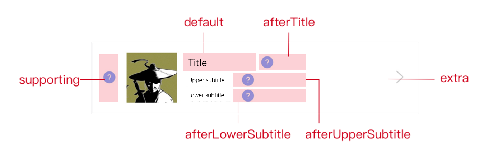

# List-secondary

Puede usar el componente de la lista-segundo para mostrar la información adicional en el lado derecho del elemento de la lista. El componente de la  list-secondary se coloca en el slot adicional.Consulte la [list-item](/) para más detalles.

## Código de muestra
Consulte los códigos de muestra en diferentes idiomas:

## .json
```js
{
 "defaultTitle": "List",
 "usingComponents":{
   "list": "mini-ali-ui/es/list/index",
   "list-item": "mini-ali-ui/es/list/list-item/index",
   "list-secondary": "mini-ali-ui/es/list/list-secondary/index"
 }
}
```
## .axml
```xml
<list>
 <view slot="header">
   list header
 </view>
 <list-item thumb="http://thumb.link.png"
   arrow="{{true}}"
   onClick="onItemClick"
   upperSubtitle="upper subtitle"
   lowerSubtitle="lower subtitle" >
   main title
   <list-secondary
     title="secondary title"
     subtitle="secondary subtitle"
     thumb="http://thumb.url.jpg"
     thumbSize="20"
     slot="extra" />
 </list-item>
 <view slot="footer">
   list footer
 </view>
</list>
```
## .js
```js
Page({
 onItemClick() {
   my.alert({
     content: 'click the event on list item'
   })
 }
})
```
## Parameters

<table>
    <tr>
        <th>Propiedad</th>
        <th>Tipo</th>
        <th>Descripción</th>
    </tr>
    <tr>
        <td>thumb</td>
        <td>String</td>
        <td>URL de imagen en miniatura.</td>
    </tr>
    <tr>
        <td>title</td>
        <td>String</td>
        <td>Título.</td>
    </tr>
    <tr>
        <td>subtitle	</td>
        <td>String	</td>
        <td>Subtitular.</td>
    </tr>
    <tr>
        <td>thumbSize	</td>
        <td>String	</td>
        <td>
       Tamaño de la imagen en miniatura, que se requiere cuando se especifica el pulgar.Se recomienda establecer manualmente el tamaño.De lo contrario, la altura de la imagen se ajusta automáticamente, pero puede no ser consistente con la altura del texto. 
        </td>
    </tr>
</table>

## slots
Seis slots están disponibles para un elemento de lista. La siguiente figura ilustra el nombre y la posición de cada slot:




<table>
    <tr>
        <th>Nombre Slot </th>
        <th>Descripción</th>
    </tr>
    <tr>
        <td>supporting	</td>
        <td>Slot del encabezado en el lado izquierdo del elemento de la lista.</td>
    </tr>
    <tr>
        <td>default 	</td>
        <td>Slot predeterminado, que se utiliza para mostrar el título.</td>
    </tr>
    <tr>
        <td>afterTitle	</td>
        <td>Slot a la derecha del título, que se utiliza para mostrar etiqueta e icono.</td>
    </tr>
    <tr>
        <td>afterUpperSubtitle</td>
        <td>Slot a la derecha del subtítulo superior, que se usa para mostrar Lable o icono.</td>
    </tr>
    <tr>
        <td>afterLowerSubtitle</td>
        <td>Slot a la derecha del subtítulo inferior, que se usa para mostrar Lable o icono.</td>
    </tr>
    <tr>
        <td>extra	</td>
        <td>Slot en el lado derecho del elemento de la lista, que se utiliza para mostrar información adicional.</td>
    </tr>
</table>

