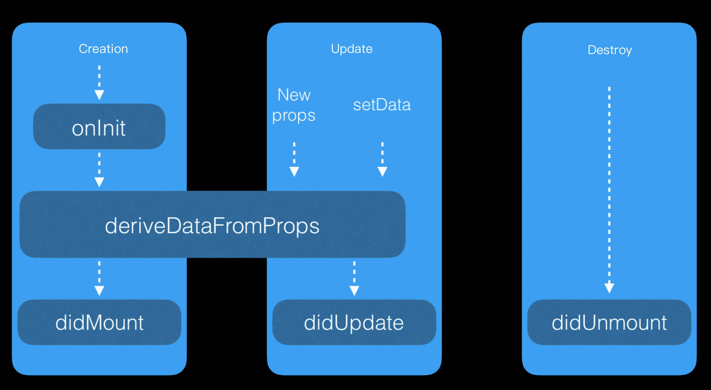

# Ciclo de vida

## Función del ciclo de vida

La función del ciclo de vida de un componente se activa en momentos específicos por el framework. A continuación, se presenta una descripción detallada de cada método del ciclo de vida:

<table>
    <thead>
        <tr>
            <th>Ciclo de Vida</th>
            <th>Parámetro</th>
            <th>Descripción</th>
        </tr>
    </thead>
    <tbody>
        <tr>
            <td>onInit</td>
            <td>No</td>
            <td>Se activa al crear el componente.</td>
        </tr>
        <tr>
            <td>deriveDataFromProps</td>
            <td>nextProps</td>
            <td>Se activa al crear el componente y antes de las actualizaciones.</td>
        </tr>
        <tr>
            <td>didMount</td>
            <td>No</td>
            <td>Se activa al completar la creación del componente.</td>
        </tr>
        <tr>
            <td>didUpdate</td>
            <td>(prevProps, prevData)</td>
            <td>Se activa al completar las actualizaciones del componente, con acceso a las props y datos anteriores.</td>
        </tr>
        <tr>
            <td>didUnmount</td>
            <td>No</td>
            <td>Se activa cuando se elimina el componente.</td>
        </tr>
    </tbody>
</table>

### onInit

El evento onInit se activa al crear el componente. En onInit, es posible:

- Acceder a atributos como this.is, this.$id y this.$page.
- Acceder a this.data y this.props.
- Acceder al atributo personalizado en los "métodos" del componente.
- Llamar a this.setData y this.$spliceData para modificar datos.

**Ejemplo 1:**

```js
// /components/counter/index.js
Component({
  data: {
    counter: 0,
  },
  onInit() {
    this.setData({
      counter: 1,
      is: this.is,
    });
  },
})
```

```xml
<!-- /components/counter/index.axml -->
<view>{{counter}}</view>
<view>{{is}}</view>
```

Cuando el componente se renderiza en la página, la salida será la siguiente:

```js
1
/components/counter/index
```

**Ejemplo 2:**

```js
// /components/counter/index.js
Component({
  onInit() {
	this.xxx = 2;
	this.data = { counter: 0 };
  },
})
```

```xml
<!-- /components/counter/index.axml -->
<view>{{counter}}</view>
```

```
0
```

## deriveDataFromProps

deriveDataFromProps se activa en la creación y actualización del componente. En deriveDataFromProps, es posible:

- Acceder a atributos como this.is, this.$id y this.$page
- Acceder a this.data y this.props
- Acceder al atributo personalizado en los "métodos" del componente
- Llamar a this.setData y this.$spliceData para modificar datos
- Utilizar el parámetro nextProps para obtener los parámetros de props que se actualizarán

### Código de ejemplo:

**Nota:** 
En este ejemplo, haz clic en el botón + y el contador en la página permanece sin cambios hasta que el valor de `pCounter` sea mayor que 5.

```js
// /components/counter/index.js
Component({
  data: {
    counter: 5,
  },
  deriveDataFromProps(nextProps) {
    if (this.data.counter < nextProps.pCounter) {
      this.setData({
        counter: nextProps.pCounter,
      });
    }
  },
})
```

```xml
<!-- /components/counter/index.axml -->
<view>{{counter}}</view>
```

```js
// /pages/index/index.js
Page({
  data: {
	counter: 1,
  },
  plus() {
	this.setData({ counter: this.data.counter + 1 })
  },
})
```

```xml 
<!-- /pages/index/index.axml -->
<counter pCounter="{{counter}}" />
<button onTap="plus">+</button>
```

### didMount

El `didMount` es el callback después de la renderización inicial del componente personalizado. Ahora que la página ha sido renderizada, generalmente se solicitan datos del servidor.

A continuación se muestra un ejemplo de código:

```js
Component({
  data: {},
  didMount() {
    let that = this;
    my.httpRequest({
      url: 'http://httpbin.org/post',
      success: function(res) {
		console.log(res);
        that.setData({name: 'Ejemplo de Nombre'});               
      }
    });
  },
});
```

### didUpdate

El `didUpdate` es el callback después de la actualización del componente personalizado. Se llama cada vez que cambian los datos del componente.

**Código de ejemplo:**

```js
Component({
  data: {},
  didUpdate(prevProps, prevData) {
    console.log(prevProps, this.props, prevData, this.data);
  },
});
```

Nota:

- La llamada interna de this.setData en el componente desencadena didUpdate.
- La llamada externa de this.setData también desencadena didUpdate.

### didUnmount

`didUnmount` es la devolución de llamada que se ejecuta después de la eliminación del componente personalizado. Se llama cada vez que la instancia del componente se descarga de la página.

**Ejemplo de código:**

```js
Component({
  data: {},
  didUnmount() {
    console.log(this);
  },
});
```

