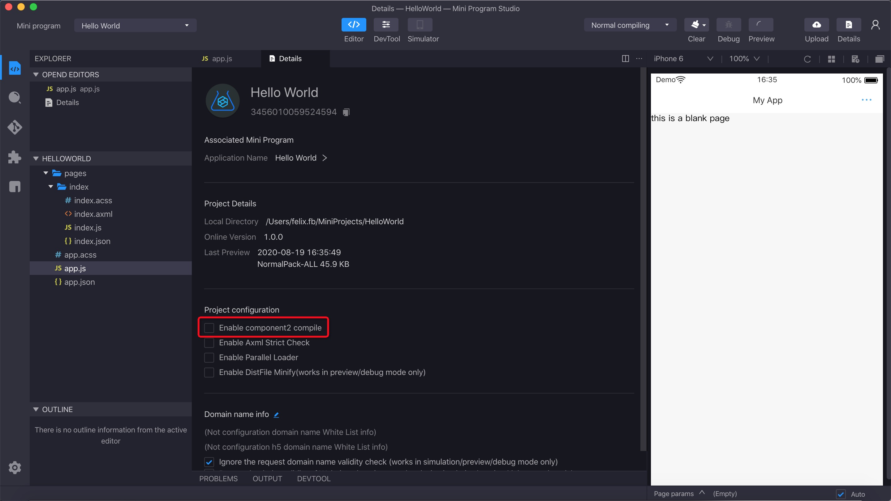

## Introduction

2021-07-06 06:36

Al llamar a my.canIUse('component'), es posible determinar si la función del componente personalizado es utilizable en la versión actual. Para el uso de [my.canIUse()](/), consulta canIUse.
La función del componente personalizado puede abstraer las funciones que se van a reutilizar en un componente personalizado para que se puedan reutilizar en diferentes páginas. También permite publicar el componente personalizado en npm, para que se pueda reutilizar en diferentes Mini Programas. Para el uso de npm, consulta [npm](/).

**El my.canIUse('component2') se puede utilizar para verificar si la versión actual admite la nueva función del componente personalizado.**

Para usar las funciones relacionadas con component2, en **Detalles > Configuración del proyecto** de la herramienta para desarrolladores, verifica component2.

