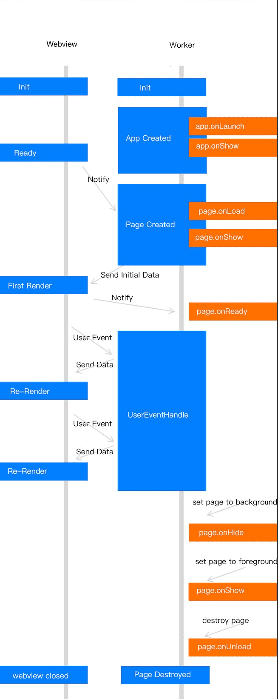

# Mecanismos de Page

## Page(object: Object)

Cada archivo .js en el directorio ```/pages``` tiene un objeto de ```Page``` para definir propiedades para una página de Mini Program.Podemos usar este objeto para especificar los datos iniciales, registrar devoluciones de llamada del ciclo de vida y personalizar los controladores de eventos.

A continuación se presentan los códigos de página básicos:

```js
// pages/index/index.js
Page({
  data: {
    title: "Mini Program",
  },
  onLoad(query) {
    // Page cargando
  },
  onShow() {
    // Page showing
  },
  onReady() {
    // Page loading complete
  },
  onHide() {
    // Page hiding
  },
  onUnload() {
    // Page closed
  },
  onTitleClick() {
    // Title clicked
  },
  onPullDownRefresh() {
    // Page pulled down
  },
  onReachBottom() {
    // Page pulled down till bottom
  },
  onShareAppMessage() {
   // Return customized sharing information
  },
  // Event handler object
  events: {
    onBack() {
      console.log('onBack');
    },
  },
  // Custom event handler
  viewTap() {
    this.setData({
      text: 'Set data for update.',
    });
  },
  // Custom event handler
  go() {
    // Jump with parameters, read type from query of onLoad function in page/ui/index
    my.navigateTo({url:'/page/ui/index?type=mini'});
  },
  // Custom data object
  customData: {
    name: 'Mini Program',
  },
});
```

## Ciclo de Vida de Page 

El diagrama a continuación muestra el ciclo de vida del objeto ```Page```.

El Mini Program básicamente utiliza el hilo de vista (Webview) y el hilo de servicio de aplicación (Worker) para control y gestión. Los hilos Webview y Worker se ejecutan en paralelo.

* Al iniciarse, el hilo Worker invoca ```app.onLauch``` y ```app.onShow``` cuando se crea la aplicación. Posteriormente, cuando la inicialización de WebView se completa, el hilo Worker recibe una notificación del hilo WebView y luego invoca ```page.onLoad``` y ```page.onShow``` para indicar la finalización de la creación de la página.

* Tras la notificación de la finalización de la inicialización de WebView, el Worker envía los datos inicializados al WebView para que los renderice. Ahora el WebView completa el primer renderizado de datos.

* Después de que se complete el primer renderizado, el WebView entra en el estado listo y notifica al Worker. El Worker llama a la función ```page.onReady``` y entra en el estado activo.

* En el estado activo, el Worker modifica los datos cada vez y luego notifica al WebView para que los renderice. Cuando se cambia al fondo, el Worker llama a la función ```page.onHide``` y entra en el estado suspendido. La función ```page.onShow``` se llamará cuando la página vuelva al primer plano y entre en el estado activo. Cuando se llama a la página de retorno o de redirección, se llama a la función ```page.onUnload``` para destruir la página.



Descripción del atributo de objeto

<table>
  <tr>
    <th>Property</th>
    <th>Type</th>
    <th>Descripción</th>
    <th>Versión mínima</th>
  </tr>
  <tr>
    <td>data</td>
    <td>Object | Function</td>
    <td>Función para inicializar datos o devolver datos inicializados.</td>
    <td>-</td>
  </tr>
  <tr>
    <td>events</td>
    <td>Object</td>
    <td>Objeto manejador de eventos.</td>
    <td>1.13.7</td>
  </tr>
  <tr>
    <td>onLoad</td>
    <td>Function(query: Object)</td>
    <td>Se dispara en la carga de la página.</td>
    <td>-</td>
  </tr>
  <tr>
    <td>onShow</td>
    <td>Function</td>
    <td>Se dispara al mostrar la página.</td>
    <td>-</td>
  </tr>
  <tr>
    <td>onReady</td>
    <td>Function</td>
    <td>Se dispara al completarse el renderizado inicial de la página.</td>
    <td>-</td>
  </tr>
  <tr>
    <td>onHide</td>
    <td>Function</td>
    <td>Se dispara al ocultar la página.</td>
    <td>-</td>
  </tr>
  <tr>
    <td>onUnload</td>
    <td>Function</td>
    <td>Se dispara al descargar la página.</td>
    <td>-</td>
  </tr>
  <tr>
    <td>onShareAppMessage</td>
    <td>Function(options: Object)</td>
    <td>Se dispara al hacer clic en el botón de compartir en la esquina superior derecha.</td>
    <td>-</td>
  </tr>
  <tr>
    <td>onTitleClick</td>
    <td>Function</td>
    <td>Se dispara al hacer clic en el título.</td>
    <td>-</td>
  </tr>
  <tr>
    <td>onOptionMenuClick</td>
    <td>Function</td>
    <td>Se dispara al hacer clic en el icono extra de la barra de navegación.</td>
    <td>1.3.0</td>
  </tr>
  <tr>
    <td>onPopMenuClick</td>
    <td>Function</td>
    <td>Se dispara al hacer clic en los botones de menú personalizados en el menú general en la esquina superior derecha.</td>
    <td>1.3.0</td>
  </tr>
  <tr>
    <td>onPullDownRefresh</td>
    <td>Function ```({from: manual| code})```</td>
    <td>Se dispara al desplazar hacia abajo la página.</td>
    <td>-</td>
  </tr>
  <tr>
    <td>onPullIntercept</td>
    <td>Function</td>
    <td>Se dispara en la interrupción del desplazamiento hacia abajo.</td>
    <td>1.11.0</td>
  </tr>
  <tr>
    <td>onTabItemTap</td>
    <td>Function</td>
    <td>Se dispara al hacer clic en ```tabItem```.</td>
    <td>1.11.0</td>
  </tr>
  <tr>
    <td>onPageScroll</td>
    <td>Function```({scrollTop})```</td>
    <td>Se dispara al desplazarse por la página.</td>
    <td>-</td>
  </tr>
  <tr>
    <td>onReachBottom</td>
    <td>Function</td>
    <td>Se dispara al desplazar la página hasta el fondo.</td>
    <td>-</td>
  </tr>
  <tr>
    <td>Others</td>
    <td>Any</td>
    <td>El desarrollador puede agregar cualquier función o atributo dentro del <code>object</code>. <code>this</code> se puede utilizar para acceder en las funciones de la página.</td>
    <td>-</td>
  </tr>
</table>

## Objeto de datos de Page

La ```data``` inicial se pueden especificar para la página configurando datos. Cuando los datos son un objeto, lo comparten todas las páginas.En otras palabras, cuando regrese y luego ingresa a la página nuevamente, los datos de la última página se mostrarán en lugar de la ```data``` inicial. En tal caso, el problema se puede solucionar estableciendo datos como datos sin cambios o cambiando los datos como la ```data``` exclusiva de la page.

Establecer como datos sin cambios

```js
Page({
 data: { arr:[] },
 doIt() {
   this.setData({arr: [...this.data.arr, 1]});
 },
});
```

**Establecer como data exclusiva de la page (no recomendados)**

```js
Page({
 data() { return { arr:[] }; },
 doIt() {
   this.setData({arr: [1, 2, 3]});
 },
});
```
Notas:

No modifique ```this.data``` directamente, que no cambiará el estado de la página y causará inconsistencia de datos.

Por ejemplo:

```js
Page({
 data: { arr:[] },
 doIt() {
   this.data.arr.push(1); // Do not do this!
   this.setData({arr: this.data.arr});
 }
});
```

## Lifecycle Function

### onLoad(query: Object)

Disparador al inicializar la página. Se llama solo una vez para cada página.

El query es el objeto de consulta transferido en el ```my.navigateTo``` y ```my.redirectTo```.

El contenido del query está en el formato: "parameter name=parameter value&parameter name=parameter value…"

<table>
  <tr>
    <th>Propiedad</th>
    <th>Tipo</th>
    <th>Descripción</th>
  </tr>
  <tr>
    <td>query</td>
    <td>Object</td>
    <td>Parámetro para abrir la ruta de la página actual.</td>
  </tr>
</table>

### onShow()

Disparador en la página que muestra o cambia a primer plano

### onReady()

Activar al completar la renderización inicial de la página. Se llama solo una vez para cada página, lo que indica que la página está lista y puede interactuar con la capa de vista.Para la configuración de interfaz como my.setNavigationBar, establezca detrás de OnReady.

### onHide()

Disparador al ocultar la página o al cambiar a segundo plano. Por ejemplo, al usar my.navigateTo para ir a otra página o al cambiar a través de la pestaña inferior.

### onUnload()

Disparador al descargar la página. Por ejemplo, al usar my.redirectTo o my.navigateBack para ir a otra página.

## Manejador de Eventos de Página

### onShareAppMessage(options: Object)

Disparador al hacer clic en el botón de compartir en el menú general en la esquina superior derecha o al hacer clic en el botón de compartir en la página.

Define la función ```onShareAppMessage``` en la ```Page``` y establece la información de compartir:

* Muestra el botón de compartir en el menú general en la esquina superior derecha de cada página de forma predeterminada. Solo el contenido compartido se puede personalizar mediante el uso de la función ```onShareAppMessage```.

* La función ```onShareAppMessage``` se llama cuando el usuario hace clic en el botón de **Share**.

* Este manejador de eventos debe devolver un Objeto para personalizar el contenido compartido.

* El mini program admite activar el uso del componente de botón para compartir. El valor de ```open-type``` es ```share```.

Ejemplos de código:

```js
// API-DEMO page/API/share/share.json 
 {
    "defaultTitle" : "onShareAppMessage" 
 }
```

```js
<view class = "page" > 
<view class = "page-description" > Haga clic en el menú superior derecha para personalizar el intercambio </view>
</view>
```

```js
// API-DEMO page/API/share/share.js 
 Page ({
  onShareAppMessage () {
  return {
    title : 'Sharing the View component' ,
    desc : 'The View component is general' ,
    path : 'page/component/view/view' ,
    };
  },
 });
 ```

Códigos de muestra para activar el intercambio con el componente del botón:

```js
<view>
<button type="primary" open-type="share" a:if="{{canIUseShareButton}}">Share to friends</button>
</view>
```

```js
Page({ 
  data: { canIUseShareButton: true },
  setShareButtonSwitch () { this.setData({ canIUseShareButton: my.canIUse('button.open-type.share') }) },
	onLoad() { this.setShareButtonSwitch(); } ,
 
	onShareAppMessage() {
  	return {
      title: 'Mini program demo',
      desc: 'Mini program official demo that displays the supported APIs and components',
      path: 'page/component/component-pages/view/view?param=123'
   	}
  }
});
```

Los parámetros están en tipo Object y tienen los siguientes atributos:

<table>
  <tr>
    <th>Propiedad</th>
    <th>Tipo</th>
    <th>Descripción</th>
  </tr>
  <tr>
    <td>from</td>
    <td>String</td>
    <td>
        Origen del evento de compartir. Los valores válidos son:
        - ```button```: hacer clic en el botón en la página para activar el compartir
        - ```menu```: hacer clic en el botón en el menú de la esquina superior derecha para activar el compartir
        - ```code```: llamar a la API my.showSharePanel para activar el compartir.
    </td>
  </tr>
  <tr>
    <td>target</td>
    <td>Object</td>
    <td>Si el valor de ```from``` es ```button```, ```target``` es el ```button``` que activa el evento. De lo contrario, ```button``` es ```undefined```.</td>
  </tr>
  <tr>
    <td>webViewUrl</td>
    <td>String</td>
    <td>Cuando la página contiene el componente web-view, devuelve la URL del web-view actual.</td>
  </tr>
</table>


Este controlador de eventos debe devolver un Object para personalizar el contenido compartido.

<table>
  <tr>
    <th>Propiedad</th>
    <th>Tipo</th>
    <th>Requerido</th>
    <th>Descripción</th>
  </tr>
  <tr>
    <td>title</td>
    <td>String</td>
    <td>Sí</td>
    <td>Título personalizado para compartir.</td>
  </tr>
  <tr>
    <td>desc</td>
    <td>String</td>
    <td>No</td>
    <td>Descripción personalizada sobre el compartir. La longitud máxima es de 140 caracteres al compartir en Sina Weibo, por lo que se sugiere que la descripción no supere los 140 caracteres.</td>
  </tr>
  <tr>
    <td>path</td>
    <td>String</td>
    <td>Sí</td>
    <td>Ruta de compartir personalizada. Los parámetros personalizados en la ruta pueden ser obtenidos de la función del ciclo de vida onLoad y seguir las reglas HTTP GET. La ruta no puede contener el directorio raíz (/).</td>
  </tr>
  <tr>
    <td>imageUrl</td>
    <td>String</td>
    <td>No</td>
    <td>La ruta del icono personalizado, que puede ser una ruta de imagen web.</td>
  </tr>
  <tr>
    <td>bgImgUrl</td>
    <td>String</td>
    <td>No</td>
    <td>La ruta de la imagen personalizada, que puede ser una ruta de imagen web. Se sugiere que el tamaño de la imagen sea de 750 x 825 píxeles.</td>
  </tr>
  <tr>
    <td>success</td>
    <td>Function</td>
    <td>No</td>
    <td>El método de devolución de llamada que indica un compartir exitoso.</td>
  </tr>
  <tr>
    <td>fail</td>
    <td>Function</td>
    <td>No</td>
    <td>El método de devolución de llamada que indica un compartir fallido.</td>
  </tr>
</table>

Callback de devolución de llamada satisfactoria

<table>
  <tr>
    <th>Propiedad</th>
    <th>Tipo</th>
    <th>Descripción</th>
  </tr>
  <tr>
    <td>channelName</td>
    <td>String</td>
    <td>El nombre del canal de compartición.</td>
  </tr>
  <tr>
    <td>shareResult</td>
    <td>Boolean</td>
    <td>El resultado que indica si la compartición fue exitosa.</td>
  </tr>
</table>

### onTitleClick()

Disparador al hacer clic en el título.

### onOptionMenuClick()

Disparador al hacer clic en el botón del menú en la esquina superior derecha.

### onPopMenuClick()

Disparador al hacer clic en el botón del menú general en la esquina superior derecha.

### onPullDownRefresh```({from: manual|code})```

Disparador al tirar hacia abajo para refrescar. Es necesario habilitar ```pullRefresh``` en la opción ```window``` de ```app.json```. Cuando se haya procesado completamente la actualización de datos, llama a ```my.stopPullDownRefresh``` para detener el tirón para refrescar esa página.

### onPullIntercept()

Disparador en la interrupción del tirón hacia abajo.

### onTabItemTap(objeto: Object)

Disparar al hacer clic en ```tabItem```:

<table>
  <tr>
    <th>Property</th>
    <th>Type</th>
    <th>Descripción</th>
  </tr>
  <tr>
    <td>from</td>
    <td>String</td>
    <td>Origen del clic.</td>
  </tr>
  <tr>
    <td>pagePath</td>
    <td>String</td>
    <td>Ruta de la página del tabItem clicado.</td>
  </tr>
  <tr>
    <td>text</td>
    <td>String</td>
    <td>Texto del botón del tabItem clicado.</td>
  </tr>
  <tr>
    <td>index</td>
    <td>Number</td>
    <td>Número del tabItem clicado, empezando desde 0.</td>
  </tr>
</table>

### onPageScroll```({scrollTop})```

Disparador en la página Scrolling, Scrolltop es la distancia de desplazamiento de la página.

### onReachBottom()

Disparar en la página de extracción hasta la parte inferior.

### Events

Para simplificar los códigos, está disponible un nuevo manejador de eventos.El controlador de página existente es equivalente a las funciones del evento expuesto en la instancia de la página.

**Notes:**

* El soporte de eventos comienza desde la versión básica de la biblioteca 1.13.7.

* Porfavor distinga los requisitos básicos de la versión de la biblioteca para las mismas funciones nombradas del controlador de eventos y eventos de la página.

A continuación se muestra la lista de funciones de eventos respaldadas por eventos:

<table>
  <tr>
    <th>Evento</th>
    <th>Tipo</th>
    <th>Descripción</th>
    <th>Versión mínima</th>
  </tr>
  <tr>
    <td>onBack</td>
    <td>Function</td>
    <td>Disparador al regresar a la página.</td>
    <td>1.13.7</td>
  </tr>
  <tr>
    <td>onKeyboardHeight</td>
    <td>Function</td>
    <td>Disparador al cambiar la altura del teclado.</td>
    <td>1.13.7</td>
  </tr>
  <tr>
    <td>onOptionMenuClick</td>
    <td>Function</td>
    <td>Disparador al hacer clic en el botón del menú de la esquina superior derecha.</td>
    <td>1.13.7</td>
  </tr>
  <tr>
    <td>onPopMenuClick</td>
    <td>Function</td>
    <td>Disparador al hacer clic en el botón del menú general de la esquina superior derecha.</td>
    <td>1.13.7</td>
  </tr>
  <tr>
    <td>onPullIntercept</td>
    <td>Function</td>
    <td>Disparador en la interrupción del desplazamiento hacia abajo.</td>
    <td>1.13.7</td>
  </tr>
  <tr>
    <td>onPullDownRefresh</td>
    <td>Function```({from: manual/code})```</td>
    <td>Disparador al desplazar hacia abajo la página.</td>
    <td>1.13.7</td>
  </tr>
  <tr>
    <td>onTitleClick</td>
    <td>Function</td>
    <td>Disparador al hacer clic en el título.</td>
    <td>1.13.7</td>
  </tr>
  <tr>
    <td>onTabItemTap</td>
    <td>Function</td>
    <td>Disparador al hacer clic en un tabItem que no es el actual.</td>
    <td>1.13.7</td>
  </tr>
  <tr>
    <td>beforeTabItemTap</td>
    <td>Function</td>
    <td>Disparador antes de hacer clic en un tabItem que no es el actual.</td>
    <td>1.13.7</td>
  </tr>
  <tr>
    <td>onResize</td>
    <td>Function```({size: {windowWidth: number, windowHeight: number}})```</td>
    <td>Disparador al cambiar el tamaño de la ventana.</td>
    <td>1.16.0</td>
  </tr>
</table>

Ejemplo del código:

```js
// Detección de características
my.canIUse('page.events.onBack');

Page({
  data: {
    text: 'Estos son datos de página'.
  },
  onLoad(){
    // activar la carga de la página
  },
  events:{
    onBack(){
     // disparar en la página que regresa
    },
    onKeyboardHeight(e){
      // activar el cambio de altura del teclado
      console.log('keyboard height:', e.height)
    },
    onOptionMenuClick(){
      // disparar al hacer clic en el botón de menú de esquina superior derecha
    },
    onPopMenuClick(e){
      // activar los botones de menú personalizados en el menú general de la parte superior derecha
      console.log('Índice del menú personalizado haciendo clic', e.index)
      console.log('Nombre del menú personalizado de clic', e.name)
      console.log('Menuiconurl del menú personalizado hecho hecho hecho', e.menuIconUrl)
    },
    onPullIntercept(){
      // disparador al tirar de la interrupción
    },
    onPullDownRefresh(e){
      // disparador en la página de extracción El valor de e.from "código" indica el evento activado por startpuldownrefresh;Valor "Manual" indica el gatillo del evento desplegable por el usuario
      console.log('type of triggered pull-down refresh', e.from)
      my.stopPullDownRefresh()
    },
    onTitleClick(){
      //Disparar al hacer clic en el título
    },
    onTabItemTap(e){
      // E.From significa activar después de hacer clic en Tabitem y conmutación;Valor "Usuario" indica el evento activado por el clic del usuario;El valor "API" indica el evento activado por SwitchTab
      console.log('Tipo de cambio de pestaña de activación', e.from)
      console.log('ruta de la página correspondiente a la pestaña haciendo clic', e.pagePath)
      console.log('texto de la pestaña haciendo clic', e.text)
      console.log('Índice de la pestaña haciendo clic', e.index)
    },
    beforeTabItemTap(){
      // disparar al hacer clic en Tabitem pero antes de cambiar
    },
    onResize(e){
      // Disparador en el tamaño de la ventana Cambio
      var {windowWidth, windowHeight} = e.size
      console.log('Ancho de la ventana cambiada', windowWidth)
      console.log('Altura de la ventana cambiada', windowHeight)
    },
  }
})
```

## Page.prototype.setData(data: Object, callback: Function)

```The setData``` envía datos desde la capa lógica a la capa de vista y cambia el valor de ```this.data```.

El Objeto se expresa en la forma ```key: value```. El valor de la clave en ```this.data``` se cambia a ```value```. Aquí, la clave puede ser proporcionada de forma flexible en forma de ruta de datos, como ```array[2].message```, ```a.b.c.d```. No es necesario predefinir en ```this.data```.

Los siguientes puntos son dignos de atención en su uso:

- Es inválido modificar ```this.data``` directamente, lo cual no cambiará el estado de la página y provocará inconsistencias en los datos.
- Solo se admite datos compatibles con JSON.
- Trate de no establecer demasiados datos a la vez.
- No establezca ningún valor en los datos como indefinido, de lo contrario, ese elemento no se establecerá y puede surgir un problema potencial.

Ejemplo del código:

```js
<view>{{text}}</view>
<button onTap="changeTitle"> Change normal data </button>
<view>{{array[0].text}}</view>
<button onTap="changeArray"> Change Array data </button>
<view>{{object.text}}</view>
<button onTap="changePlanetColor"> Change Object data </button>
<view>{{newField.text}}</view>
<button onTap="addNewKey"> Add new data </button>
<view>hello: {{name}}</view>
<button onTap="changeName"> Change name </button>
```

```js
Page({
  data: {
    text: 'test',
    array: [{text: 'a'}],
    object: {
      text: 'azul',
    },
    name: 'Mini Programa',
  },
  changeTitle() {
    // ¡Incorrecto! No modifiques los datos directamente
    // this.data.text = 'datos modificados'
    
    // ¡Correcto!
    this.setData({
      text: 'ha',
    });
  },
  changeArray() {
    // Posible modificar datos usando la ruta de datos directamente
    this.setData({
      'array[0].text': 'b',
    });
  },
  changePlanetColor(){
    this.setData({
      'object.text': 'rojo',
    });
  },
  addNewKey() {
    this.setData({
      'newField.text': 'c',
    });
  },
  changeName() {
    this.setData({
      name: 'Mini Programa',
    }, () => { // Aceptar transferencia de función de retorno de llamada
      console.log(this); // this: instancia de la página actual
      this.setData({ name: this.data.name + ', ' + '¡bienvenido!'});
    });
  },
});
```

Descripción de parámetros:

<table>
  <tr>
    <th>Evento</th>
    <th>Tipo</th>
    <th>Descripción</th>
    <th>Versión mínima</th>
  </tr>
  <tr>
    <td>data</td>
    <td>Object</td>
    <td>Datos a ser cambiados.</td>
    <td>-</td>
  </tr>
  <tr>
    <td>callback</td>
    <td>Function</td>
    <td>Función de retorno de llamada, para ser ejecutada al completar el renderizado y la actualización de la página.</td>
    <td>1.7.0, Use my.canIUse('page.setData.callback') para el procesamiento de compatibilidad.</td>
  </tr>
</table>

## Page.prototype.$spliceData(data: Object, callback: Function)

**Note**: ```$spliceData``` es compatible desde la versión 1.7.2. Se puede usar ```my.canIUse('page.$spliceData')``` para procesamiento de compatibilidad.

Del mismo modo, ```spliceData``` se utiliza para transferir datos de la capa lógica a la capa de vista, pero tiene un rendimiento superior a ```setData``` en el procesamiento de listas largas.

El ```Object``` se expresa en la forma ```key: value```. El valor de la ```key``` en ```this.data``` se cambia a ```value```. Aquí, la clave se puede proporcionar de forma flexible en forma de ruta de datos, como ```array[2].message```, ```a.b.c.d```. No es necesario predefinir en ```this.data```. El ```value``` es una matriz (formato: ```[start, deleteCount, ...items]```). El primer elemento de la matriz es la posición de inicio de la operación, el segundo elemento es el número de elementos que se van a eliminar, y los otros elementos son los datos de inserción. Mapea el método ```splice``` de la matriz en ES5.

Ejemplo del código:

```js
<!-- pages/index/index.axml -->
<view class="spliceData">
  <view a:for="{{a.b}}" key="{{item}}" style="border:1px solid red">
    {{item}}
  </view>
</view>
```

```js
// pages/index/index.js
Page({
  data: {
    a: {
      b: [1,2,3,4],
    },
  },
  onLoad(){
    this.$spliceData({ 'a.b': [1, 0, 5, 6] });
  },
});
```

Salida de la página:

```js
1
5
6
2
3
4
```

Descripción del parámetro:

<table>
  <tr>
    <th>Evento</th>
    <th>Tipo</th>
    <th>Descripción</th>
  </tr>
  <tr>
    <td>datos</td>
    <td>Object</td>
    <td>Datos a cambiar.</td>
  </tr>
  <tr>
    <td>callback</td>
    <td>Function</td>
    <td>Función de devolución de llamada, para ser ejecutada al completarse el renderizado y la actualización de la página.</td>
  </tr>
</table>

## Page.prototype.$batchedUpdates(callback: Function)

Datos de actualización por lotes.

**Nota:** ```$batchedUpdates``` es compatible desde la versión 1.14.0.Themy.Caniuse ('Page.$ BatchedUpdates') se puede utilizar para el procesamiento de compatibilidad.

Descripción de parámetros:

<table>
  <tr>
    <th>Evento</th>
    <th>Tipo</th>
    <th>Descripción</th>
  </tr>
  <tr>
    <td>callback</td>
    <td>Function</td>
    <td>La operación de datos en la función de devolución de llamada se actualizará en lote.</td>
  </tr>
</table>

Ejemplo del código:

```js
// pages/index/index.js
Page({
  data: {
    counter: 0,
  },
  plus() {
    setTimeout(() => {
      this.$batchedUpdates(() => {
        this.setData({
          counter: this.data.counter + 1,
        });
        this.setData({
          counter: this.data.counter + 1,
        });
      });
    }, 200);
  },
});
```

```js
<!-- pages/index/index.axml -->
<view>{{counter}}</view>
<button onTap="plus">+2</button>
```

1. En este ejemplo, el ```counter``` de la página (page) agrega 2 en cada botón haciendo clic.

2. El ```setData``` se coloca dentro de esto. $ BatchedUpdates.Por lo tanto, solo una transferencia de datos ocurre a pesar de los múltiples ```setData```.

## Page.route

Ruta de la ```Page```, asignando el valor de ruta configurado en app.json, escriba ```String```

Este es un atributo de solo lectura.

```js
Page({
  onShow() {
    // Asigne el valor de ruta configurado en app.json
    console.log(this.route)
  }
})
```