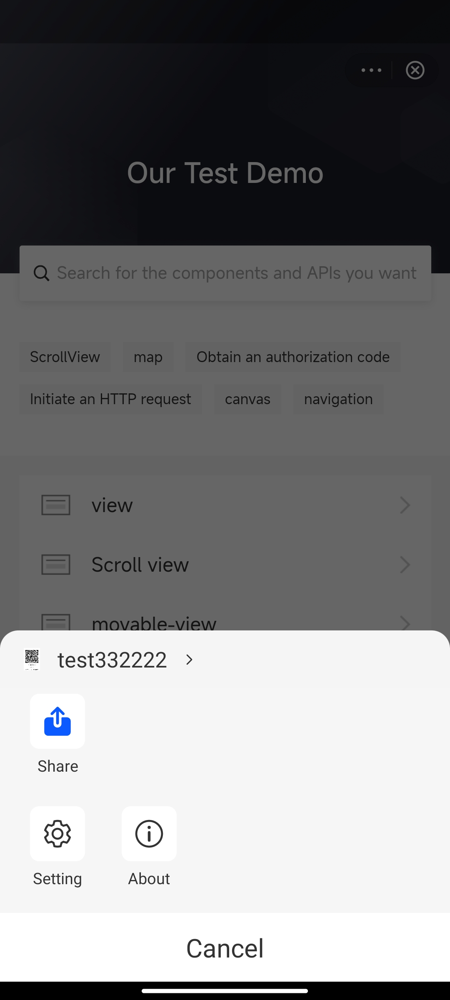
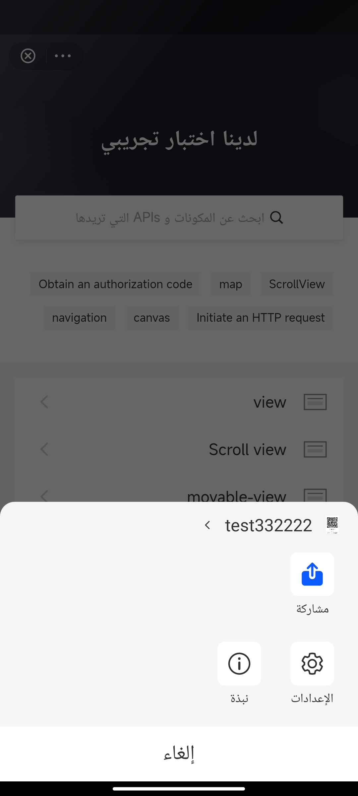

# Idioma

IAPMiniprogram SDK puede ajustar dinámicamente la pantalla del idioma según la preferencia del idioma del usuario para admitir diferentes idiomas y culturas. Esta adaptación del idioma se aplica a todas las páginas proporcionadas por SDK, que incluyen:

- Páginas dentro del menú Más, como **Settings** y **About**
- páginas JSAPI-triggered, como la caja de alerta de [my.alert](/)
- Otras páginas comunes, como la pantalla de salpicaduras y las páginas de error

Este tema presenta principalmente los idiomas compatibles y la lógica de visualización de lenguaje subyacente del SDK.

:::info[Nota:]
Los mini programas también pueden ajustar dinámicamente su visualización de lenguaje llamando al my.getSysteminfo JSAPI para obtener la preferencia de lenguaje del usuario a través del parámetro de respuesta del idioma. Para obtener más información, consulte [my.getSystemInfo](/).
:::

## Idiomas compatibles
La siguiente tabla enumera los idiomas admitidos por el SDK y otra información clave:


<table>
    <tr>
        <th>Lenguaje apoyado</th>
        <th>Lenguaje</th>
        <th>Dirección de diseño</th>
        <th>Versión SDK requerida</th>
    </tr>
    <tr>
        <td>English (default)</td>
        <td>en</td>
        <td>LTR (left-to-right)</td>
        <td>Todas las versiones</td>
    </tr>
    <tr>
        <td>Arabic</td>
        <td>ar</td>
        <td>RTL (right-to-left)</td>
        <td>v2.50.2 o superior</td>
    </tr>
    <tr>
        <td>Spanish</td>
        <td>es</td>
        <td>LTR (left-to-right)</td>
        <td>v2.50.3 o superior</td>
    </tr>
</table>

Si necesita una capacidad de idioma adicional para el SDK, comuníquese con nuestro soporte técnico en <a href="mailto:overseas_support@service.alibaba.com.">overseas_support@service.alibaba.com.</a>


## Experiencia de usuario
Las siguientes imágenes muestran un panel de menú de demostración en inglés y árabe:


<table>
    <tr>
        <th>Inglesa</th>
        <th>Arábica</th>
    </tr>
    <tr>
        <td></td>
        <td></td>
    </tr>
</table>


## Language display logic
La pantalla de lenguaje SDK puede sincronizar con la preferencia de lenguaje en la configuración del sistema o en la configuración por APP en el dispositivo del usuario.La lógica de visualización se emplea automáticamente dependiendo de cómo la super aplicación implementa capacidades multilingües sin requerir ninguna acción adicional. Consulte la siguiente tabla para la lógica de visualización de idiomas que corresponde a la implementación específica de su aplicación:

<table>
    <tr>
        <th>Escenario de implementación</th>
        <th>Lógica de visualización de idiomas</th>
    </tr>
    <tr>
        <td>No implementar capacidades multilingües.</td>
        <td>[Sync with system settings](/)</td>
    </tr>
    <tr>
        <td>No siga las pautas de Android para implementar capacidades multilingües.</td>
        <td>[Sync with system settings](/)</td>
    </tr>
    <tr>
        <td>
        Siga las pautas de Android para implementar capacidades multilingües a través de la configuración del sistema.Para obtener más información, consulte la documentación de Android sobre [soporte de diferentes idiomas y culturas](/).
        </td>
        <td>[Sync with system settings](/)</td>
    </tr>
    <tr>
        <td>
        Siga las pautas de Android para implementar capacidades multilingües a través de la configuración del lenguaje por aplicación.Para obtener más información, consulte la documentación de Android sobre las p[referencias de lenguaje por aplicación](/).
        </td>
        <td>[Sync with per-app settings](/)</td>
    </tr>
</table>


## Sincronizar con la configuración del sistema
Puede esperar los siguientes dos escenarios para esta lógica de pantalla:

- Si el lenguaje del sistema es compatible con el SDK, el lenguaje de visualización de SDK coincide con el lenguaje del sistema.
- Si el idioma del sistema no es compatible con el SDK, el idioma de visualización SDK es inglés de forma predeterminada.


## Sincronizar con per-app settings
Para esta lógica de visualización, el SDK obtiene la preferencia de lenguaje de la aplicación principal en el archivo LocalEconFig utilizando el siguiente código:

```js
if (Build.VERSION.SDK_INT >= Build.VERSION_CODES.N) {
    return resources.getConfiguration().getLocales().get(0);
} else {
    Configuration configuration = resources.getConfiguration();
    return configuration.locale;
}
```

Dependiendo de si el lenguaje de la aplicación obtenido es compatible con el SDK, puede esperar los siguientes dos escenarios:

- Si el idioma de la aplicación es compatible, el lenguaje de visualización SDK coincide con el idioma de la aplicación.
- Si el idioma de la aplicación no es compatible, el idioma de pantalla SDK es inglés de forma predeterminada.

Por lo tanto, cuando el archivo localConFig se configura de la siguiente manera, el idioma de la aplicación obtenido es el inglés, que es compatible con el SDK y, en consecuencia, se utiliza como lenguaje de pantalla SDK.

```xml
<?xml version="1.0" encoding="utf-8"?>
<locale-config xmlns:android="http://schemas.android.com/apk/res/android">
  <locale android:name="en-US"/>
  <locale android:name="en-GB"/>
  <locale android:name="fr"/>
  <locale android:name="ja"/>
  <locale android:name="zh-Hans-MO"/>
  <locale android:name="zh-Hant-MO"/>
</locale-config>
```
