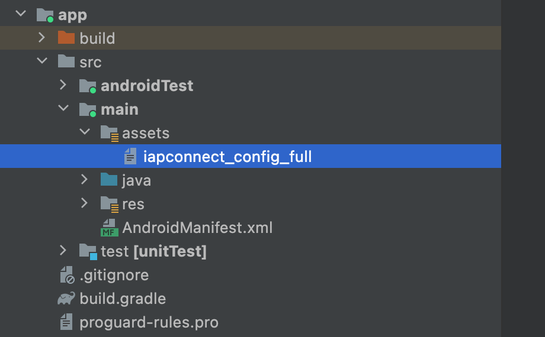

# Inicio rápido

Este tema presenta cómo configurar rápidamente el SDK de Android IAPminiprogram e implementar capacidades básicas de mini-programa.

## Antes de que empieces
Antes de comenzar, asegúrese de estar familiarizado con las siguientes cosas:

<ul>
    <li>
        Sistemas operativos:
        <ul>
            <li>
                Para ejecutar miniprogramas HTML5, su dispositivo debe ser Android 4.1 (nivel AP 16) o superior.
            </li>
            <li>
                Para ejecutar miniprogramas basados en DSL (Domain Specific Language), su dispositivo debe ser Android 6.0 (nivel API 23) o superior.
            </li>
        </ul>
    </li>
    <li>
        Android Studio está instalado en su computadora.
    </li>
    <li>
        La versión del complemento de Gradle debe ser 4.1 o más.
    </li>
    <li>
        Las dependencias de la biblioteca de terceros del SDK de Android IAPminiprogram podrían entrar en conflicto con los requisitos de la versión de otros SDK o su aplicación.Se recomienda probar a fondo las funcionalidades de su aplicación después de la integración.Para obtener más información, consulte las dependencias de [biblioteca de terceros](/).
    </li>
</ul>

## Empezar
Para comenzar con IAPminiprogram SDK, realice las siguientes acciones:

### Step 1: Descargar el SDK
Inicie sesión en la plataforma de mini programa, vaya a la página  **App Manage**, y haga click en **Resource > Android Resource** Para descargar IApminiprogram SDK para Android. Un archivo llamado ***iapconnect_config_full*** se descargará a su computadora.

Para obtener más información sobre cómo descargar los recursos de la aplicación, consulte los recursos de descarga de la aplicación.

### Paso 2: Agregue el archivo de configuración
Agregue el archivo ***iapconnect_config_full*** en el directorio de activos de su proyecto Android.



### Step 3: Agregue el repositorio maven
Agregue el repositorio maven a su archivo de construcción raíz.

```json
repositories {
    maven {
        url 'https://globaltech.alipay.com/api/v1/file/repository/minisdk/'
        credentials {
            username = USERNAME
            password = PASSWORD
        }
    }
}
```

En el código anterior, los valores de nombre de usuario y contraseña están desensibilizados. Para obtener los códigos de muestra con los valores, consulte [Credenciales](/).


### Step 4: Agregar dependencias
Para agregar dependencias, siga estos pasos:

1. Agregue las dependencias en el archivo Build.gradle de la aplicación a nivel con el siguiente código:

```js
// en app build.gradle
// Si hay algunos conflictos con el SDK existente, excluirlos
dependencies {
    implementation "com.alipay.plus.android:iapminiprogram:${iapminiprogram_version}"
}
```

2. Externalice el número de versión en el archivo build.gradle para administrar fácilmente las actualizaciones con el siguiente código:

```js
ext {
    iapminiprogram_version = 'IAPMINPROGRAM_VERSION'
}
```

Reemplace el valor de ```IAPMINPROGRAM_VERSION``` con el último número de versión que se proporciona en las notas de [versión de Android](/).


### Step 5: Inicializar el SDK
Después de agregar dependencias, debe inicializar el SDK en el evento ```OnCreate``` de la aplicación. Consulte los siguientes códigos para obtener más detalles.

#### Kotlin
```js
class YourApplication : Application() {
    override fun onCreate() {
        super.onCreate()
        IAPConnect.init(this, InitConfig(), object : InitCallback {
            override fun onSuccess() {
                //success
            }
            override fun onFailure(errorCode: InitErrorCode?, errorMsg: String?) {
                // failure
            }
        })
    }
}

```
#### Java

```js
public class YourApplication extends Application {
    @Override
    public void onCreate() {
        super.onCreate();
        InitConfig initConfig = new InitConfig();
        IAPConnect.init(this, initConfig, new InitCallback() {
            @Override
            public void onSuccess() {
                // success
            }
            @Override
            public void onFailure(String errorCode, String errorMessage) {
                // failure
            }
        });  
    }
}
```

### Step 6: IImplementar capacidades básicas
#### Abrir un mini-programa
Para abrir un mini programa en su aplicación, llame a cualquiera de las siguientes API:

* [openApp](/): Llame a esta API para abrir un miniprograma con appId.
* [openUrl](/): Llame a esta API para abrir un miniprograma con una URL.

#### Obtener la lista de mini-program
Para obtener la lista de mini-programs en su aplicación, llame a cualquiera de las siguientes API:

* [fetchApps](/):Llame a esta API para obtener la lista de mini-programas con FetchAppRequestVO.
* [fetchAppInfoListByIds](/): Llame a esta API para obtener la lista de mini-programa con ID de mini-program.


## Próximos pasos

Los pasos anteriores se centran en cómo integrar el SDK de Android IAPminiprogram e implementar sus capacidades básicas.Además de eso, los desarrolladores pueden consultar selectivamente los siguientes capítulos para implementar capacidades avanzadas del SDK de Android IAPMiniprogram.


* [Integrar los componentes SDK](/): para implementar capacidades relacionadas con MAP, multimedia o Bluetooth, consulte esta guía para integrar los componentes SDK predefinidos correspondientes.
* [Escuche los eventos SDK](/): para realizar operaciones especificadas en un evento determinado, consulte esta guía para implementar interfaces específicas para escuchar eventos SDK.
* [Personalizar capacidades relacionadas con la interfaz de usuario](/): para personalizar ciertas interfaces de usuario y capacidades relacionadas, consulte esta guía para implementar interfaces específicas.
* [Personalizar JSAPIS](/): para extender las funcionalidades de SDK a través de JSAPIS, consulte esta guía para crear nuevos JSAPIS y anular la implementación predeterminada de JSAPIS incorporado.
* [Abra un mini programa a través de un código QR promocional](/): para permitir a los usuarios abrir mini programas y obtener beneficios a través de códigos QR promocionales, consulte esta guía para habilitar la apertura de mini programas escaneando dichos códigos.