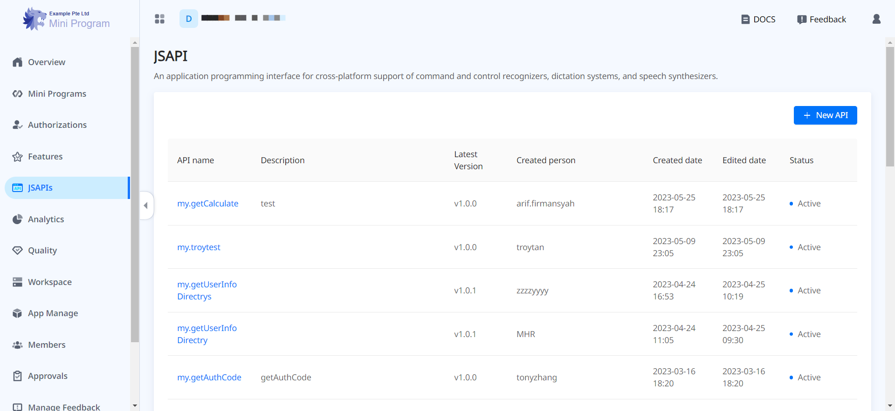
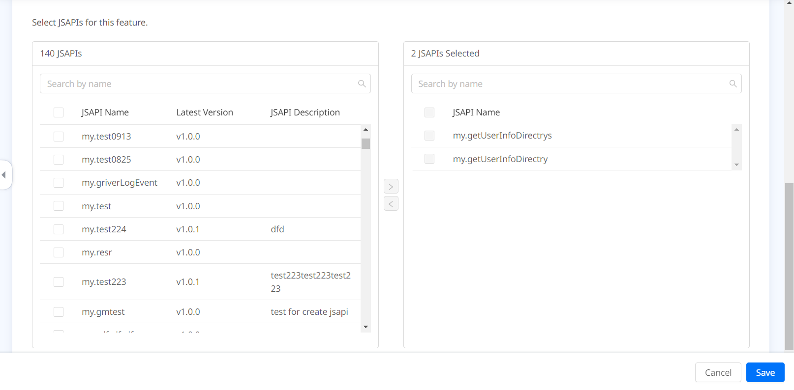
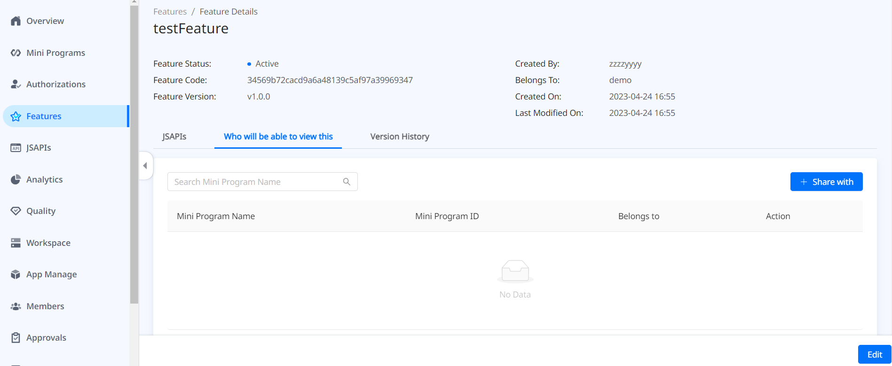
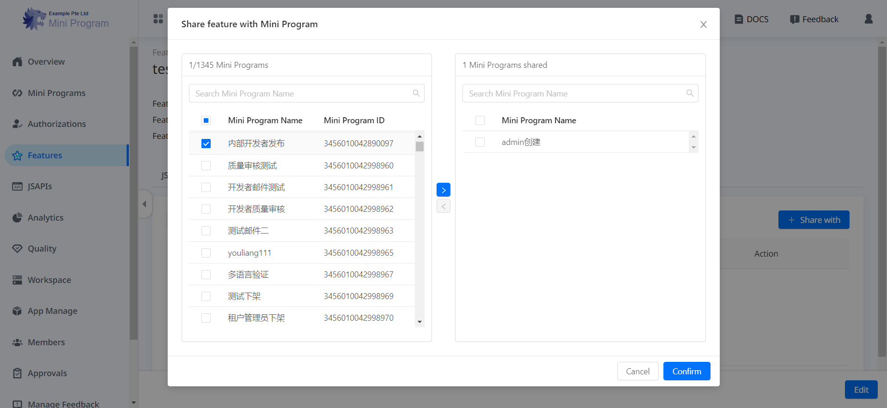

# Personalizar JSAPIs

Después de integrar el SDK IAPminiprogram en su aplicación, los JSAPIS incorporados están fácilmente disponibles para que los mini programas llamen para lograr características básicas. Una lista de estos JSAPIS y sus características se pueden encontrar en la[referencia de JSAPI](/). Además, si desea extender aún más la funcionalidad, el SDK ofrece la capacidad de personalizar JSAPIS. Con esta capacidad, puede crear un nuevo JSAPI o reemplazar la implementación predeterminada de un JSAPI incorporado existente. Para agregar o anular un JSAPI, siga las instrucciones paso a paso a continuación.

## Procedimientos
### Paso 1: Defina el JSAPI
Defina el JSAPI personalizado de acuerdo con los siguientes tres pasos.

#### 1. Agregue una clase
Cree una nueva clase que extienda SimpleBridgeExtension con el siguiente código de muestra:

```js
public class TestBridgeExtension extends SimpleBridgeExtension {

}
```
:::info[Nota]
Para la legibilidad y el mantenimiento del código, se recomienda crear una nueva clase para cada JSAPI.
:::


#### 2.Agregar un método
Agregue un método dentro de la clase recién creada con el siguiente código de muestra:

```js
public class TestBridgeExtension extends SimpleBridgeExtension {
    @ActionFilter(canOverride = false)
    @ThreadType(ExecutorType.UI)
    public void testAPI(){
    }
}
```

Al usar el código anterior, debe tomar las siguientes acciones dependiendo de sus necesidades especiales:
1. Especifique un nombre de método y reemplace ```testApi``` con él. El nombre del método es el nombre JSAPI sin el ```my.``` espacio de nombres. Dependiendo de sus necesidades específicas, puede nombrar el método de cualquiera de las dos formas siguientes:
- Use un nombre que sea diferente de todos los JSapis incorporados, que crea un nuevo JSAPI.
- Use el nombre de un JSAPI incorporado, que le permite anular la implementación predeterminada de este JSAPI.

2. (Opcional) Agregue anotaciones para este método si es necesario.Hay dos anotaciones disponibles: ```ActionFilter``` y ```ThreadType```. Consulte la siguiente tabla sobre cómo especificar los valores para ellos:

<table>
    <tr>
        <th>Anotación</th>
        <th>Descripción</th>
        <th>Valores válidos</th>
    </tr>
    <tr>
        <td>```ActionFilter```</td>
        <td>Las condiciones para ejecutar el JSAPI.</td>
        <td>
        ```canOverride```:Si permitir que este JSAPI anule un JSAPI existente con el mismo nombre. Los valores válidos son:
            - ```true```: Permitir que este JSAPI anule un JSAPI existente con el mismo nombre.
            - ```false```: Prohibir este JSAPI anular un JSAPI existente con el mismo nombre.
       El valor predeterminado es ```true```.
</td>
    </tr>
    <tr>
        <td>```ThreadType```</td>
        <td>El hilo JSAPI Runing.</td>
        <td>
        ExecutorType.SYNC: Hilo actual
            - ```ExecutorType.UI```: Hilo principal
            - ```ExecutorType.IO```: Hilo IO
            - ```ExecutorType.NETWORK```: Hilo de red
            El valor predeterminado es ```ExecutorType.SYNC```.
        </td>
    </tr>
</table>


#### 3. Agregar parámetros
Agregue parámetros al método especificado con los siguientes códigos de muestra:

```js
public class TestBridgeExtension extends SimpleBridgeExtension {

    @ActionFilter(canOverride = false)
    @ThreadType(ExecutorType.UI)
    public void testAPI(@BindingNode(Page.class) Page page,
                        @BindingParam(intDefault = 1) int intParam1,
                        @BindingParam(stringDefault = "ABC") String stringParam2,
                        @BindingCallback BridgeCallback bindingCallback){

    }
}
```

Hay cuatro tipos de parámetros y anotaciones correspondientes disponibles. Consulte los [parámetros para la definición de JSAPI](/) para obtener más detalles. En el código de muestra anterior, se agregan cuatro parámetros al método ```testAPI```:

- *page*: Una instancia de la página actual.
- *intParam1*: Un parámetro relacionado con el negocio cuyo tipo de datos es entero y el valor predeterminado es ```1```.
- *stringParam2*: Un parámetro relacionado con el negocio cuyo tipo de datos es String y el valor predeterminado es ```'ABC'```.
- *bindingCallback*: Un parámetro de devolución de llamada que devuelve una respuesta al programa MINI.


### Paso 2: Implemente el JSAPI
Implemente el JSAPI definido estableciendo la respuesta al programa MINI a través de la devolución de llamada.Debe configurar la respuesta con cualquiera de los siguientes métodos:

- ```jsonResponse```: llame a este método para devolver una respuesta personalizada para una devolución de llamada de éxito o falla.  Para obtener instrucciones detalladas, consulte [la respuesta establecida con JsonResponse](/).
-```BridgeResponse```: llame a este método para devolver una respuesta incorporada para una devolución de llamada de éxito o falla. Para obtener instrucciones detalladas, consulte [la respuesta establecida con BridgerSponse](/).

#### Establezca respuestas con jsonResponse
Construya un objeto JSON de resultado en la devolución de llamada para devolver una respuesta a los mini programas. Consulte diferentes códigos de muestra para diferentes respuestas:

- Para enviar una devolución de llamada de éxito, construya el objeto de resultado con el siguiente código de muestra. Aquí, la respuesta básicamente resuena en los parámetros de entrada.

```js
public class TestBridgeExtension extends SimpleBridgeExtension {
    @ActionFilter(canOverride = false)
    @ThreadType(ExecutorType.UI)
    public void testAPI(@BindingNode(Page.class) Page page,
                        @BindingParam(name = "intParam1", intDefault = 1) int intParam1,
                        @BindingParam(name = "stringParam2", stringDefault = "ABC") String stringParam2,
                        @BindingCallback BridgeCallback bindingCallback){
        // Construct a result object
        JSONObject result = new JSONObject();
        result.put("param1", intParam1);
        result.put("param2", stringParam2);
        result.put("success", true);
        // Send the result back to the mini program
        bindingCallback.sendJSONResponse(result);
    }
}
```
-Para enviar una devolución de llamada de falla, construya el objeto de resultado con el error (el código de error de la llamada JSAPI fallida) y los parámetros errorMessage (mensaje de error de la llamada JSAPI fallida) como se muestra en el siguiente código de muestra:

```js
@ActionFilter
@ThreadType(ExecutorType.UI)
public void testAPI(@BindingApiContext ApiContext apiContext,
                 @BindingCallback BridgeCallback bridgeCallback) {
    JSONObject result = new JSONObject();
    result.put("error", errorCode);
    result.put("errorMessage", "Your error message");
    bridgeCallback.sendJSONResponse(result);
}
```

#### Establecer respuestas con BridgerSponse
Para usar respuestas incorporadas en su implementación, debe construir ```BridgeResponse.Error``` con el siguiente código de muestra.Para obtener información sobre las respuestas incorporadas disponibles, consulte las [respuestas incorporadas para BridgeResponse](/).

```js
@ActionFilter
@ThreadType(ExecutorType.UI)
public void testAPI(@BindingApiContext ApiContext apiContext,
                 @BindingCallback BridgeCallback bridgeCallback) {
    bridgeCallback.sendBridgeResponse(BridgeResponse.UNKNOWN_ERROR);
}
```

### Paso 3: Registre el JSAPI a SDK
Registre el JSAPI a IAPminiprogram SDK.Aquí, envuelva la extensión creada y el JSAPI con ```GriverBridgeManifest```. En el manifiesto, especifique el JSAPI con Arrays.asList. Luego, llame a la API de [registerBridge](/) para registrar la implementación de JSAPI al SDK. Consulte el siguiente código de muestra para obtener más detalles:

```js
Griver.registerBridge(new GriverBridgeManifest(TestBridgeExtension.class, Arrays.asList("testAPI")), new GriverContainerAPICallBack() {
       @Override
       public void error(int errorCode, String errorMessage) {
              showErrorToast(errorCode, errorMessage);
      }
});
```

### Paso 4: Registre la plataforma JSAPI en Mini Program
Registre su plataforma JSAPIS personalizada en Mini Program para que los mini programas puedan acceder a estos JSAPIS.En el espacio de trabajo de su inquilino, solo el administrador del espacio de trabajo puede realizar los siguientes dos pasos para completar esta acción.

#### 1. Registre un nuevo JSAPI
Complete los siguientes tres pasos para registrar el nuevo JSAPI:

1. Inicie sesión en la [plataforma Mini Program](/) y navegue a **JSAPIS**.




2. Click + New JSAPI y complete los campos requeridos de acuerdo con la ayuda integrada y también las siguientes instrucciones:
    - **JSAPI Name**: Ingrese el mismo nombre del método que especifique en el paso 1.2 Agregue un método.Por ejemplo, en las muestras anteriores, el nombre es ```testAPI```.
    - **App**: Seleccione las Super Aplicaciones que admiten este JSAPI.
3. Click **Confirm** Para terminar el registro.Luego, el JSAPI agregado aparece en la lista de JSAPI.


#### 2. Agregue el JSAPI a una función
Luego, agregue el JSAPI a una función.Una característica es básicamente una funcionalidad comercial que se logra por un conjunto de JSAPIS.Por ejemplo, para JSAPIS relacionados con el pago, puede agregarlos a una característica llamada pago.Hay dos escenarios que puede esperar al agregar el JSAPI a una función.Siga los pasos que son apropiados para su escenario específico:


- <a href="#agregue-el-jsapi-a-una-nueva-característica">Agregue el JSAPI a una nueva característica</a>
- <a href="#agregue-el-jsapi-a-una-función-existente">Agregue el JSAPI a una característica existente</a>


#### Agregue el JSAPI a una nueva característica

1. En la plataforma Mini Program, navegue a **Features** y haga clic en + Agregar función.
2. Complete los detalles de la función de acuerdo con la ayuda e instrucciones integradas a continuación:
        - Establezca la visibilidad de la función: cambie todos los programas Mini pueden ver este botón de alternancia de características si desea hacer que la función sea visible para todos los programas mini tanto en el espacio de trabajo de los inquilinos como en los espacios de trabajo de desarrolladores asociados. De lo contrario, esta característica está oculta a menos que la comparta con cualquier mini programa después de la creación. Para obtener más información sobre el intercambio de funciones, consulte [cómo compartir una característica con Mini Programs Target](/).
        - Agregue el JSAPI: todos los JSAPI registrados en la plataforma se enumeran en el panel izquierdo.Busque y seleccione los JSAPIS que están relacionados con esta característica particular y haga clic en el signo ＞ para agregarlos.Verifique los JSAPIs agregados que aparecen en el panel derecho y luego haga clic en **Confirm**.


#### Agregue el JSAPI a una función existente

1. En la plataforma Mini Program, navegue hasta **Features** y encuentre la función existente a la que desea agregar el JSAPI.
2. Haga clic en el nombre de la función y haga clic en **Edit** en la página siguiente.
3. En la página de **Edit Feature** , desplácese hacia abajo hasta la parte JSAPIS directamente.Todos los JSAPI registrados en la plataforma se enumeran en el panel izquierdo.Busque y seleccione los JSAPIS que están relacionados con esta característica en particular y haga clic en el ＞ sIGN para agregarlos.Verifique los JSAPIs agregados que aparecen en el panel derecho y luego click **Save**.




## Apéndices

### Parámetros para la definición de JSAPI

<table>
    <tr>
        <th>Tipo de parámetro y su descripción</th>
        <th>Anotación</th>
        <th>Valores válidos de la anotación</th>
    </tr>
    <tr>
        <td>**Context**: IIncluye los parámetros que pueden obtener información relacionada con el contexto.</td>
        <td>```BindingApiContext```</td>
        <td>```ApiContext```: El contexto del mini programa actual.</td>
    </tr>
    <tr>
        <td>**Scope**: The class that can be inherited by the request parameters.</td>
        <td>```BindingNode```</td>
        <td>```Page```: La página actual del mini programa.</td>
    </tr>
    <tr>
        <td>
            **Business**: Includes business-related parameters, whose data type needs to be any of the following:
                - String
                - Integer
                - Double
                - Long
                - Boolean
        </td>
        <td>
            ```BindingParam```
        </td>
        <td>
            * ```name```: El nombre del parámetro.
            * ```stringDefault```: El valor de cadena predeterminado cuando el parámetro es una cadena.
            * ```intDefault```: El valor entero predeterminado cuando el parámetro es un entero.
            * ```doubleDefault```: El valor doble predeterminado cuando el parámetro es un doble.
            * ```longDefault```: El valor largo predeterminado cuando el parámetro es largo.
            * ```booleanDefault```: El valor booleano predeterminado cuando el parámetro es booleano.
            * ```required```: WSe requiere el parámetro.Si no se especifica, el valor se establece en ```false``` por defecto.Los valores válidos son:
                - ```true```: The parameter is required.
                - ```false```: El parámetro es opcional.
        </td>
    </tr>
    <tr>
        <td>**Callback**: Incluye parámetros de devolución de llamada.</td>
        <td>```BindingCallback```</td>
        <td>
            ```BridgeCallback```: Use esta devolución de llamada para devolver una respuesta a los mini programas.Puede devolver el resultado a través de ```JSONResponse``` o  ```BridgeResponse```. Consulte [Implementar el JSAPI](/) para más detalles.
        </td>
    </tr>
</table>


### Respuestas incorporadas para BridgeResponse


<table>
    <tr>
        <th>Respuesta</th>
        <th>error</th>
        <th>mensaje de error</th>
        <th>Descripción</th>
    </tr>
    <tr>
        <td>SUCCESS</td>
        <td>N/A</td>
        <td>N/A</td>
        <td>TLa llamada JSAPI tiene éxito.</td>
    </tr>
    <tr>
        <td>INVALID_PARAM</td>
        <td>2</td>
        <td>invalid parameter!</td>
        <td>El programa MINI pasa los parámetros en un formato incorrecto o con valores no válidos.</td>
    </tr>
    <tr>
        <td>UNKNOWN_ERROR</td>
        <td>3</td>
        <td>unknown error!</td>
        <td>Una excepción desconocida.</td>
    </tr>
</table>


### Cómo compartir una característica con Mini Programas elegidos
Para una función de mini programa, cuando todos los programas Mini pueden ver esta alternancia de características apagada, Workspace Admin debe establecer su visibilidad seleccionando Mini Programas para compartir.Tome los siguientes pasos para compartir una característica con Mini Programas Target:

1. En la plataforma Mini Program, navegue a las funciones y encuentre la función que desea compartir.
2. Haga clic en el nombre de la función para ver los detalles y haga clic en la OMS podrá ver esta pestaña.



3. Click + Share with para seleccionar miniprogram a compartir. Todos los mini programas del espacio de trabajo del inquilino y los espacios de trabajo del desarrollador se enumeran en el panel izquierdo. Busque y marque los mini programas de destino y haga clic en el ＞ sign Para agregarlos. Verifique los mini programas agregados que aparecen en el panel derecho y luego click **Confirm**.




## Próximos pasos
Después de personalizar JSAPIS, Super Apps necesita instruir a los desarrolladores de mini programas para que utilicen estos JSAPI. Para obtener más información, consulte [Guía Mini Programas para llamar a JSAPIS personalizados](/).


