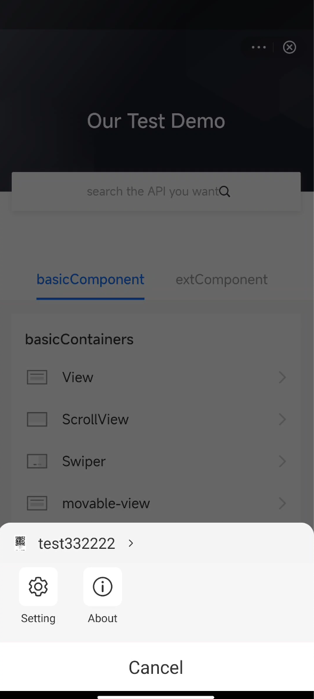
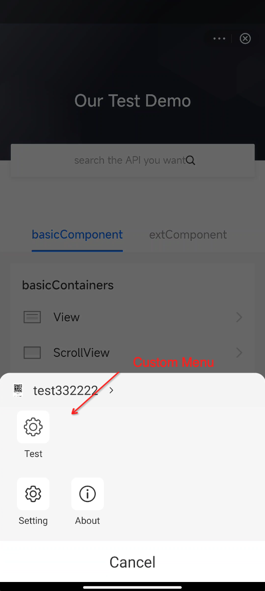
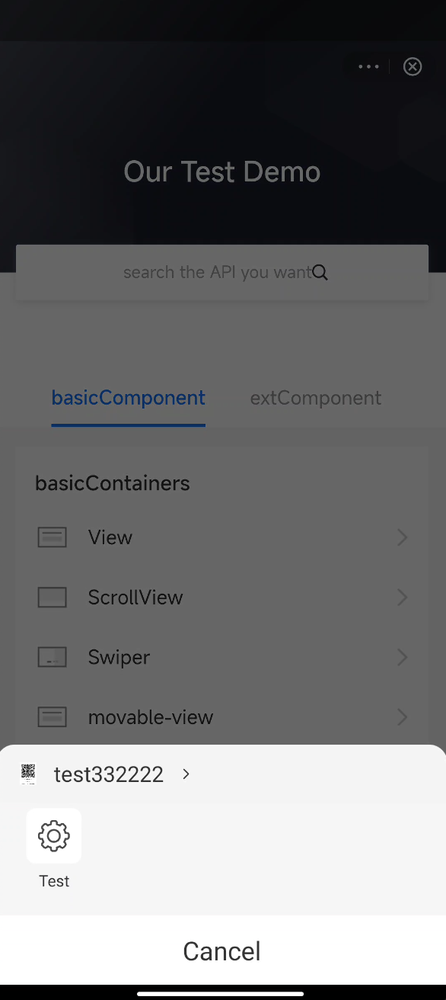

# Personalizar el menú Más

Para admitir diferentes requisitos comerciales dentro de la SUPER APP, el SDK admite personalización del panel de menú.Este tema presenta cómo personalizar el panel de menú en el mini programa con el SDK.

## Experiencia de usuario

La siguiente tabla muestra un panel de menú predeterminado y paneles de menú personalizados por los códigos de muestra en los procedimientos:

<table>
    <tr>
        <th>
         Por defecto
        </th>
        <th>
            Personalizado （con menú predeterminado
        </th>
        <th>
            Personalizado （sin un menú predeterminado
        </th>
    </tr>
    <tr>
        <td>
        
        </td>
        <td>
        
        </td>
        <td>
        
        </td>
    </tr>
</table>

## procedimientos

Para agregar otros elementos de menú en el panel de menú, implementa los siguientes pasos:

## Paso 1: Extender Griverbasemenuitem

Consulte la siguiente muestra sobre cómo extender la clase `theGriverBaseMenuItem`. Para obtener más información sobre esta clase, consulte [GriverBaseMenuItem](/).

```js

public class TestMenu extends GriverBaseMenuItem {
    public TestMenu() {
        this.identifier = "Test";
        this.name = "Test";
        this.row = ROW_ONE;
        this.iconDrawable = R.drawable.test;
        this.listener = new OnMenuItemClickListener() {
            @Override
            public void onItemClick(Page page, String id) {
                 Toast.makeText(GriverEnv.getApplicationContext(), "test", Toast.LENGTH_SHORT).show();
            }
        };
    }
}

```

## Paso 2: Extender GriverMenuExtensionImpl

Si desea agregar sus elementos de menú personalizados a la lista de menú predeterminada, devuelva los elementos de menú predeterminados y los elementos de menú personalizados por el método `getAppendMenuList` al SDK, y luego el SDK representa todos los menús en el panel.Consulte la siguiente muestra para extender la clase `GriverMenuExtensionImpl`:

```js
public class CustomMenuExtensionImpl extends GriverMenuExtensionImpl {
    @Override
    public List<GriverMenuItem> getAppendMenuList(Page page) {
        List<GriverMenuItem> list = new ArrayList<>();
        list.add(new TestMenu());
        return list;
    }
}
```

## Default menu

Refer to the following table to learn about the functions and positions of the default menu items:

<table>
    <tr>
        <th>
            Menú
        </th>
        <th>
            Descripción
        </th>
        <th>
            Fila
        </th>
    </tr>
    <tr>
        <td>
            SettingMenu
        </td>
        <td>
           Soporte para administrar los permisos otorgados por los usuarios.
        </td>
        <td>
            2
        </td>
    </tr>
    <tr>
        <td>
            AboutMenu
        </td>
        <td>
           Soporte para obtener la información mini del programa.
        </td>
        <td>
            2
        </td>
    </tr>
</table>

Si desea eliminar el menú predeterminado, devuelva la lista del menú por el método `getMenuList` al SDK, y el SDK solo representa el menú personalizado en el panel. Consulte la tercera imagen en la sección[Experiencia del usuario](/) para el efecto de renderizado.

```JS
public class CustomMenuExtensionImpl extends GriverMenuExtensionImpl {
    @Override
    public List<GriverMenuItem> getMenuList(Page page) {
        List<GriverMenuItem> list = new ArrayList<>();
        list.add(new TestMenu());
        return list;
    }
}

```

## Paso 3: Registre custommueNXensionImpl

Consulte la siguiente muestra para llamar a la API de Registroxtension para registrar la clase `CustomMenuExtension` después de inicializar el SDK.

```js
Griver.registerExtension(
  new GriverExtensionManifest(
    GriverMenuExtension.class,
    new CustomMenuExtensionImpl()
  )
);
```

Para obtener más información sobre la API anterior, consulte `registerExtension`.

## Interfaces

### GriverBaseMenuItem

La definición de la clase **GriverBaseMenuItem** se muestra en el siguiente código:

```js

public class GriverBaseMenuItem extends GriverMenuItem {

    @Override
    public boolean canShow(Page page) {
        return true;
    }
}

public abstract class GriverMenuItem {
    public static final int ROW_ONE = 1;
    public static final int ROW_TWO = 2;

    /**
     * El identificador del elemento del menú.
     */
    public String identifier;

    /**
     * El nombre del elemento del menú, se mostrará en el panel de menú.
     */
    public String name;

    /**
     * La URL del icono para el elemento del menú.Se cargará si no está vacío.
     */
    public String iconUrl;

    /**
     * TLa identificación local de dibujo del icono para el elemento del menú.Tiene menor prioridad que {@link
     * GriverMenuItem#iconUrl}.
     */
    public int iconDrawable;

    /**
     * TLa fila de los lugares del menú, 1 representa que el menú está en la primera fila y 2 representa el menú está en la segunda fila
     * Otro valor será ignorado por defecto
     */
    public int row;

    /**
     * El oyente de clic del elemento del menú.
     */
    public @Nullable OnMenuItemClickListener listener;
}

```

### Parameters

<table>
    <tr>
        <th>
           Nombre
        </th>
        <th>
            Tipo
        </th>
        <th>
            Longitud
        </th>
        <th>
            Descripción
        </th>
        <th>
            Requerido
        </th>
    </tr>
    <tr>
        <td>
            identifier
        </td>
        <td>
            String
        </td>
        <td>
            N/A
        </td>
        <td>
            El identificador único del elemento del menú.
        </td>
        <td>
            M
        </td>
    </tr>
    <tr>
        <td>
        name
        </td>
        <td>
         String
        </td>
        <td>
         N/A
        </td>
        <td>
       El nombre del elemento del menú, que se muestra en el panel.
        </td>
        <td>
        M
        </td>
    </tr>
    <tr>
        <td>
        row
        </td>
        <td>
        integer
        </td>
        <td>
        N/A
        </td>
        <td>
        La fila del elemento del menú.Los valores de valor son:
            * ROW_ONE: Indica que el menú está en la primera fila.
            * ROW_TWO: Indica que el menú está en la segunda fila.
            Nota: Si no establece la fila, el elemento del menú no se muestra.
        </td>
        <td>
        M
        </td>
    </tr>
    <tr>
        <td>
            iconUrl
        </td>
        <td>
            String
        </td>
        <td>
            N/A
        </td>
        <td>
            The HTTPS URL of the icon for the menu item.
            Specify this parameter if the icon of the menu item needs to be rendered in the menu panel.
        </td>
        <td>
            O
        </td>
    </tr>
    <tr>
        <td>
            iconDrawable
        </td>
        <td>
            integer
        </td>
        <td>
            N/A
        </td>
        <td>
            La identificación local de dibujo del icono para el elemento del menú.
            Especifique este parámetro si el icono del elemento del menú debe representarse en el panel de menú.
            **Nota**: Si se especifican *iconUrl* e *iconDrawable*, *iconUrl* tiene prioridad sobre *iconDrawable*. 
        </td>
        <td>
            O
        </td>
    </tr>
    <tr>
        <td>
            listener
        </td>
        <td>
            OnMenuItemClickListener
        </td>
        <td>
            N/A
        </td>
        <td>
           El listener para los eventos de clics de los usuarios en el elemento del menú. Si desea escuchar este tipo de evento, consulte el código de muestra [```OnMenuClickListener```](/) para especificar al oyente.
        </td>
        <td>
            O
        </td>
    </tr>
</table>

### OnMenuItemClickListener

```js
public interface OnMenuItemClickListener {
    void onItemClick(Page page, String id);
}
```

## GriverMenuExtensionImpl

La definición de la clase **GriverMenuExtensionImpl** se muestra en el siguiente código:

```js
public class GriverMenuExtensionImpl implements GriverMenuExtension {

    @Override
    public List<GriverMenuItem> getMenuList(Page page) {
        List<GriverMenuItem> menuItems = new LinkedList<>();
        menuItems.add(new ShareMenu());
        menuItems.add(new SettingMenu());
        menuItems.add(new AboutMenu());
        boolean showReopenMenu = GriverInnerConfig.getConfigBoolean(GriverConfigConstants.KEY_MENU_SHOW_REOPEN,
                GriverConfigConstants.DEFAULT_VALUE_MENU_SHOW_REOPEN);
        if (showReopenMenu) {
            App app = page.getApp();
            if (app != null) {
                Bundle startParams = app.getStartParams();
                if (startParams != null && AppInfoScene.ONLINE.toString().equalsIgnoreCase(BundleUtils.getString(startParams, "nbsn", AppInfoScene.ONLINE.toString()))) {
                    menuItems.add(new ReopenMenu());
                }
            }
        }
        List<GriverMenuItem> appendMenuList = getAppendMenuList(page);
        if (appendMenuList != null) {
            menuItems.addAll(appendMenuList);
        }
        return menuItems;
    }

    @Override
    public List<GriverMenuItem> getAppendMenuList(Page page) {
        return null;
    }
}
```

## Método

<table>
    <th>
       Nombre del método
    </th>
    <th>
        Descripción
    </th>
    <th>
        Requerido
    </th>
    <tr>
        <td>
            getMenuList
        </td>
        <td>
            Return the customized menu list to overwrite the default menu list.
        </td>
        <td>
            O
        </td>
    </tr>
    <tr>
        <td>
            getAppendMenuList
        </td>
        <td>
            Return the customized menu list and add the menu items to the default menu list.
        </td>
        <td>
            O
        </td>
    </tr>
</table>

