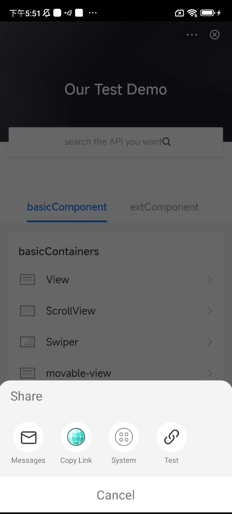

# Personalizar la capacidad de compartir

El mini programa se puede compartir con otros a través de la capacidad de acciones proporcionada por el SDK.Otros que reciben el enlace compartido a través de Facebook, Twitter u otras aplicaciones pueden abrir el programa Mini compartido.

Este tema lo guía a través de cómo personalizar la capacidad de compartir con el SDK en los siguientes aspectos:

* Personalice el panel de acciones donde los usuarios comienzan a compartir.
* Personalice los canales de compartir que admite su aplicación, como Facebook, Twitter, WhatsApp, etc.
* Personalice el enlace compartido que puede ser reconocido por su aplicación para que otros usuarios vayan a su aplicación desde otras aplicaciones.


## Experiencia de usuario predeterminada
El menú Compartir se muestra solo cuando implementa todos los siguientes pasos.

## procedimientos
Cuando los usuarios comienzan a compartir el programa Mini desde el menú Compartir, el SDK recibe el contenido compartido y luego comienza a compartir.El SDK proporciona una extensión para que pueda representar su panel de compartir personalizado.En esta extensión, recibe información de intercambio detallada, los canales compartidos compatibles y la devolución de llamada para devolver el resultado de intercambio.

Para obtener información detallada sobre cómo personalizar la capacidad de compartir, complete los siguientes pasos:


### Paso 1: Extiende BaseShareItem
Extiende la clase BaseShareItem, y luego se muestran todos los canales de acciones.Consulte la siguiente muestra sobre cómo extender BaseShareItems.Para obtener más información sobre esta clase, consulte BaseShareItems.

```js
public class TestShareItem extends BaseShareItem {
    public TestShareItem() {
        this.iconDrawable = R.drawable.griver_core_share_copy_link;
        this.channelName = "Test";
    }

    @Override
    public void onShare(ShareParam shareParam, ShareResultListener listener) {
        listener.success(this.channelName);
        Toast.makeText(GriverEnv.getApplicationContext(), shareParam.url, Toast.LENGTH_SHORT).show();
    }
}
```

#### Compartir a través de una cadena corta
Cabe señalar que la clase ```BaseShareItem``` DOE no realiza ningún procesamiento en el enlace de compartir.Si el enlace de compartir debe ser de cadena corta, el SDK proporciona la clase ```BaseOutShareItem``` para crear una cadena corta.Por lo tanto, se recomienda extender la clase ```BaseOutShareItem``` e implementar el método Doshare para agregar un canal compartido.
Consulte la siguiente muestra sobre cómo extender ```BaseOutShareItem```.Para obtener más información sobre esta clase, consulte ```BaseOutShareItem```:

```js
public class TestShareItem extends BaseOutShareItem {
    public TestShareItem() {
        this.iconDrawable = R.drawable.griver_core_share_copy_link;
        this.channelName = "Test";
    }

    @Override
    public void doShare(ShareParam shareParam, ShareResultListener listener) {
        listener.success(this.channelName);
        Toast.makeText(GriverEnv.getApplicationContext(), shareParam.url, Toast.LENGTH_SHORT).show();
    }
}
```


### Paso 2: Implementar GriverSharePanelExtension
Para personalizar la capacidad de compartir, debe implementar la clase ```GriverSharePanelExtension```.Para obtener más información sobre esta clase, consulte [GriverSharePanelExtension](/).


#### Personalice el enlace de compartir y el canal de acciones
En las propiedades de ```ShareParam```, la ```url``` es el enlace de acciones.Como el SDK no sabe qué enlace compartido puede reconocer su aplicación, debe decirle al SDK el enlace compartido del método ```getShareLink```. De lo contrario, el enlace compartido no puede redirigir a los usuarios a su aplicación.

```js
public class CustomSharePanelExtension implements GriverSharePanelExtension {
    ...
    @Override
    public String getShareLink(Map<String, String> params) {
        Uri parse = Uri.parse("mini://platformapi/startApp");
        Uri.Builder builder = parse.buildUpon();
        for (Map.Entry<String, String> entry : params.entrySet()) {
            builder.appendQueryParameter(entry.getKey(), entry.getValue());
        }
        Uri reBuild = builder.build();
        return reBuild.toString();
    }
    ...
}
```


#### Agregue su canal de compartir personalizado al SDK
Mientras tanto, debe devolver los canales de compartir personalizados que creó en el método ```getSharesItems``` y agregarlos al SDK.También proporcionamos tres canales de acciones predeterminados que puede agregar opcionalmente al SDK. Para obtener más información sobre el canal predeterminado, consulte los canales de compartir predeterminados.

Consulte la siguiente muestra para agregar los canales de acciones predeterminados y los canales de acciones personalizados al SDK:

```js
public class CustomSharePanelExtension implements GriverSharePanelExtension {
    ...
    @Override
    public List<BaseShareItem> getSharesItems(String appId) {
        ArrayList<BaseShareItem> items = new ArrayList<>();
        // default share item
        items.add(new MessagesShareItem());
        items.add(new CopyUrlShareItem());
        items.add(new MoreShareItem());
        // your custom share item
        items.add(new TestShareItem());
        return items;
    }
    ...
}
```

### Canales de compartir por defecto


<table>
    <th>
    Menu
    </th>
    <th>
    Description
    </th>
    <tr>
        <td>
        MessagesShareItem
        </td>
        <td>
        Compartir mensaje a SMS.
        </td>
    </tr>
    <tr>
        <td>
        CopyUrlShareItem
        </td>
        <td>
Comparta el mensaje al portapapeles.
        </td>
    </tr>
    <tr>
        <td>
        MoreShareItem
        </td>
        <td>
        Compartir mensaje al panel System Share.
        </td>
    </tr>
</table>


Para el efecto de representación de los canales de acciones predeterminados y los canales de acciones personalizados, consulte la siguiente imagen:




### (Opcional) Personalice el panel de acciones
Consulte la siguiente muestra sobre cómo personalizar el panel compartido:

 ```js
public class CustomSharePanelExtension implements GriverSharePanelExtension {
    private RecyclerView channelRecyclerView;
    private ShareRecyclerAdapter shareRecyclerAdapter;
    
    ...
    @Override
    public boolean showPanel(ShareParam shareParam, List<BaseShareItem> baseShareItems, ShareResultListener listener) {
        View shareView = LayoutInflater.from(shareParam.activity).inflate(R.layout.window_share, null);
        shareView.setLayoutParams(new RelativeLayout.LayoutParams(ViewGroup.LayoutParams.MATCH_PARENT, DensityUtil.dip2px(shareParam.activity, 220)));
        channelRecyclerView = shareView.findViewById(R.id.recycler_view);

        LinearLayoutManager linearLayoutManager = new LinearLayoutManager(shareParam.activity);
        linearLayoutManager.setOrientation(LinearLayoutManager.HORIZONTAL);
        channelRecyclerView.setLayoutManager(linearLayoutManager);
        channelRecyclerView.setItemAnimator(new DefaultItemAnimator());
        BottomPopupDialog bottomPopupDialog = new BottomPopupDialog(shareParam.activity, shareView);
        bottomPopupDialog.show();
        bottomPopupDialog.setOnCancelListener(new DialogInterface.OnCancelListener() {
            @Override
            public void onCancel(DialogInterface dialogInterface) {
                listener.cancel();
            }
        });
        shareView.findViewById(R.id.tv_cancel).setOnClickListener(new View.OnClickListener() {
            @Override
            public void onClick(View view) {
                bottomPopupDialog.dismiss();
                listener.cancel();
            }
        });
        shareRecyclerAdapter = new ShareRecyclerAdapter(shareParam.activity, baseShareItems);
        channelRecyclerView.setAdapter(shareRecyclerAdapter);
        shareRecyclerAdapter.setOnItemClickListener(new OnItemClickListener() {
            @Override
            public void onClick(View view, int position) {
                BaseShareItem baseShareItem = baseShareItems.get(position);
                bottomPopupDialog.dismiss();
                baseShareItem.onShare(shareParam,
                        new ShareResultListener() {
                            @Override
                            public void success(String channelName) {
                                listener.success(channelName);
                            }

                            @Override
                            public void cancel() {
                                listener.cancel();
                            }

                            @Override
                            public void fail(String channelName, String errorCode,
                                             String errorMessage) {
                                listener.fail(channelName, errorCode, errorMessage);
                            }
                        });
            }
        });
        return true;
    }
    ...
}
 ```

Si no tiene necesidad de personalizar el Panel Compartir, devuelva ```false``` el método ```showPanel ```.


```js
public class CustomSharePanelExtension implements GriverSharePanelExtension {
    private RecyclerView channelRecyclerView;
    private ShareRecyclerAdapter shareRecyclerAdapter;
    
    ...
    @Override
    public boolean showPanel(ShareParam shareParam, List<BaseShareItem> baseShareItems, ShareResultListener listener) {       
        return false;
    }
    ...
}
```

## Paso 3: Registre a CustomSharePanelExtension
Consulte el siguiente código de muestra sobre cómo llamar a la API de **registerExtension**  para registrar la extensión después de inicializar el SDK.

```js
Griver.registerExtension(new GriverExtensionManifest(GriverSharePanelExtension.class, new CustomSharePanelExtension()));
For more information about the above API, refer to registerExtension.
```

Para obtener más información sobre la API anterior, consulte [registerExtension](/).


## Interfaces
### BaseShareItem
La definición de la clase **BaseShareItem** se muestra en el siguiente código:

```js
public abstract class BaseShareItem implements Serializable {
    public String iconUrl;
    public String channelName;
    public int iconDrawable;

    public abstract void onShare(ShareParam shareParam, ShareResultListener listener);
}
```

<table>
    <tr>
        <th> Nombre </th>
        <th> Tipo </th>
        <th> Descripción </th>
        <th> requerido </th>
    </tr>
    <tr>
        <td>channelName</td>
        <td>String</td>
        <td>TEl nombre del canal.</td>
        <td>M</td>
    </tr>
    <tr>
        <td>
            iconUrl
        </td>
        <td>
            String
        </td>
        <td>
            La URL HTTPS del icono que se muestra en el panel de intercambio.
        </td>
        <td>
            Especifique este parámetro si el icono del elemento del menú debe representarse en el panel de menú.
        </td>
        <td>
            O
        </td>
    </tr>
    <tr>
        <td>
            iconDrawable
        </td>
        <td>
            Integer
        </td>
        <td>
            La ID local dibujable del icono que se muestra en el panel de intercambio.
            Especifique este parámetro si el icono del elemento del menú debe representarse en el panel de menú.
            Nota: Si se especifican Iconurl e Icondrawable, IconUrl tiene prioridad sobre ICondrawable.
        </td>
        <td>
            O
        </td>
    </tr>
</table>


### Método
Consulte la siguiente tabla para el método utilizado en la clase **BaseShareItem**:

<table>
    <tr>
        <th>Nombre del método </th>
        <th> Descripción </th>
    </tr>
    <tr>
        <td>onShare</td>
        <td>El método que se implementa cuando el usuario hace clic en el elemento compartido.</td>
    </tr>
</table>


### ShareParam


<table>
    <tr>
        <th> nombre </th>
        <th> escriba </th>
        <th> Descripción </th>
        <th> requerido </th>
    </tr>
    <tr>
        <td>page</td>
        <td>Page</td>
      <td> La página actual del programa mini. </td>
        <td>M</td>
    </tr>
    <tr>
        <td>activity</td>
        <td>Activity</td>
        <td>The current activity.</td>
        <td>M</td>
    </tr>
    <tr>
        <td>title</td>
        <td>String</td>
        <td> El título del mensaje compartido. </td>
        <td>M</td>
    </tr>
    <tr>
        <td>desc</td>
        <td>String</td>
        <td> La descripción del mensaje compartido.</td>
        <td>O</td>
    </tr>
    <tr>
        <td>content</td>
        <td>String</td>
        <td>The content of the shared message.</td>
        <td>O</td>
    </tr>
    <tr>
        <td>url</td>
        <td>String</td>
       <td> La URL del esquema que puede usarse para abrir el mini programa compartido por ```Griver.openUrl``` y el esquema puede ser reconocido por su aplicación. </td>
        <td>M</td>
    </tr>
    <tr>
        <td>imageUrl</td>
        <td>String</td>
        <td> El icono del mensaje compartido.Es la URL de icono del programa MINI si el desarrollador no lo especifica en el programa Mini. </td>
        <td>M</td>
    </tr>
    <tr>
        <td>bgImgUrl</td>
        <td>String</td>
        <td> La imagen de vista previa del mensaje compartido.Es la instantánea de la página de mini del programa actual. </td>
        <td>M</td>
    </tr>
    <tr>
        <td>from</td>
        <td>String</td>
       <td> La entrada desde la cual el usuario comienza a compartir.Puede ser menú, ```button``` o ```code```. </td>
        <td>M</td>
    </tr>
</table>


## BaseOutShareItem
La definición de la clase **BaseOutShareItem** se muestra en el siguiente código:

```js
abstract class BaseOutShareItem extends BaseShareItem {
     ...
     abstract void doShare(ShareParam shareParam, ShareResultListener listener);
}
```

### Método
Consulte la siguiente tabla para el método utilizado en la clase **BaseOutShareItem** 

<table>
    <tr>
        <th>Method name</th>
        <th>Description</th>
    </tr>
    <tr>
        <td>doShare</td>
        <td>El método que se implementa cuando el usuario hace clic en el elemento compartido.</td>
    </tr>
</table>


## GriverSharePanelExtension
La definición de la interfaz **GriverSharePanelExtension** se muestra en el siguiente código:

```js
public interface GriverSharePanelExtension extends GriverExtension {
    String getShareLink(Map<String, String> params);
    boolean showPanel(ShareParam shareParam, List<BaseShareItem> baseShareItems,ShareResultListener listener);
    List<BaseShareItem> getSharesItems(String appId);
```

### Método
Consulte la siguiente tabla para ver los métodos utilizados en la interfaz **GriverSharePanelExtension**:


<table>
    <tr>
        <th>Method</th>
        <th>Description</th>
        <th>Required</th>
    </tr>
    <tr>
        <td>getShareLink</td>
        <td>Cree la URL del canal compartido basado en la información de mini-programa.</td>
        <td>M</td>
    </tr>
    <tr>
        <td>getSharesItems</td>
        <td>Cree una lista de los canales compartidos.</td>
        <td>M</td>
    </tr>
    <tr>
        <td>showPanel</td>
        <td>
        El método que se llama cuando se muestra el panel de intercambio.
        Si la Super App devuelve False, use el panel de intercambio predeterminado.Si la Super App devuelve verdadera, use el panel de intercambio personalizado y el panel predeterminado no se muestra.
        </td>
        <td>M</td>
    </tr>
</table>


