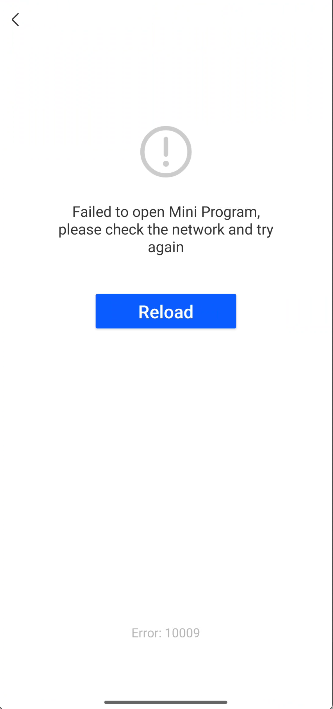

# Personalizar la página Splash

IAPminiprogram SDK muestra una página de salpicaduras en el lanzamiento inicial de un mini programa.Esto garantiza una experiencia de usuario suave porque permite tiempo para que el SDK cargue los datos de mini-programa.La super aplicación puede seguir esta guía para personalizar una página de salpicaduras.

## Experiencia de usuario predeterminada
La página de splash predeterminada incluye las siguientes dos partes:

- Una página de carga que muestra el progreso de carga
- Una página de error que describe el error cuando falla el lanzamiento

Puede ver ejemplos de estas dos páginas en la siguiente tabla:

<table>
    <tr>
        <th>Página Cargando</th>
        <th>Página de error</th>
    </tr>
    <tr>
        <td></td>
        <td></td>
    </tr>
</table>


## Procedimientos
Tome los siguientes tres pasos para personalizar la página Splash:

## Paso 1: implementar AbstractSplashFragment
Cree una clase que extienda la clase de AbstractSplashFragment para definir un fragmento de splash personalizado. Este fragmento tiene los eventos de carga, error y salida. Consulte el siguiente código de muestra para la implementación:

```js
public static class CustomSplashFragment extends AbstractSplashFragment {
    private ImageView iconView;
    private TextView appName;
    private ProgressBar loadingView;
    private TextView desc;

    @Nullable
    @Override
    public View onCreateView(@NonNull LayoutInflater inflater, 
                             @Nullable ViewGroup container,
                             @Nullable Bundle savedInstanceState) {
        View view = inflater.inflate(R.layout.fragment_custom_splash, container, false);
        initView(view);
        return view;
    }

    private void initView(View view) {
        iconView = view.findViewById(R.id.iv_icon);
        appName = view.findViewById(R.id.tv_name);
        loadingView = view.findViewById(R.id.loading_view);
        desc = view.findViewById(R.id.tv_desc);
    }

    @Override
    public void updateLoadingInfo(SplashEntryInfo info) {
        if (info == null) {
            return;
        }
        ImageUtils.loadImage(info.iconUrl, new ImageListener() {
            @Override
            public void onImage(Bitmap bitmap) {
                iconView.setImageBitmap(bitmap);
            }
        });
        appName.setText(info.appName);
        desc.setText(info.desc);
        loadingView.setVisibility(View.VISIBLE);
    }

    @Override
    public void showError(String code, String message) {
        loadingView.setVisibility(View.GONE);
        desc.setText(message + "(" + code + ")");
    }

    @Override
    public void exit() {
        loadingView = null;
    }
}

```

Para obtener más información sobre la clase ```AbstractSplashFragment```, consulte [```AbstractSplashFragment```](/).

Al personalizar el fragmento de Splash, puede usar el método ```onCreateView ``` para inflar su archivo de diseño personalizado (que es ***fragment_custom_splash*** en esta muestra). El siguiente código de muestra muestra cómo definir el diseño en XML:

```xml
<?xml version="1.0" encoding="utf-8"?>
<RelativeLayout xmlns:android="http://schemas.android.com/apk/res/android"
  android:orientation="vertical" android:layout_width="match_parent"
  android:layout_height="match_parent"
  android:layout_centerInParent="true">
        <ImageView
      android:layout_width="100dp"
      android:layout_height="100dp"
      android:id="@+id/iv_icon"
      android:layout_centerHorizontal="true"
      />

    <TextView
      android:layout_width="wrap_content"
      android:layout_height="wrap_content"
      android:layout_centerHorizontal="true"
      android:id="@+id/tv_name"
      android:layout_below="@id/iv_icon"
      android:layout_marginTop="10dp"
      />

    <TextView
      android:layout_width="wrap_content"
      android:layout_height="wrap_content"
      android:id="@+id/tv_desc"
      android:layout_below="@id/tv_name"
      android:layout_marginTop="10dp"
      android:layout_centerHorizontal="true"/>

    <ProgressBar
      android:id="@+id/loading_view"
      android:layout_width="wrap_content"
      android:layout_height="wrap_content"
      style="@style/Widget.AppCompat.ProgressBar"
      android:layout_centerHorizontal="true"
      android:layout_below="@id/tv_desc"
      android:layout_marginTop="10dp"/>
</RelativeLayout>

```


## Step 2: Implementar GriverSplashFragmentExtension
Cree una clase que implementa la interfaz ```GriverSplashFragmentExtension``` para crear un fragmento de splash que se define en el paso anterior. Consulte el siguiente código de muestra para la implementación:


```js
public class CustomSplashViewExtension implements GriverSplashFragmentExtension {
    @Override
    public AbstractSplashFragment createSplashFragment() {
        return new CustomSplashFragment();
    }
}
```

Para obtener más información sobre la interfaz, consulte [```GriversPlashFragmentExtension```](/).


## Paso 3: Registre GriversPlashFragmentExtension
Después de la lógica de inicialización de SDK, llame a la API de **registerExtension** de Registro para registrar la interfaz ```GriverSplashFragmentExtension``` implementada al SDK con el siguiente código de muestra:

```js
Griver.registerExtension(new GriverExtensionManifest(GriverSplashFragmentExtension.class, new CustomSplashViewExtension()));
```


## Interfaces y clases
## AbstractSplashFragment
La clase ```AbstractSplashFragment``` se utiliza para personalizar un fragmento de splash. El siguiente código muestra la definición de esta clase:

```js
abstract class AbstractSplashFragment extends Fragment {
    public abstract void updateLoadingInfo(SplashEntryInfo info);
    public void updateProgress(SplashEntryInfo info) {}
    public abstract void showError(String code, String message);
    public abstract void exit();
    public void reload() {
        if (listener != null) {
            listener.onReload();
        }
    }
}
```

Como podemos ver en la definición, la clase ```AbstractSplashFragment``` proporciona los siguientes cinco métodos:


<table>
    <tr>
        <th>Método</th>
        <th>Descripción</th>
        <th>Requerida</th>
    </tr>
    <tr>
        <td>updateLoadingInfo</td>
        <td>La super aplicación utiliza este método para obtener la información más reciente del programa mini abierto y mostrarla en una página de salpicaduras.Para obtener más información, consulte [```updateLoadingInfo```](/).</td>
        <td>M</td>
    </tr>
    <tr>
        <td>updateProgress</td>
        <td>La super aplicación utiliza este método para obtener el progreso de carga del programa MINI y actualizarlo en una página de salpicaduras.Para obtener más información, consulte [```updateProgress```](/).</td>
        <td>M</td>
    </tr>
    <tr>
        <td>showError</td>
        <td>La super aplicación utiliza este método para mostrar una vista de error en una página de salpicaduras cuando el lanzamiento del mini-programa falla.Para obtener más información, consulte [```showError```](/).</td>
        <td>O</td>
    </tr>
    <tr>
        <td>exit</td>
        <td>El SDK llama a este método para mostrar el botón de salida en la página Splash. Esto permite a los usuarios salir del progreso de carga.</td>
        <td>M</td>
    </tr>
    <tr>
        <td>reload</td>
        <td>El SDK llama a este método para mostrar el botón Recargar en la página Splash. Esto permite a los usuarios recargar el MINI program cuando falla el lanzamiento.</td>
        <td>O</td>
    </tr>
</table>


## updateLoadingInfo
El método ```updateLoadingInfo``` tiene el siguiente parámetro de entrada cuyo valor pasa por el SDK:

<table>
    <tr>
        <th>Campo</th>
        <th>Tipo de datos</th>
        <th>Descripción</th>
        <th>Requerida</th>
    </tr>
    <tr>
        <td>info</td>
        <td>[```SplashEntryInfo```](/)</td>
        <td>La última información del programa mini abierto.Para obtener más información, consulte [```SplashEntryinfo```](/).</td>
        <td>M</td>
    </tr>
</table>


## updateProgress
El método ```updateProgress``` tiene el siguiente parámetro de entrada cuyo valor pasa por el SDK:

<table>
    <tr>
        <th>Campo</th>
        <th>Tipo de datos</th>
        <th>Descripción</th>
        <th>Requerido</th>
    </tr>
    <tr>
        <td>info</td>
        <td>[```SplashEntryInfo```](/)</td>
        <td>El progreso de carga del mini programa.Para obtener más información, consulte [```SplashEntryInfo```](/).</td>
        <td>M</td>
    </tr>
</table>


## showError
El método ```showError``` tiene los siguientes dos parámetros de entrada cuyos valores pasan el SDK:

<table>
    <tr>
        <th>Campo</th>
        <th>Tipo de datos</th>
        <th>Descripción</th>
        <th>Requerido</th>
    </tr>
    <tr>
        <td>code</td>
        <td>String</td>
        <td>El código de error del error encontrado. Para obtener más información, consulte [Errors](/).</td>
        <td>M</td>
    </tr>
    <tr>
        <td>message</td>
        <td>String</td>
        <td>El mensaje de error que describe el código de error en detalle.Para obtener más información, consulte [Errors](/).</td>
        <td>M</td>
    </tr>
</table>


## GriverSplashFragmentExtension
La interfaz ```GriverSplashFragmentExtension``` se utiliza para crear una página de salpicaduras que se define por la clase de ```AbstractSplashFragment```. El siguiente código muestra la definición de esta interfaz:

```js
public interface GriverSplashFragmentExtension extends GriverExtension {
    AbstractSplashFragment createSplashFragment();
}
```

Como podemos ver en la definición, la interfaz ```GriversPlashFragmentExtension``` tiene el siguiente método:


<table>
    <tr>
        <th>Método</th>
        <th>Descripción</th>
        <th>Requerida</th>
    </tr>
    <tr>
        <td>createSplashFragment</td>
        <td>El Super llama a este método para crear un fragmento de salpicaduras personalizado.Este fragmento extiende la clase de ```AbstractSplashFragment```.</td>
        <td>M</td>
    </tr>
</table>

## Apéndices
### SplashEntryInfo
El modelo SplashEntryInfo tiene los siguientes parámetros:

<table>
    <tr>
        <th>Campo</th>
        <th>Tipo de datos</th>
        <th>Descripción</th>
        <th>Requerida</th>
    </tr>
    <tr>
        <td>appId</td>
        <td>String</td>
        <td>La identificación del mini programa. Este parámetro se devuelve si se llama al método ```updateLoadingInfo```.</td>
        <td>O</td>
    </tr>
    <tr>
        <td>appName</td>
        <td>String</td>
        <td>El nombre del mini programa. Este parámetro se devuelve si se llama al método ```updateLoadingInfo```. Su valor puede estar vacío cuando la identificación del programa mini abierto no es válido.</td>
        <td>O</td>
    </tr>
    <tr>
        <td>iconUrl</td>
        <td>String</td>
        <td>La url del icono de mini-programa. Este parámetro se devuelve si se llama al método ```updateLoadingInfo```. Su valor puede estar vacío cuando la identificación del programa mini abierto no es válido.</td>
        <td>O</td>
    </tr>
    <tr>
        <td>desc</td>
        <td>String</td>
        <td>
        La descripción del mini programa. Este parámetro se devuelve si se llama al método ```updateLoadingInfo```. Su valor puede estar vacío para cualquiera de los siguientes dos escenarios:
        - La identificación del programa mini abierto no es válido.
        - El programa mini no tiene una descripción.
        </td>
        <td>O</td>
    </tr>
    <tr>
        <td>slogan</td>
        <td>String</td>
        <td>
        El eslogan del mini programa. Este parámetro se devuelve si se llama al método ```updateLoadingInfo```. Su valor puede estar vacío para cualquiera de los siguientes dos escenarios:
        - La identificación del programa mini abierto no es válido.
        - El programa Mini no tiene un eslogan.
        </td>
        <td>O</td>
    </tr>
    <tr>
        <td>progress</td>
        <td>Integer</td>
        <td>
        Cargando el progreso del mini programa. Este parámetro se devuelve si se llama al método ```updateProgress```.
        Rango de valor: 0-100
        </td>
        <td>O</td>
    </tr>
</table>


## Errores
La siguiente tabla enumera los detalles de los errores que pueden ocurrir cuando el lanzamiento del mini-Program falla:


<table>
    <tr>
        <th>Código de error</th>
        <th>Mensaje de error</th>
        <th>Descripción</th>
    </tr>
    <tr>
        <td>1001</td>
        <td>Mini Program has been removed</td>
        <td>El mini programa se elimina de la plataforma de desarrollo de Mini Program.</td>
    </tr>
    <tr>
        <td>1002</td>
        <td>Mini Program has been suspended</td>
        <td>El mini programa se elimina de la superpección.</td>
    </tr>
    <tr>
        <td>10000</td>
        <td>Unknown error</td>
        <td>Error desconocido.</td>
    </tr>
    <tr>
        <td>10001</td>
        <td>Mini program does not exist.</td>
        <td>TSu podría suceder cuando la identificación de mini-programa pasada no es válida.</td>
    </tr>
    <tr>
        <td>10002</td>
        <td>Mini program unzip failed</td>
        <td>No se pudo descomprimir el paquete mini-programa.Esto podría suceder cuando el paquete descargado está dañado.</td>
    </tr>
    <tr>
        <td>10003</td>
        <td>Mini program fetch failed</td>
        <td>No se pudo obtener los metadatos de mini-programa probablemente debido a problemas de red.</td>
    </tr>
    <tr>
        <td>10009</td>
        <td>Mini program download failed</td>
        <td>No se pudo descargar el paquete Mini-Program probablemente debido a problemas de red.</td>
    </tr>
    <tr>
        <td>10010</td>
        <td>Mini program preparation timed out</td>
        <td>No se pudo lanzar el programa MINI dentro del umbral de tiempo de espera de 30 segundos, que probablemente sea causado por problemas de red.</td>
    </tr>
    <tr>
        <td>10030</td>
        <td>Failed to load remote resources</td>
        <td>No se pudo descargar los recursos remotos que se requieren para ejecutar el programa mini, que probablemente sea causado por problemas de red.</td>
    </tr>
</table>

