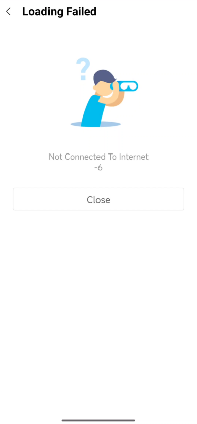

# Personalizar páginas de error

IAPminiprogram SDK muestra páginas de error cuando los errores de apertura de la página ocurren en un mini programa.Los errores caen en los siguientes dos tipos:

- Errores de red o servidor
- Errores de estado causados por estados no válidos del mini programa o la URL de la página

La Super App puede personalizar las páginas de error de acuerdo con los tipos de error y mostrar mensajes de error específicos de acuerdo con los códigos de error.


## Personalice la página de error para errores de red o servidor

Esta sección proporciona un ejemplo de una página de error predeterminada e instrucciones para personalizar la página de error para errores de red o servidor.

## Experiencia de usuario predeterminada
Para los errores de red o servidor, el SDK muestra una página de error predeterminada de la siguiente manera, mientras que el mensaje de error y el código de error (que no está conectado a Internet -6 en el ejemplo) puede variar según el error específico encontrado.
<center>

</center>
## Procedimientos
Tome los siguientes tres pasos para personalizar una página de error para errores de red o servidor:

## Paso 1: Cree su página de error personalizado
Cree un nuevo archivo HTML para personalizar su propia página de error.Puede incorporar el siguiente código esquemático para recibir y procesar la información necesaria para la personalización:
```error.html?a=b```

La siguiente tabla muestra la información que se pasa cada vez que el usuario encuentra un error de red o servidor y se accede a su página de error personalizado:


|askasks|alsdald|
|:----:|:-----:|
|alsdkaslas|alshdhoda|

<table>
    <tr>
        <th>Campo </th>
        <th>Tipo de datos </th>
        <th>Descripción </th>
    </tr>
    <tr>
        <td>errorCode</td>
        <td>String</td>
        <td>
           El código de estado del error.Los códigos caen en los siguientes dos tipos:
            - Las constantes ```Error_*``` del WebView error. Para obtener más información, consulte la documentación de Android en [WebViewClient](/).
            * El código de estado de error HTTP dentro del rango de [400, 599].
        </td>
    </tr>
    <tr>
        <td>errorMessage</td>
        <td>String</td>
        <td>El mensaje de error predeterminado que muestra el SDK. </td>
    </tr>
    <tr>
        <td>layoutDirection</td>
        <td>String</td>
        <td>
            Envía la dirección de texto en el dispositivo del usuario. Los valores válidos son:
            * ```RTL```: El texto se muestra de derecha a izquierda.
            * ```LTR```: El texto se muestra de izquierda a derecha.
        </td>
    </tr>
    <tr>
        <td>language</td>
        <td>String</td>
        <td>La preferencia de idioma en el dispositivo del usuario.</td>
    </tr>
</table>

## Paso 2: Ponga la página de error en su directorio de activos
Coloque su página de error personalizado en la carpeta de activos como se muestra en el siguiente ejemplo:


:::info[Nota]

Some **content** with _Markdown_ `syntax`. Check [this `api`](#).

:::

 ```js
    //Antes de inicializar el SDK
GriverPageConfiguration pageConfiguration = new GriverPageConfiguration();
pageConfiguration.errorPageURL = "errorPage/custom_page_error.html";
IAPGriverConfig.getInstance().setPageConfiguration(pageConfiguration);
// Inicializar el SDK
IAPConnect.init(context, initConfig, callback)
 ```


