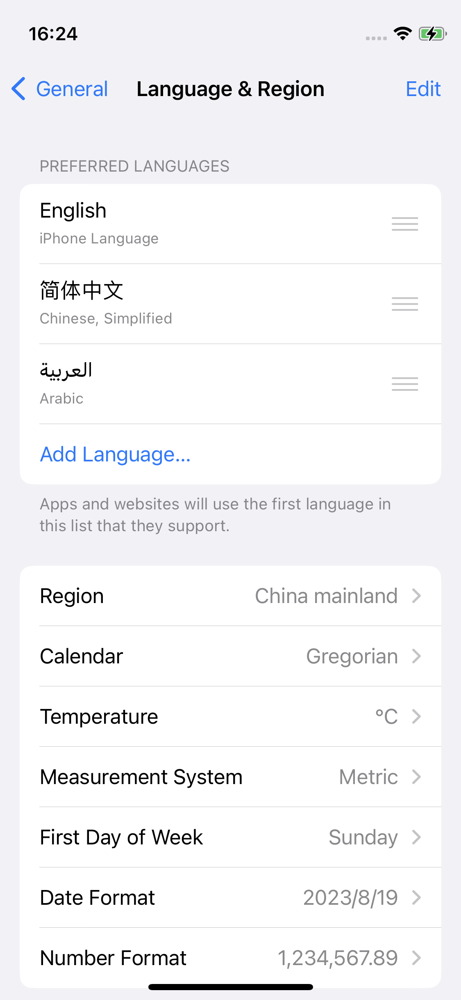

# Idioma

IAPMiniprogram SDK puede ajustar dinámicamente la pantalla del idioma según la preferencia del idioma del usuario para admitir diferentes idiomas y culturas. Esta adaptación del idioma se aplica a todas las páginas proporcionadas por SDK, que incluyen:

- Páginas dentro del menú Más, como **Settings** y **About**
- páginas JSAPI-triggered, como la caja de alerta de [my.alert](/)
- Otras páginas comunes, como la pantalla de salpicaduras y las páginas de error

Este tema presenta principalmente los idiomas compatibles y la lógica de visualización de lenguaje subyacente del SDK.

:::info[Nota:]
Los mini programas también pueden ajustar dinámicamente su visualización de lenguaje llamando al my.getSysteminfo JSAPI para obtener la preferencia de lenguaje del usuario a través del parámetro de respuesta del idioma. Para obtener más información, consulte [my.getSystemInfo](/).
:::

## Idiomas compatibles
La siguiente tabla enumera los idiomas admitidos por el SDK y otra información clave:

<table>
    <tr>
        <th>Lenguaje apoyado</th>
        <th>Lenguaje</th>
        <th>Dirección de diseño</th>
        <th>Versión SDK requerida</th>
    </tr>
    <tr>
        <td>English (default)</td>
        <td>en</td>
        <td>LTR (left-to-right)</td>
        <td>Todas las versiones</td>
    </tr>
    <tr>
        <td>Arabic</td>
        <td>ar</td>
        <td>RTL (right-to-left)</td>
        <td>v2.50.2 o superior</td>
    </tr>
    <tr>
        <td>Spanish</td>
        <td>es</td>
        <td>LTR (left-to-right)</td>
        <td>v2.50.3 o superior</td>
    </tr>
</table>

Si necesita una capacidad de idioma adicional para el SDK, comuníquese con nuestro soporte técnico en <a href="mailto:overseas_support@service.alibaba.com.">overseas_support@service.alibaba.com.</a>

## Experiencia de usuario
Las siguientes imágenes muestran un panel de menú de demostración en inglés y árabe:

<table>
    <tr>
        <th>Inglesa</th>
        <th>Arábica</th>
    </tr>
    <tr>
        <td></td>
        <td></td>
    </tr>
</table>

## Lógica de visualización de idiomas

El SDK llama a iOS national **Locale.preferredLanguages.first** API para obtener la preferencia del idioma principal en el dispositivo del usuario y luego ajusta la pantalla del idioma en consecuencia. La llamada API puede tener los dos resultados siguientes:

- Si la configuración del lenguaje por APP está disponible, la API obtiene el idioma de esta configuración.Para obtener más información sobre esta función, consulte la documentación de iOS sobre cómo a[dmitir la configuración del idioma por aplicación en su aplicación](/).
- En otros casos, la API obtiene el idioma de la configuración del sistema.Esto incluye los siguientes escenarios:
    - La super aplicación no implementa capacidades multilingües.
    - La super aplicación implementa capacidades multilingües a través de la configuración del sistema.
    - La super aplicación implementa capacidades multilingües solo a través de la configuración del lenguaje en la aplicación.

Consulte la siguiente tabla para la ruta y la interfaz de la configuración del sistema y la configuración por APP respectivamente:

<table>
    <tr>
        <th></th>
        <th>Ajustes del sistema</th>
        <th>Configuración por aplicación</th>
    </tr>
    <tr>
        <td>Path</td>
        <td>Settings > General > Language & Region</td>
        <td>Settings > Your app > Language</td>
    </tr>
    <tr>
        <td>Interface</td>
        <td></td>
        <td></td>
    </tr>
</table>

El SDK ajusta automáticamente su lenguaje de visualización para que coincida con la preferencia de lenguaje obtenida.Sin embargo, si el idioma preferido no es compatible con el SDK, el idioma de visualización es inglés de forma predeterminada.

