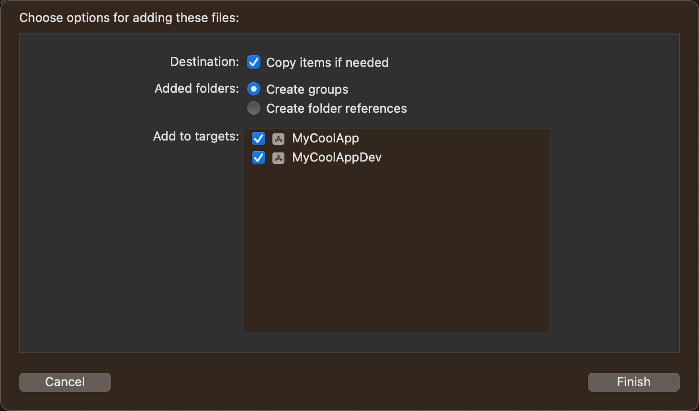
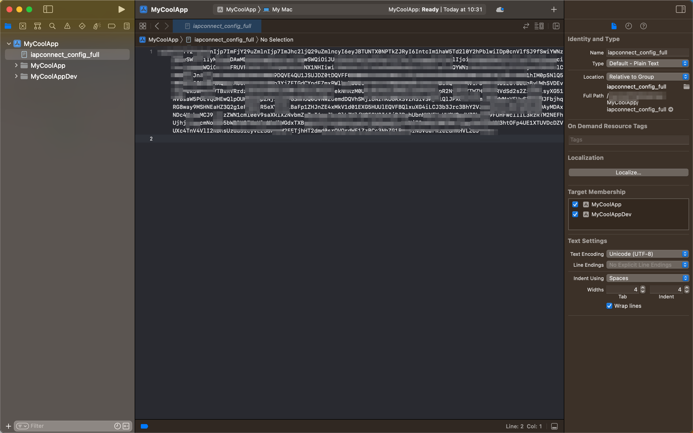

# Inicio rápido

Este tema presenta cómo configurar rápidamente el SDK IOS IAPminiprogram e implementar capacidades básicas de mini-program.

## Antes de que empieces
Antes de comenzar, asegúrese de estar familiarizado con las siguientes cosas:

- Para ejecutar miniprogramas, su dispositivo debe ser iOS 11 o superior.
- Xcode 14.0 o superior se instala en su computadora.
- [Cocoapods](/) 1.10.0 o superior se instala en su computadora.
- Las dependencias de la biblioteca de terceros del SDK de iApminiprogram podrían entrar en conflicto con los requisitos de la versión de otros SDK o su aplicación.Se recomienda probar a fondo las funcionalidades de su aplicación después de la integración.Para obtener más información, consulte las[ dependencias de la biblioteca de terceros](/).

## Empezar
Para comenzar con IAPminiprogram SDK, realice las siguientes acciones:

## Paso 1: Descargue el SDK
Inicie sesión en la [plataforma Mini Program](/), vaya a la página **Administrar la aplicación** y haga clic en **Resource > iOS Resource** para descargar IAPminiprogram SDK para iOS.Se descarga un archivo llamado iapconnect_config_fulll a su computadora.

Para obtener más información sobre cómo descargar los recursos de la aplicación, consulte [Descargar recursos de la aplicación](/).

## Paso 2: Agregue el archivo de configuración
Mueva el archivo iapconnect_config_full a la raíz de su proyecto xcode.Cuando aparezca un cuadro de diálogo, marque las casillas de verificación para agregar el archivo a todos los objetivos, como **MyCoolApp** y **MyCoolAppDev** como se muestra en la siguiente captura de pantalla.



Para confirmar que el archivo de configuración se agrega a todos los objetivos previstos, seleccione el archivo en XCode, y el **Target Membership** en el lado derecho muestra los objetivos seleccionados.




## Paso 3: actualice su archivo .netrc
Por razones de seguridad, Mini Program Platform utiliza una fuente privada de Cocoapods para distribuir las cápsulas.Para obtener acceso a la fuente privada, debe actualizar su archivo .netrc que contiene las credenciales requeridas.Para obtener más información sobre el archivo .netrc, consulte el archivo .netrc.

Para actualizar su [archivo .netrc](/), tome los siguientes pasos:


1. Copie la configuración a continuación en su archivo .netrc. El archivo .netrc se ubica en su directorio de ```$HOME```. Crea uno si no existe.

```js
machine globaltech.alipay.com 
login YOUR_ACCOUNT 
password YOUR_PASSWORD
```

En el código anterior, los valores dees de YOUR_ACCOUNT y YOUR_PASSWORD están desensibilizados. Para obtener los códigos de muestra con los valores, consulte Credenciales.

2. Agregue la fuente privada y la dependencia a su podfile con el siguiente código:

```js
source 'https://globaltech.alipay.com/api/v1/file/common/2017062215370883/minisdk'

target 'YOUR_TARGET' do

  pod 'IAPMiniProgram'

end
```

## Step 4: Install the SDK
Para instalar el SDK, ejecute ```pod install``` or ```pod install --repo-update``` Comando en la ruta de su Podfile.

Si encuentra algún problema al instalar el SDK, consulte [Troubleshooting CocoaPods CDN Source](/) para la resolución de problemas.

## Paso 5: Inicializar el SDK
Para inicializar el SDK, use el siguiente código:

```js
import UIKit
import IAPConnect
import GRVAppContainer

func application(_ application: UIApplication,
                 didFinishLaunchingWithOptions launchOptions: [UIApplication.LaunchOptionsKey: Any]?) -> Bool {
    let config = IAPConnectInitConfig()
    IAPConnectClient.sharedInstance()?.initWithContext(config, success: {
    
    }, failure: { (error, errorMessage) in
                 
    })
}
```
No se recomienda insertar el código ```application(_:didFinishLaunchingWithOptions:)``` y debe ejecutarse en el hilo principal.

## Paso 6: Implementar capacidades básicas de SDK
### Abrir un mini-programa
Para abrir un mini programa en su aplicación, llame a cualquiera de las siguientes API:

- [openAppWithApppId](/): Llame a este método para abrir un miniprograma con APPID.
- [openAppWithUrl](/): Llame a este método para abrir un miniprograma con una URL.

### Obtenga la lista de mini-programas
Para obtener la lista de mini-programa en su aplicación, llame a cualquiera de las siguientes API:

- fetchApps: Llame a esta API para obtener la lista de miniprogramas con *FetchAppRequestvo*.
- fetchAppInfosByIds: Llame a esta API para obtener la lista de miniprogramas con mini-program IDs.

## Próximos pasos
Los pasos anteriores se centran en cómo integrar el SDK de iOS iApminiprogram e implementar sus capacidades básicas.Además de eso, los desarrolladores pueden referirse selectivamente a los siguientes capítulos para implementar capacidades avanzadas de iOS iApminiprogram SDK.

- [Integrate SDK components](/): para implementar capacidades relacionadas con MAP, multimedia o Bluetooth, consulte esta guía para integrar los componentes SDK predefinidos correspondientes.
- [Listen for SDK events](/): para realizar operaciones especificadas en un evento determinado, consulte esta guía para implementar protocolos específicos para escuchar eventos SDK.
- [Customize UI-related capacities](/): para personalizar ciertas interfaces de usuario y capacidades relacionadas, consulte esta guía para implementar protocolos específicos.
- [Customize JSAPIs](/): para extender las funcionalidades de SDK a través de JSAPIS, consulte esta guía para crear nuevos JSAPIS y anular la implementación predeterminada de JSAPIS incorporado.
- [Open a mini program via a promotional QR code](/): para permitir a los usuarios abrir mini programas y obtener beneficios a través de códigos QR promocionales, consulte esta guía para habilitar la apertura de mini programas escaneando dichos códigos.

