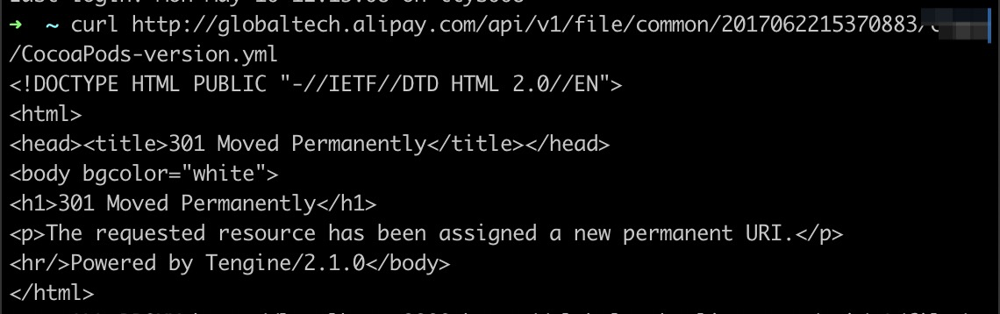

# Solución de problemas CocoaPods CDN source

Para integrar el IAPminiprogram SDK, debe configurar su archivo *.netrc* correctamente; De lo contrario, puede ocurrir un error cuando ejecuta el comando ```pos install```.

Siga los pasos a continuación para solucionar el problema.

## Paso 1: Remueva el caché de los CocoaPodos
Para garantizar que se use la última fuente de CDN, debe eliminar el caché de Cocoapods del disco local. Haz los siguientes pasos:

1. Vaya al directorio ```~/.cocoapods/repo``` y elimine la carpeta que tiene prefijo ```i-v1-file-common-```. Esta carpeta contiene los metadatos y el archivo *.podspec* de cocoapods.
2. Run the command below to remove the CocoaPods cache.
```
pod cache clean IAPMiniProgram --all; 
```

## Paso 2: Actualice sus Cocoapods
La versión requerida para Cocoapods es 1.10.0 o más.Ejecute el comando a continuación para verificar la versión de sus Cocoapods.Actualice sus Cocoapods si su versión es más baja que la versión requerida.

```
pod --version
```

## Paso 3: Configure el archivo .netrc correctamente
Asegúrese de que el archivo .netrc esté configurado correctamente con los siguientes pasos:

1. Ejecute el comando a continuación para verificar si el archivo .netrc existe en el directorio ```$HOME```.
```
cd ~; ls .netrc
```

2. Asegúrese de que el archivo .netrc contenga credenciales para nuestro servidor como se muestra en las [credenciales](Credentials.md).
3. Ejecute el comando a continuación para descargar el archivo *CocoaPods-version.yml* nuevamente.
```
curl --netrc http://globaltech.alipay.com/api/v1/file/common/2017062215370883/minisdk/CocoaPods-version.yml
```
Si el archivo .netrc funciona correctamente, la respuesta ```301``` se devuelve a continuación.



## STEP 4: Use Charles para verificar las solicitudes
Después de los pasos de arriba, ejecute nuevamente el comando ```pod install```. Si tiene éxito, entonces el problema se resuelve; De lo contrario, use Charles para registrar las solicitudes de CLI de análisis posterior.

Abra su Charles de antemano y suponga que el puerto de monitoreo de Charles es 8888 (el puerto predeterminado de Charles).Pruebe el comando a continuación:

```js
ALL_PROXY=http://localhost:8888 pod install
```

Con el comando anterior, Charles puede grabar las solicitudes de CLI.Exporte los registros y envíelos al arquitecto de soluciones para obtener ayuda.